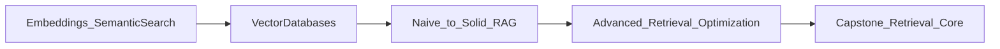
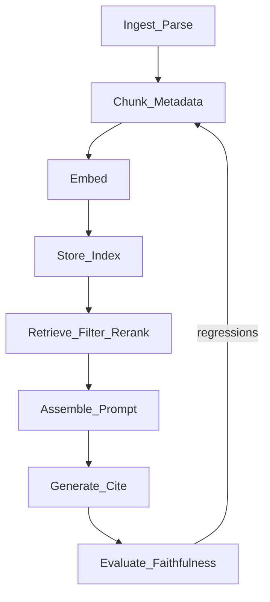

# Part II — Knowledge & Retrieval: Embeddings, Vector DBs & RAG

*Give models access to private, up-to-date knowledge. Master embeddings and vector search, then build and optimize production Retrieval-Augmented Generation systems that answer from your own data with citations and measurable quality.*

**Nav:** [README](README.md) · [M4 →](04-embeddings-semantic-search.md) · [M5](05-vector-databases.md) · [M6](06-retrieval-augmented-generation.md) · [M7](07-advanced-rag-optimization.md)

---

## Why this part exists

A frontier model knows a great deal about the public web of yesterday. It knows almost nothing about **your** onboarding guide, **your** incident runbook, or **your** pricing sheet revised last Tuesday. When you ask it those questions without retrieval, you get polished inventiveness — hallucination dressed as confidence.

Part II teaches the industrial cure: **retrieve relevant private context, then generate**. You will not treat RAG as a framework demo. You will treat it as a data pipeline with indexes, failure modes, cost ceilings, and evaluation gates — the same discipline you already apply to any production service.

By the end of Module 7 you will have:

1. Built semantic search without a vector database (so you understand the math).
2. Operated production-capable stores (Qdrant and pgvector) behind a swappable interface.
3. Shipped a cited “Chat With Your Docs” application with honest refusals.
4. Upgraded retrieval with reranking, query transformation, and hybrid fusion — and **proved** the upgrade on a fixed golden set.

That upgraded retrieval stack is the knowledge core of your Week 8 capstone.

---

## Dependency chain



| Module | What you gain | What you hand forward |
| :---- | :---- | :---- |
| **M4** | Embedding geometry, chunking as design, in-memory semantic search | Corpus + chunk experiments + hit-rate mindset |
| **M5** | ANN indexes, filters, hybrid search, multi-tenancy | Reusable vector-store layer (pgvector ↔ Qdrant) |
| **M6** | End-to-end RAG, citations, RAGAS metrics | Chat-with-docs app + evaluation baseline |
| **M7** | Rerank, rewrite, fusion, advanced indexes, routing | Measurable quality lift; capstone-ready retrieval |

---

## The RAG mental model

Every production RAG system is a loop. Memorize the stages; diagnose by stage.



1. **Ingest** — load PDF, HTML, DOCX, tables; normalize text; keep provenance.
2. **Chunk** — split for retrieval *and* for generation; attach metadata.
3. **Embed** — map chunks (and queries) into a shared vector space with one pinned model version.
4. **Store** — index for approximate nearest neighbor search at acceptable recall/latency.
5. **Retrieve** — top-k, filters, hybrid, rerank; compress if the window is tight.
6. **Augment** — assemble grounded prompts with clear citation contracts.
7. **Generate** — answer only from context; refuse when evidence is missing.
8. **Evaluate** — faithfulness, relevance, context precision/recall — not vibes.

Part I gave you control of the model (prompts, structured outputs, tools). Part II gives the model **something true to say**.

---

## What “good” looks like

| Signal | Weak system | Strong Part II system |
| :---- | :---- | :---- |
| Grounding | Sounds right; invents SOP steps | Quotes or paraphrases retrieved chunks with citations |
| Refusal | Guesses when docs are silent | Says “I don’t know” / out of corpus |
| Retrieval | Keyword-only or random top-k | Chunking + embeddings (+ hybrid/rerank) measured by hit rate |
| Ops | Notebook to nowhere | Swappable store, upserts, tenant isolation |
| Quality | Demo on three questions | Golden set + RAGAS (or equivalent) scorecard |
| Change control | Tweaks without baselines | Before/after on the **same** test set (M7) |

---

## Recurring tools

These appear throughout Part II. Prefer concepts first; vendors second.

| Layer | Primary choices in this ebook |
| :---- | :---- |
| Language | Python 3.11+, Pydantic, env-based secrets |
| Embeddings | OpenAI `text-embedding-3-*`, Cohere, Voyage, open BGE/E5 / sentence-transformers |
| Local math | NumPy (M4 naive index) |
| Vector DBs | **Qdrant** (Docker) and **pgvector** (Postgres) |
| Hybrid / sparse | BM25 (or store-native sparse) + dense fusion |
| Rerank | Cross-encoder or Cohere Rerank (M7) |
| Eval | RAGAS — faithfulness, answer relevance, context precision/recall |
| Frameworks | Stay framework-light until the pipeline is clear; LangChain is optional glue |

---

## Narrative corpus: AlrightTech Internal Docs

Across M4–M7 we use one coherent story:

- **Engineering Handbook** — coding standards, review checklist, deployment SLAs.
- **Onboarding Pack** — first-week setup, accounts, mentors.
- **Incident Runbooks** — paging, severity, rollback.
- **Product FAQs** — feature flags, pricing tiers (intentionally conflicting versions to teach conflict handling).

Metadata you should carry everywhere:

```text
source          # file or URI
doc_type        # handbook | onboarding | runbook | faq
updated_at      # ISO date — for staleness and filters
section         # heading path if available
tenant_id       # multi-tenancy labs in M5
chunk_id        # stable id for citations
```

---

## Bridging from Part I

You already know:

- Tokens and context windows drive **cost and truncation**.
- Prompts are versioned contracts (Role → Task → Context → Constraints → Format).
- Structured outputs (Pydantic) make citations and tool results parseable.

In Part II, retrieval **fills the Context slot**. Generation still obeys Constraints: cite sources, refuse without evidence, stay on format.

---

## Assessment overview

| Module | Mini project | Evidence of mastery |
| :---- | :---- | :---- |
| M4 | Semantic Search Engine | Ranked results + chunking quality table, **no** vector DB |
| M5 | Production Vector Store Layer | Same API over pgvector and Qdrant |
| M6 | Chat With Your Docs | Citations, out-of-scope guard, RAGAS report |
| M7 | Advanced RAG Upgrade | Before/after eval lift on a frozen golden set |

Weekly labs remain pass/fail against acceptance criteria inside each chapter. Rubrics for mini projects grade **correctness**, **code quality**, and **evaluation evidence**.

---

## How to use this volume with the live course

1. Skim the overview chapter once.
2. For each module day: read concepts → run the day’s lab → check acceptance.
3. Ship the mini project before starting the next module when the schedule allows; at minimum, freeze interfaces the next module imports.
4. Keep a single `evals/` folder from M6 onward; M7 must not invent a new test set midstream.

You are ready for Module 4 — embeddings as geometry, and semantic search built by hand.
