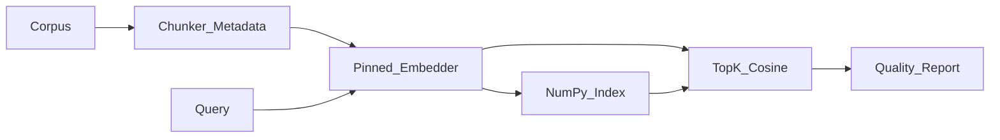

# Module 4: Embeddings & Semantic Search

*Part II — Knowledge & Retrieval · Duration: **2 days***

**Nav:** [Part overview](00-part-ii-overview.md) · **M4** · [M5 Vector Databases →](05-vector-databases.md)

---

## Why this matters in production

A support engineer types: *“How do we rollback a bad release on Railway?”*  
Keyword search looks for the literal string `rollback` and misses the runbook titled **“Reverting a failed deploy.”**  
Semantic search maps both phrases into nearby vectors and surfaces the right page.

Embeddings are not a research curiosity. They are the address system for private knowledge. If you misunderstand them, every RAG system you build will retrieve the wrong neighbors — and your LLM will confidently answer from the wrong neighborhood.

This module forces you to **earn** that intuition: cosine similarity in NumPy, chunking experiments with measured hit rate, and a semantic search engine **without** a vector database.

---

## Learning objectives

By the end of this module you will be able to:

- Explain what embeddings are and why they enable meaning-based search.
- Generate, store, and compare embeddings and choose an embedding model deliberately.
- Implement similarity search from scratch before adopting a vector database.
- Understand how chunking decisions drive retrieval quality.

---

## Day 1 — Geometry, models, and naive search

### 1. Meaning as geometry

An **embedding** is a fixed-length list of floats that places a piece of text in a high-dimensional space so that **similar meanings sit near each other**.

You do not need the full neural math. You need the engineering contract:

| Idea | Engineering consequence |
| :---- | :---- |
| Same model for query and documents | Mixing models (or versions) silently destroys recall |
| Fixed dimension `d` | Index and DB schema must match `d` |
| Similarity ≈ proximity | Your ranker is a distance function over vectors |
| Truncation / max tokens | Oversized chunks get clipped — meaning is lost before indexing |

Think of each embedding as a coordinate. Search is: embed the query, find document coordinates closest to it.

### 2. Similarity metrics

Given vectors \(\mathbf{q}\) and \(\mathbf{d}\):

| Metric | Formula intuition | Use when |
| :---- | :---- | :---- |
| **Cosine similarity** | Angle between vectors; ignore length | Default for most text embeddings; compare direction of meaning |
| **Dot product** | Cosine × magnitudes | When vectors are already **L2-normalized**, cosine ≡ dot |
| **Euclidean (L2) distance** | Straight-line distance | Some indexes prefer distance; lower is better |

**Use when / skip when — Cosine**

- **Use when:** general semantic search with OpenAI/Cohere/Voyage/sentence-transformers.
- **Skip when:** the store’s index was built for a different metric than you query with (mismatch is a silent bug).

**Normalization.** Many pipelines L2-normalize embeddings once at ingest:

```python
import numpy as np

def l2_normalize(x: np.ndarray, eps: float = 1e-12) -> np.ndarray:
    norms = np.linalg.norm(x, axis=-1, keepdims=True)
    return x / np.maximum(norms, eps)
```

After normalization, ranking by **dot product** equals ranking by cosine. That is why some APIs say “use cosine” and some indexes say “dot” — check whether norms are already unit length.

### 3. Cosine similarity by hand

```python
import numpy as np

def cosine_similarity(a: np.ndarray, b: np.ndarray) -> float:
    a = a.astype(np.float64)
    b = b.astype(np.float64)
    return float(np.dot(a, b) / (np.linalg.norm(a) * np.linalg.norm(b) + 1e-12))

# Toy 2-D "embeddings" for intuition only
docs = {
    "rollback_runbook": np.array([0.9, 0.1]),
    "onboarding_wifi": np.array([0.1, 0.95]),
    "pricing_faq": np.array([0.5, 0.5]),
}
query = np.array([0.85, 0.2])  # "how do we revert a deploy?"

scores = {name: cosine_similarity(query, vec) for name, vec in docs.items()}
ranked = sorted(scores.items(), key=lambda x: x[1], reverse=True)
print(ranked)
# -> [('rollback_runbook', ...), ...]
```

In real systems `d` is 384–3072, not 2 — but the ranking logic is identical.

### 4. Embedding models (2025–26)

| Family | Examples | Notes for engineers |
| :---- | :---- | :---- |
| Hosted general | OpenAI `text-embedding-3-small` / `3-large` | Strong default; pick dim via API truncation options where available |
| Hosted retrieval-tuned | Cohere embed, Voyage | Often excel on retrieval benchmarks; price/latency trade-offs |
| Open / local | BGE, E5, sentence-transformers | Run via local GPU/CPU or vLLM-class stacks; good for privacy and cost at scale |

**Dimensions, cost, and MTEB.** Higher dimension can capture nuance and cost more storage and latency. **MTEB** (Massive Text Embedding Benchmark) is a useful *leaderboard signal* — not a guarantee on *your* tickets and PDFs. Always A/B on a small labeled retrieval set from your domain.

**Use when / skip when — Switching embedding models**

- **Use when:** you have a frozen eval set and measured hit-rate lift that beats migration cost.
- **Skip when:** “the blog said Voyage is better” with no test on your corpus. Re-embedding everything is expensive; pin a **model + version** in config.

```python
# Pattern: one pinned embedder for the whole system
import os
from openai import OpenAI

client = OpenAI(api_key=os.environ["OPENAI_API_KEY"])
EMBED_MODEL = "text-embedding-3-small"  # pin in config, not in scattered calls

def embed_texts(texts: list[str]) -> list[list[float]]:
    # Batch for cost/latency; respect provider batch limits
    resp = client.embeddings.create(model=EMBED_MODEL, input=texts)
    return [item.embedding for item in sorted(resp.data, key=lambda x: x.index)]
```

### 5. Building a naive in-memory semantic search

Before Qdrant or pgvector, implement the algorithm you will rely on for the rest of your career:

```python
from dataclasses import dataclass
import numpy as np

@dataclass
class Chunk:
    chunk_id: str
    text: str
    metadata: dict

class InMemorySemanticIndex:
    def __init__(self, embed_fn):
        self.embed_fn = embed_fn
        self.chunks: list[Chunk] = []
        self.matrix: np.ndarray | None = None  # shape (n, d), L2-normalized

    def add(self, chunks: list[Chunk]) -> None:
        vectors = np.array(self.embed_fn([c.text for c in chunks]), dtype=np.float64)
        vectors = l2_normalize(vectors)
        self.chunks.extend(chunks)
        self.matrix = vectors if self.matrix is None else np.vstack([self.matrix, vectors])

    def search(self, query: str, top_k: int = 5) -> list[tuple[Chunk, float]]:
        q = l2_normalize(np.array(self.embed_fn([query]), dtype=np.float64))[0]
        scores = self.matrix @ q  # cosine via normalized dot
        idx = np.argsort(scores)[::-1][:top_k]
        return [(self.chunks[i], float(scores[i])) for i in idx]
```

This is slow at millions of rows — good. That pain is why Module 5 exists. First, prove you can rank correctly on hundreds of AlrightTech Internal Docs chunks.

### 6. Multilingual and domain-specific embeddings

- **Multilingual models** map cross-language paraphrases into one space — use when queries and docs speak different languages.
- **Domain jargon** (legal, medical, infra acronyms) often loses less from **better chunking and metadata** than from fine-tuning embeddings.
- **Fine-tuning embeddings** is worth it when you have labeled query↔document pairs at scale and offline retrieval metrics have plateaued under strong chunking/hybrid baselines.

**Use when / skip when — Fine-tuning embeddings**

- **Use when:** ≥ thousands of labeled pairs; clear MTEB-style local metric; dedicated ML ownership.
- **Skip when:** your corpus is a few hundred docs — fix chunking, titles, and metadata first (see Day 2).

---

## Day 2 — Chunking, quality, and pitfalls

### 7. Chunking as product design

Chunking is not “split on `\n\n` and hope.” Each chunk must be:

1. **Embeddable** — small enough that the embedding model sees the whole unit.
2. **Answerable** — large enough (or linked via metadata) that a reader can use it alone or with a parent.
3. **Citable** — stable `chunk_id` and `source` for Module 6 citations.

| Strategy | How it works | Strength | Weakness |
| :---- | :---- | :---- | :---- |
| **Fixed size** | N characters or tokens | Simple, predictable | Mid-sentence cuts; topic bleed |
| **Recursive** | Split by headings → paragraphs → sentences until under limit | Respects document structure | Needs good separators |
| **Semantic** | Split where topic/embedding shifts | Coherent topics | Heavier; hyperparameters |
| **Token-aware** | Size by tokenizer of the *embedding* model | Matches model limits | Need tokenizer alignment |

**Overlap.** A 10–20% overlap (e.g., 512-token chunks with 64–100 token overlap) reduces boundary misses for queries that straddle two sections. Too much overlap duplicates storage and dilutes rankings.

**Metadata to attach at chunk time** (AlrightTech Internal Docs):

```python
{
  "source": "runbooks/revert-failed-deploy.md",
  "doc_type": "runbook",
  "updated_at": "2026-03-12",
  "section": "Railway > Rollback",
  "tenant_id": "alrighttech",
  "chunk_id": "runbooks/revert-failed-deploy.md#c003",
}
```

### 8. Worked example: recursive-ish splitter

```python
def split_recursive(text: str, max_chars: int = 1200, overlap: int = 150) -> list[str]:
    separators = ["\n## ", "\n### ", "\n\n", "\n", ". "]
    if len(text) <= max_chars:
        return [text.strip()] if text.strip() else []

    for sep in separators:
        if sep in text:
            parts = text.split(sep)
            chunks: list[str] = []
            buf = ""
            for i, part in enumerate(parts):
                piece = (sep + part) if i and sep.strip() else part
                if len(buf) + len(piece) <= max_chars:
                    buf += piece
                else:
                    if buf.strip():
                        chunks.append(buf.strip())
                    # overlap from end of previous
                    buf = (buf[-overlap:] + piece) if overlap and buf else piece
            if buf.strip():
                chunks.append(buf.strip())
            return chunks
    # hard wrap fallback
    return [text[i : i + max_chars] for i in range(0, len(text), max_chars - overlap)]
```

Tune `max_chars` against your embedding model’s token limit (character counts are approximate — prefer token-aware sizing in production).

### 9. Measuring retrieval: hit rate

Do not optimize chunk size by aesthetic. Label a small set:

```text
query_id | query | relevant_chunk_ids (gold)
q001 | How do we rollback Railway? | runbooks/...#c003, runbooks/...#c004
```

**Hit rate@k:** fraction of queries for which at least one gold chunk appears in the top-k results.

```python
def hit_rate_at_k(results: list[list[str]], gold: list[set[str]], k: int) -> float:
    hits = 0
    for ranked_ids, relevant in zip(results, gold):
        if relevant & set(ranked_ids[:k]):
            hits += 1
    return hits / max(len(gold), 1)
```

Compare embedding models and chunk configs with the **same** gold file. Module 7 will demand the same discipline for rerankers.

### 10. Embedding pitfalls (and diagnostics)

| Pitfall | Symptom | Fix |
| :---- | :---- | :---- |
| Model/version drift | Sudden recall collapse after a “harmless” dependency bump | Pin model id + version; re-embed on change |
| Dimension mismatch | Insert errors or silent padding | Assert `len(vector) == expected_dim` on write |
| Unnormalized mix | Unstable score thresholds | Normalize once; document metric |
| Chunk-size sensitivity | Tiny chunks: no context; huge chunks: diluted vectors | Sweep sizes; plot hit rate@k |
| Query ≠ doc preprocessing | Asymmetric casing/boilerplate | Same normalize/strip pipeline both sides |
| Title-only embedding | Body holds the answer | Include heading path in chunk text or metadata boost |

---

## Engineering decision guide

| Decision | Prefer | Avoid |
| :---- | :---- | :---- |
| First embedder | One hosted small model (`text-embedding-3-small` or peer) | Fine-tuning on day one |
| Index for learning | In-memory NumPy | Jumping straight to a managed cloud DB |
| Chunk size | Start ~400–800 tokens with modest overlap | One chunk per entire PDF |
| Eval | 30–100 labeled queries | “It found something sensible in the demo” |
| Multilingual need | Multilingual embedding model | Translating the whole corpus “for convenience” without measuring |

---

## Failure modes & diagnostics

1. **Everything ranks near ~0.7–0.8** — vectors may be too similar (boilerplate-heavy chunks) or metric broken. Inspect top text; strip nav/headers.
2. **Good keywords, bad semantics** — wrong model or oversized chunks. Run the chunking lab.
3. **Reproducibility fails** — floating seeds are rare for embeddings; more often unstable chunk IDs. Stabilize `chunk_id` generation (hash of source + offsets).
4. **Cost spike** — re-embedding full corpus on every code change. Cache embeddings keyed by `(model, text_hash)`.

---

## Hands-on labs

### Lab 4.1 — Cosine similarity and cluster intuition

**Steps**

1. Take 20 short sentences from AlrightTech Internal Docs (mix runbook, onboarding, pricing).
2. Embed with one model; L2-normalize.
3. Compute pairwise cosine matrix with NumPy.
4. Optionally project with PCA/UMAP and color by `doc_type`.

**Acceptance**

- [ ] You can point to two near neighbors that share meaning but not keywords.
- [ ] You can explain why cosine (not Euclidean length) is what you plotted.

### Lab 4.2 — Compare embedding models on hit rate

**Steps**

1. Build a 30-query gold set with relevant `chunk_id`s.
2. Embed corpus with two or three models (e.g., OpenAI small vs large, or OpenAI vs a local BGE).
3. Report hit rate@5 and mean latency/cost notes.

**Acceptance**

- [ ] A Markdown table comparing models on the **same** chunks and gold labels.
- [ ] A written recommendation: which model you pin for M5–M7 and why.

### Lab 4.3 — Chunk size and overlap experiment

**Steps**

1. Fix the embedding model from Lab 4.2.
2. Sweep chunk sizes (e.g., 256 / 512 / 1024 tokens) × overlaps (0 / 10% / 20%).
3. Plot or tabulate hit rate@5.

**Acceptance**

- [ ] A clear winner (or Pareto note: quality vs chunk count/cost).
- [ ] Documented settings committed to config for the mini project.

### Lab 4.4 — Semantic search over my notes

**Steps**

1. Index your notes or a slice of AlrightTech Internal Docs with `InMemorySemanticIndex`.
2. CLI: `python search.py "how do mentors get assigned?"`
3. Print top-k texts with scores and metadata.

**Acceptance**

- [ ] Ranked, scored results for natural-language queries.
- [ ] README explaining how to rebuild the index after adding files.

---

## Mini project — Semantic Search Engine

### Spec

Build a documented Python tool that:

1. Ingests a document corpus (Markdown/text minimum; PDF optional).
2. Chunks with your chosen strategy and durable `chunk_id`s.
3. Embeds and stores vectors **in memory or on disk as NumPy/npz-free `.npz`** — **no vector database**.
4. Answers natural-language queries with ranked, scored results (text + metadata + score).
5. Emits a **retrieval quality report** comparing at least two chunking strategies on a fixed gold set (hit rate@k).

### Architecture sketch



### Definition of done

- [ ] Query CLI or small script returns top-k with scores.
- [ ] Config pins embedding model name and chunk parameters.
- [ ] Quality report (Markdown or CSV) shows chunking comparison.
- [ ] No Qdrant/Chroma/Pinecone/pgvector dependencies.
- [ ] README with setup, env vars, and how to regenerate the index.

### Rubric

| Criterion | Weight | Excellent |
| :---- | :---- | :---- |
| Correctness | 40% | Cosine ranking correct; IDs stable; report numbers reproducible |
| Code quality | 30% | Clear modules (chunk / embed / index / eval); typed where useful; secrets in env |
| Evaluation evidence | 30% | Gold set ≥ 20 queries; ≥ 2 chunk configs; hit rate@k tabulated |

---

## Bridge to Module 5

You now retrieve well on hundreds of chunks. Production corpora have **millions**, need **filters** (`doc_type`, `tenant_id`), **persistence**, and **approximate** nearest neighbors within milliseconds.

Module 5 takes the same corpus and embedding contract and parks them in **Qdrant** and **pgvector** behind one Python interface — the layer every later RAG lab reuses.

Keep: pinned embedder, chunk config, gold set, `chunk_id` scheme.  
Leave behind: the fantasy that brute-force NumPy scales forever.
