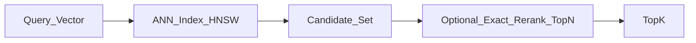
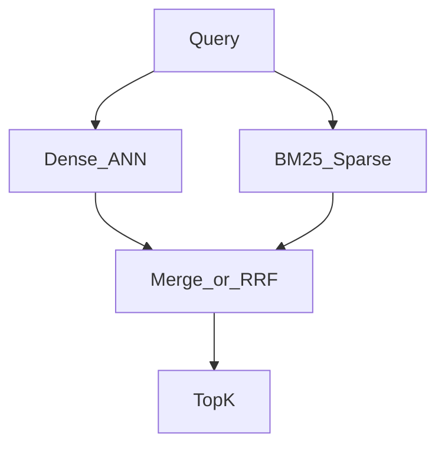
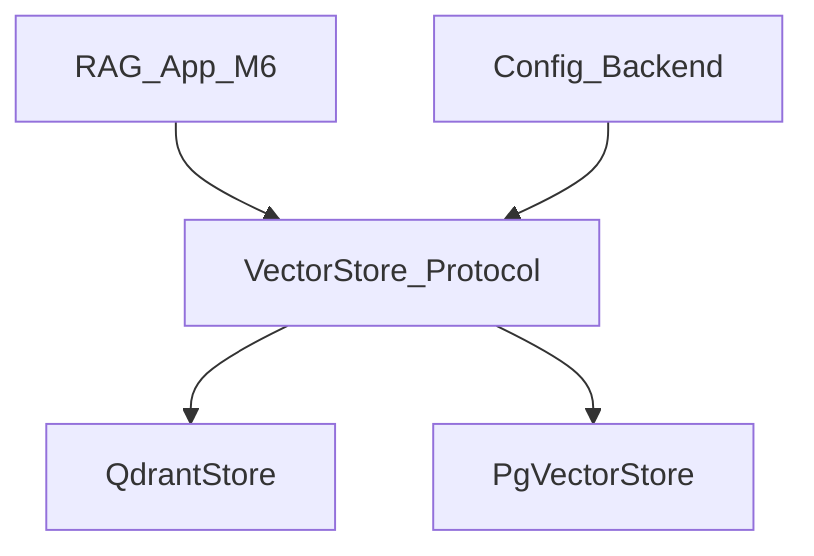

# Module 5: Vector Databases

*Part II — Knowledge & Retrieval · Duration: **2 days***

**Nav:** [← M4 Embeddings](04-embeddings-semantic-search.md) · **M5** · [M6 RAG →](06-retrieval-augmented-generation.md)

---

## Why this matters in production

Your Module 4 NumPy index answered “rollback Railway?” beautifully on two hundred chunks. Then product uploaded three years of Confluence exports. Brute-force cosine over the full matrix now costs more latency than your SLA allows — and legal wants **tenant isolation** so Customer A never retrieves Customer B’s contracts.

A **vector database** (or a vector index inside Postgres) exists to do three jobs well:

1. **Approximate** nearest neighbor search at scale (recall vs latency trade-off).
2. **Filter** by metadata in the same query (source, date, tenant).
3. **Persist** and operate (upserts, deletes, backups, multi-tenancy).

This module makes you operationally competent — and ends with a **swappable store layer** that Modules 6 and 7 import without caring which backend is live.

---

## Learning objectives

By the end of this module you will be able to:

- Explain how vector databases index and search at scale using approximate nearest neighbors.
- Stand up and operate a production-capable vector store.
- Design collections, metadata filters, and hybrid search.
- Choose an appropriate vector database for a given use case.

---

## Day 1 — ANN, landscape, and first collections

### 1. Exact vs approximate nearest neighbors

**Exact** search computes similarity against every vector (your NumPy matrix multiply). Correct, simple, \(O(n \cdot d)\).

**Approximate nearest neighbors (ANN)** trade a small amount of recall for large latency wins using indexes such as **HNSW** (Hierarchical Navigable Small World graphs) or IVF-style partitions.



**Recall vs latency.** Raising `ef` / probe parameters usually increases recall and latency. Production work is: pick a minimum recall@k on a held-out set, then minimize p95 latency under that constraint.

**Use when / skip when — ANN**

- **Use when:** \(n\) is large enough that exact search breaks latency, or you need filtered search in-engine.
- **Skip when:** \(n\) is tiny (hundreds) and exact search is already sub-millisecond — complexity without benefit.

### 2. HNSW intuition (engineer depth, not a paper)

HNSW builds a multi-layer graph: coarse layers jump long distances; lower layers refine. Search walks the graph greedily toward the query. You need not implement HNSW; you need to know:

- **Build parameters** affect memory and quality (e.g., `M`, `ef_construction`).
- **Query parameters** (e.g., `ef_search`) are your runtime recall dial.
- Filters may change how candidates are visited — test filtered recall separately.

### 3. Vector DB landscape (2025–26)

| Store | Shape | Fit |
| :---- | :---- | :---- |
| **pgvector** | Extension on Postgres | Teams already on Postgres; transactional metadata; “good enough” vectors |
| **Qdrant** | Dedicated vector DB | Strong filters, hybrid, self-host Docker, clear payloads |
| **Weaviate** | Dedicated | Schema-centric, hybrid, modules ecosystem |
| **Pinecone** | Managed SaaS | Fast to production if you accept vendor lock-in and cost model |
| **Chroma** | Lightweight | Prototypes and local demos; be deliberate before calling it “prod” |

**Managed vs self-hosted**

| Prefer managed | Prefer self-hosted |
| :---- | :---- |
| Small ops team; traffic spiky; need global SLA quickly | Strict data residency; predictable high volume; already run Postgres/K8s |

**Use when / skip when — pgvector**

- **Use when:** document count is moderate, Postgres is already source of truth, ops skill is SQL-first.
- **Skip when:** you need advanced hybrid/sparse and multi-tenant isolation patterns that are cleaner in a dedicated engine — or ANN performance requirements exceed what your Postgres sizing delivers.

**Use when / skip when — Qdrant**

- **Use when:** payload filters + hybrid matter; Docker-first labs and mid-scale prod.
- **Skip when:** your org standardizes on one managed API and forbids new infra — then Pinecone/Weaviate Cloud may win politically even if Qdrant wins technically.

### 4. Data model: collections, metrics, payloads

Speak these terms fluently:

| Concept | Meaning |
| :---- | :---- |
| **Collection / index** | Named universe of vectors with one dimension and distance metric |
| **Point / row** | One vector + id + **payload** (metadata) |
| **Distance metric** | Cosine / Dot / Euclid — must match how you embed |
| **Payload / metadata** | Filterable fields: `doc_type`, `updated_at`, `tenant_id`, `source` |
| **Namespace / tenant** | Logical isolation (collection-per-tenant or payload filter + strict enforcement) |

AlrightTech Internal Docs payload schema (carry forward from M4):

```json
{
  "source": "runbooks/revert-failed-deploy.md",
  "doc_type": "runbook",
  "updated_at": "2026-03-12",
  "section": "Railway > Rollback",
  "tenant_id": "alrighttech",
  "chunk_id": "runbooks/revert-failed-deploy.md#c003",
  "text": "optional denormalized body for retrieval display"
}
```

### 5. Standing up Qdrant (Docker) and loading M4 corpus

```bash
docker run -p 6333:6333 -p 6334:6334 \
  -v $(pwd)/qdrant_storage:/qdrant/storage \
  qdrant/qdrant
```

```python
from qdrant_client import QdrantClient
from qdrant_client.http import models as qm

client = QdrantClient(url="http://localhost:6333")
COLLECTION = "alrighttech_docs"
DIM = 1536  # must match your pinned M4 embedder

client.recreate_collection(
    collection_name=COLLECTION,
    vectors_config=qm.VectorParams(size=DIM, distance=qm.Distance.COSINE),
)

client.upsert(
    collection_name=COLLECTION,
    points=[
        qm.PointStruct(
            id=1,  # or UUID; keep a map from chunk_id → point id
            vector=embedding,  # list[float]
            payload={
                "chunk_id": "runbooks/revert-failed-deploy.md#c003",
                "source": "runbooks/revert-failed-deploy.md",
                "doc_type": "runbook",
                "tenant_id": "alrighttech",
                "text": chunk_text,
            },
        )
    ],
)
```

### 6. pgvector sketch

```sql
CREATE EXTENSION IF NOT EXISTS vector;

CREATE TABLE chunks (
  id BIGSERIAL PRIMARY KEY,
  chunk_id TEXT UNIQUE NOT NULL,
  tenant_id TEXT NOT NULL,
  doc_type TEXT,
  source TEXT,
  text TEXT NOT NULL,
  embedding vector(1536) NOT NULL
);

-- IVFFlat or HNSW depending on version/ops preference
CREATE INDEX ON chunks USING hnsw (embedding vector_cosine_ops);
```

```python
# Query pattern (psycopg)
sql = """
SELECT chunk_id, source, text, 1 - (embedding <=> %s::vector) AS score
FROM chunks
WHERE tenant_id = %s
ORDER BY embedding <=> %s::vector
LIMIT %s
"""
```

Load the **same** M4 chunks into both stores in Lab 5.1 so comparisons are fair.

---

## Day 2 — Filters, hybrid, tenancy, and the abstraction layer

### 7. Metadata filtering

Semantic search alone will pull pricing FAQs into an infra question if wording drifts. Filters constrain the candidate universe:

```python
# Qdrant: only runbooks for this tenant
client.search(
    collection_name=COLLECTION,
    query_vector=query_vec,
    query_filter=qm.Filter(
        must=[
            qm.FieldCondition(key="tenant_id", match=qm.MatchValue(value="alrighttech")),
            qm.FieldCondition(key="doc_type", match=qm.MatchValue(value="runbook")),
        ]
    ),
    limit=5,
)
```

**Use when / skip when — Hard filters**

- **Use when:** ACLs, tenant isolation, or “only docs updated after X.”
- **Skip when:** users ask cross-cutting questions and you filtered so hard nothing remains — log empty-result rates.

### 8. Hybrid search: dense + sparse (BM25)

Dense embeddings miss exact identifiers (`ERR_DEPLOY_42`, SKUs, error codes). Keyword/BM25 catches them.

**Hybrid** retrieves from dense and sparse channels, then merges (simple weighted sum or **RRF** — Module 7 deep-dives fusion).



Compare **dense-only vs hybrid** on queries that include product codes and paraphrases. Expect hybrid to win the mixed set.

### 9. Reranking teaser

Two-stage retrieval: cheap ANN retrieves 50–100 candidates; a **cross-encoder** or Cohere Rerank reorders to top-5. You will implement this properly in Module 7. For now: know that “vector DB top-k” is often a **candidate generator**, not the final ranking.

### 10. Upserts, deletes, namespaces, multi-tenancy

| Operation | Production rule |
| :---- | :---- |
| **Upsert** | Idempotent by `chunk_id`; re-ingest must not duplicate |
| **Update** | Prefer delete+insert or upsert of same id when text changes; re-embed |
| **Delete** | Soft-delete flag vs hard delete — define retention |
| **Namespaces** | Collection-per-tenant (strong isolation) vs `tenant_id` filter (efficient, must never forget filter) |

**Multi-tenancy pattern for labs:** payload field `tenant_id` + **mandatory** filter in the repository API. Never expose a raw `search(vector)` that omits tenant.

**Use when / skip when — Collection per tenant**

- **Use when:** strong isolation / compliance; few large tenants.
- **Skip when:** thousands of tiny tenants — prefer shared collection + strict filters + row-level tests.

### 11. Scaling, persistence, backups, cost

- **Persistence:** mount volumes (Docker); snapshot schedules for Qdrant; Postgres `pg_dump` / managed backups for pgvector.
- **Memory:** HNSW graphs are RAM-hungry — size nodes for vector count × dim × bytes × graph overhead.
- **Cost:** managed DBs charge for storage + query units; self-host trades money for ops time.
- **Embed cache:** changing one paragraph should re-embed one chunk, not the corpus.

### 12. Designing a swappable vector store layer

Modules 6–7 must not import Qdrant types everywhere. Define a thin port:

```python
from typing import Protocol, Any
from dataclasses import dataclass

@dataclass
class VectorRecord:
    chunk_id: str
    text: str
    embedding: list[float]
    metadata: dict[str, Any]

@dataclass
class SearchHit:
    chunk_id: str
    text: str
    score: float
    metadata: dict[str, Any]

class VectorStore(Protocol):
    def ensure_collection(self, name: str, dim: int) -> None: ...
    def upsert(self, name: str, records: list[VectorRecord]) -> None: ...
    def query(
        self,
        name: str,
        embedding: list[float],
        top_k: int = 5,
        filters: dict[str, Any] | None = None,
    ) -> list[SearchHit]: ...
    def delete(self, name: str, chunk_ids: list[str]) -> None: ...
```

Config selects backend:

```yaml
# config.yaml
vector_backend: qdrant  # or pgvector
qdrant_url: http://localhost:6333
pg_dsn: postgresql://...
collection: alrighttech_docs
embedding_dim: 1536
```

Factory:

```python
def get_store(cfg) -> VectorStore:
    if cfg.vector_backend == "qdrant":
        return QdrantStore(cfg)
    if cfg.vector_backend == "pgvector":
        return PgVectorStore(cfg)
    raise ValueError(cfg.vector_backend)
```

This **is** the Module 5 mini project.

---

## Engineering decision guide

| Situation | Lean toward |
| :---- | :---- |
| Existing Postgres, moderate scale | pgvector |
| Need rich payload filters + hybrid soon | Qdrant |
| Zero-infra prototype overnight | Chroma / in-memory (swap before prod) |
| Enterprise shared SaaS mandate | Pinecone / Weaviate Cloud — wrap behind `VectorStore` anyway |
| Multi-tenant SaaS | Shared collection + enforced `tenant_id` **or** collection-per-tenant for high-risk data |

---

## Failure modes & diagnostics

| Failure | Likely cause | Diagnostic |
| :---- | :---- | :---- |
| Empty results | Filter too tight; wrong collection | Drop filters temporarily; count points |
| Garbage neighbors | Metric/dim mismatch; wrong model | Assert dim; compare to M4 NumPy top-k |
| Tenant leak | Forgot filter | Integration test: query as tenant A must never return B |
| Latency regression | `ef` too high; cold disk | Trace p95; check index loaded in RAM |
| Duplicate chunks | Non-idempotent ingest | Unique on `chunk_id`; upsert only |

---

## Hands-on labs

### Lab 5.1 — Dual load: Qdrant and pgvector

**Steps**

1. Start Qdrant via Docker; enable pgvector on a local Postgres.
2. Export chunks from your M4 index (text + metadata + embeddings).
3. Load into both backends with identical ids/metadata.

**Acceptance**

- [ ] Same query returns overlapping top-5 `chunk_id`s on both stores (allow minor rank swaps).
- [ ] Notes on setup time and rough latency.

### Lab 5.2 — Metadata-filtered search

**Steps**

1. Implement filter by `doc_type` and by `updated_at` ≥ date.
2. Run: “rollback procedure” with `doc_type=runbook` vs unfiltered.

**Acceptance**

- [ ] Filtered query excludes FAQs/onboarding that unfiltered may include.
- [ ] Document one case where filtering hurts (over-constrained).

### Lab 5.3 — Hybrid vs dense-only

**Steps**

1. Add BM25 (or store hybrid API) over chunk text.
2. Build a 15-query set that mixes paraphrases and exact error codes.
3. Compare hit rate@5 dense-only vs hybrid.

**Acceptance**

- [ ] Table of results; hybrid wins or ties on the mixed set.
- [ ] Short analysis of which queries still fail (input to M7).

### Lab 5.4 — Multi-tenant collection design

**Steps**

1. Insert chunks for `tenant_id=acme` and `tenant_id=globex`.
2. Query as each tenant through your repository API **only**.
3. Attempt a negative test that omits tenant (should be impossible via public API).

**Acceptance**

- [ ] No cross-tenant hits in positive tests.
- [ ] Written isolation choice: shared collection + filter vs separate collections.

---

## Mini project — Production Vector Store Layer

### Spec

Ship a reusable Python module that abstracts a vector DB with:

- `ensure_collection` / create  
- `upsert`  
- `query` (vector + metadata filters)  
- `delete`  

Config-swappable backends: **pgvector ↔ Qdrant**.

Reuse this module in every RAG lab that follows.

### Architecture sketch



### Definition of done

- [ ] One integration test suite runs against both backends (Docker Compose recommended).
- [ ] Filters include at least `tenant_id` and one other field.
- [ ] README documents env vars, schema, and how to switch backends.
- [ ] M4 corpus successfully loaded via the abstraction (not via one-off scripts only).

### Rubric

| Criterion | Weight | Excellent |
| :---- | :---- | :---- |
| Correctness | 40% | Upsert idempotent; filters correct; both backends pass tests |
| Code quality | 30% | Clean `Protocol`, no leakage of vendor types into app layer |
| Evaluation evidence | 30% | Side-by-side query checklist + tenant isolation test results |

---

## Bridge to Module 6

You can store and retrieve at scale. Module 6 wires retrieval into **generation**: document loaders, prompt assembly with citations, “I don’t know” behavior, and **RAGAS** metrics so quality is measured — not debated.

Import your `VectorStore`. Keep the pinned embedder from M4. Bring the gold queries — they become the seed of your RAG evaluation set.
