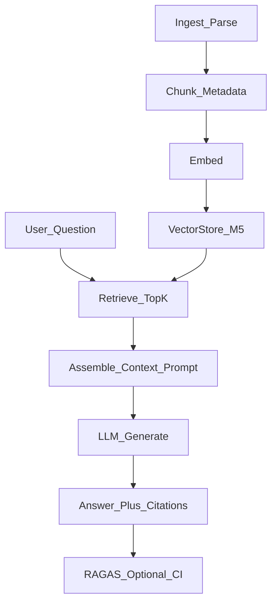
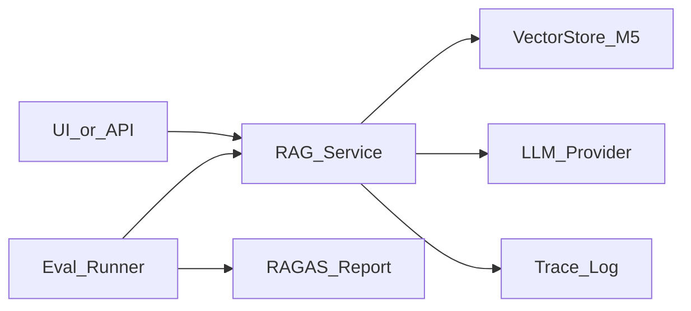

# Module 6: Retrieval-Augmented Generation (RAG)

*Part II — Knowledge & Retrieval · Duration: **3 days***

**Nav:** [← M5 Vector Databases](05-vector-databases.md) · **M6** · [M7 Advanced RAG →](07-advanced-rag-optimization.md)

---

## Why this matters in production

Retrieval without generation is search. Generation without retrieval is guesswork. **RAG** stitches them: retrieve AlrightTech Internal Docs, place evidence in the prompt, and require the model to answer **from that evidence** with citations.

The business failure mode is familiar: a chatbot that tells a new hire the wrong SSO steps because it mixed last year’s Confluence page with a blog post from training data. Your job is not “make it chatty.” Your job is **grounded answers**, honest refusal when evidence is missing, and **numbers** (RAGAS or equivalent) that catch regressions before users do.

---

## Learning objectives

By the end of this module you will be able to:

- Build an end-to-end RAG pipeline from ingestion to a grounded, cited answer.
- Reduce hallucination through grounding, source attribution, and honest “I don’t know” behavior.
- Evaluate RAG quality with the right metrics instead of eyeballing.
- Identify and fix the common failure points of naive RAG.

---

## Day 1 — Architecture and ingestion

### 1. End-to-end RAG architecture



| Stage | Responsibility | Owned artifacts |
| :---- | :---- | :---- |
| Ingest | Parse bytes → clean text + provenance | Loaders, checksums |
| Chunk | Split + metadata + stable ids | Chunker config from M4 |
| Embed | Vectors with pinned model | Embedder from M4 |
| Store | Persist + ANN query | `VectorStore` from M5 |
| Retrieve | Top-k (+ filters) | `k`, filters, score floor |
| Augment | Pack context under token budget | Prompt template version |
| Generate | Grounded answer + citations | System/user contract |
| Evaluate | Faithfulness & retrieval metrics | Golden set + RAGAS |

### 2. Document loaders and parsing pain

Real corpora are hostile:

| Format | Common failure | Mitigation |
| :---- | :---- | :---- |
| PDF | Column scramble, headers as noise | Layout-aware parsers; strip repeating headers |
| HTML | Nav, ads, cookie banners | Boilerplate removal; main-content extract |
| DOCX | Fairly clean; styles lost | Map headings → `section` metadata |
| Tables | Flattened wrong → nonsense chunks | Keep table as structured text or separate table index (M7) |

**Idempotent ingest.** Key by content hash + path. Unchanged files skip re-embed. Changed files upsert by `chunk_id` strategy (delete old chunks for that `source`, then insert).

```python
import hashlib
from pathlib import Path

def file_fingerprint(path: Path) -> str:
    data = path.read_bytes()
    return hashlib.sha256(data).hexdigest()
```

### 3. Minimal pipeline wiring (framework-light)

```python
def ingest_path(path: Path, store: VectorStore, embed_fn, chunk_fn, collection: str) -> int:
    text = path.read_text(encoding="utf-8")  # replace with PDF/HTML loaders as needed
    chunks = chunk_fn(text, source=str(path))
    vectors = embed_fn([c.text for c in chunks])
    records = [
        VectorRecord(chunk_id=c.chunk_id, text=c.text, embedding=v, metadata=c.metadata)
        for c, v in zip(chunks, vectors)
    ]
    store.upsert(collection, records)
    return len(records)
```

Prefer this clarity on Day 1. LangChain loaders are fine accelerators **after** you can narrate every stage without a stack trace.

### 4. Prompt assembly: context, citations, refusals

Treat the retrieved chunks as **evidence**, not decoration.

**System contract (example):**

```text
You are the AlrightTech Docs Assistant. Answer ONLY using the EVIDENCE blocks.
If EVIDENCE is insufficient, say you don't know and suggest which doc type might help.
Cite sources using [chunk_id] inline. Do not invent policies or URLs.
```

**User message shape:**

```text
QUESTION:
{question}

EVIDENCE:
[runbooks/revert-failed-deploy.md#c003] (source: ..., updated: 2026-03-12)
{chunk_text_1}

[onboarding/sso.md#c012] ...
{chunk_text_2}
```

**Use when / skip when — Strict grounding**

- **Use when:** policies, security, medical/legal-adjacent, internal SOPs.
- **Skip when:** brainstorming / creative tasks — don’t force RAG onto the wrong product.

### 5. Top-k and context compression

Context windows are finite and expensive (Part I lesson). Strategy ladder:

1. Choose smaller `k` of higher-quality chunks (fix improves in M7).
2. Drop chunks below a similarity floor.
3. Summarize or “compress” long chunks with a cheap model **only if** you measure faithfulness later.
4. Prefer parent-document patterns (M7) over stuffing the whole file.

```python
def pack_context(hits: list[SearchHit], max_chars: int = 12_000) -> str:
    parts: list[str] = []
    used = 0
    for h in hits:
        block = f"[{h.chunk_id}] (source: {h.metadata.get('source')})\n{h.text}\n"
        if used + len(block) > max_chars:
            break
        parts.append(block)
        used += len(block)
    return "\n".join(parts)
```

---

## Day 2 — Failure modes and a cited chatbot

### 6. RAG failure modes (with a debug playbook)

| Failure | Symptom | Where to look | First fix |
| :---- | :---- | :---- | :---- |
| **Poor retrieval** | Wrong docs; answer invents | Hit rate@k on gold | Chunking, embedding, hybrid, filters |
| **Lost-in-the-middle** | Model ignores mid-context | Trace that gold chunk was retrieved | Put critical evidence first/last; reduce `k`; rerank |
| **Stale data** | Correct old policy | `updated_at` on cited chunks | Re-ingest; filter by freshness; show dates in UI |
| **Conflicting sources** | Two FAQs disagree | Both chunks retrieved | Prefer newest; surface conflict explicitly in prompt |
| **Hallucinated citation** | `[chunk_id]` that wasn’t provided | Output validator | Constrain cites to allowed ids; structured output |
| **Over-refusal** | Says “don’t know” with good evidence | Prompt too harsh / `k` too low | Lower score floor carefully; add few-shot grounded examples |

**Debug order (always):** retrieval first, then packing, then generation. Never rewrite the system prompt until you print the retrieved chunks.

### 7. Deliberately break RAG (lab mindset)

To build diagnostic skill:

1. Set chunk size to 80 tokens → retrieval fragments incoherently.
2. Set `k=1` on multi-hop questions → incomplete answers.
3. Shuffle evidence order randomly → observe lost-in-the-middle.
4. Point retrieval at an empty collection → must refuse, not improvise.

Log a **trace** for every answer:

```json
{
  "question": "...",
  "retrieved": [{"chunk_id": "...", "score": 0.82}],
  "prompt_version": "docs-rag-v3",
  "answer": "...",
  "citations": ["..."]
}
```

### 8. Cited answer + out-of-scope guard

```python
ALLOWED = set()  # fill from packed hits' chunk_ids

def validate_citations(answer: str, allowed: set[str]) -> bool:
    import re
    cites = set(re.findall(r"\[([^\]]+)\]", answer))
    return cites.issubset(allowed) if cites else False  # or require ≥1 cite when answering
```

Out-of-scope pattern:

1. Retrieve top-k.
2. If max score < threshold **or** empty after filters → short circuit with refusal (no LLM or LLM with empty evidence).
3. Else generate under grounding contract.

**Use when / skip when — Score threshold**

- **Use when:** scores are calibrated (same model, normalized).
- **Skip when:** scores drift across models — prefer a small classifier / LLM judge for “supported?” (ties to eval).

### 9. Frameworks: LangChain — and when to skip it

| Use LangChain (or similar) when | Stay framework-light when |
| :---- | :---- |
| You need many loaders quickly and understand the pipeline already | You are learning or debugging stage failures |
| Team standardizes on LC for glue | Vendor abstractions hide prompt/retrieval bugs |
| Prototyping routing/chains you’ll rewrite | Production needs a 200-line explicit pipeline |

Opinion for this course: **implement RAG once by hand**; optionally re-express with LangChain afterward to see what the framework buys you.

---

## Day 3 — Evaluation with RAGAS

### 10. Why eyeballing fails

Demo questions become tribal knowledge. A refactor that drops hit rate@5 from 0.78 to 0.55 still “looks fine” on the three questions leadership typed in the hallway. Evaluation is how AI engineers protect users.

### 11. Core RAG metrics

| Metric | Asks | Low score means |
| :---- | :---- | :---- |
| **Context precision** | Are retrieved chunks mostly relevant? | Noisy retrieval |
| **Context recall** | Did we retrieve enough gold evidence? | Missing chunks / bad chunking |
| **Faithfulness** | Is the answer supported by context? | Hallucination / weak grounding |
| **Answer relevance** | Does the answer address the question? | Drift / refusal errors / verbosity |

**RAGAS** implements LLM-assisted and heuristic variants of these. Pin judge model versions; treat scores as **relative** (before/after) more than absolute gospel.

### 12. Golden set shape

```json
{
  "id": "q042",
  "question": "How do we rollback a failed Railway deploy?",
  "ground_truth": "Follow the revert-failed-deploy runbook: ...",
  "ground_truth_chunk_ids": ["runbooks/revert-failed-deploy.md#c003"]
}
```

Start from M4/M5 gold queries; add `ground_truth` answers. Freeze a **v1** set before the mini project polish — Module 7 must compare against the same freeze.

### 13. Wiring RAGAS (sketch)

```python
# Pseudocode — follow current RAGAS API in docs; APIs evolve
from datasets import Dataset

def build_eval_rows(questions, answers, contexts, ground_truths):
    return Dataset.from_dict({
        "question": questions,
        "answer": answers,
        "contexts": contexts,          # list[list[str]]
        "ground_truth": ground_truths,
    })

# result = evaluate(dataset, metrics=[faithfulness, answer_relevancy, context_precision, context_recall])
```

Export a Markdown scorecard next to the app:

```text
# RAGAS Report — Chat With Docs v1
faithfulness: 0.81
answer_relevance: 0.86
context_precision: 0.74
context_recall: 0.69
n: 40
prompt: docs-rag-v3
embed: text-embedding-3-small
retriever: dense top_k=5
```

---

## Engineering decision guide

| Decision | Guidance |
| :---- | :---- |
| `k` | Start 4–8; raise only if context recall is low **and** faithfulness stays high |
| Citations | Inline `[chunk_id]` + UI snippet from metadata |
| Refusal | Prefer false “don’t know” over false policy |
| Eval cadence | Run golden set on every prompt/retriever change |
| Framework | Hand-built core; optional LC for loaders |

---

## Failure modes & diagnostics (ops view)

1. **Faithfulness drops after a model upgrade** — new model more creative; tighten prompt; lower temperature; validate citations.
2. **Context recall low, faithfulness high** — answers are narrow but lucky; fix retrieval before celebrating.
3. **Users complain “robotic”** — usually over-citation or refusal; product tone ≠ remove grounding.
4. **PDF ingest looks fine, answers meaningless** — print raw extracted text; parser is the bug.

---

## Hands-on labs

### Lab 6.1 — Full RAG chatbot over a real document set

**Steps**

1. Ingest AlrightTech Internal Docs (PDFs and/or Markdown) via M5 store.
2. Build chat loop: retrieve → pack → generate with citations.
3. Show sources in the response (ids + source path).

**Acceptance**

- [ ] At least 10 successful grounded answers on held-out questions.
- [ ] Trace JSON saved per response.

### Lab 6.2 — Out-of-corpus “I don’t know”

**Steps**

1. Ask questions outside the corpus (sports scores, other companies’ policies).
2. Add threshold or empty-evidence short circuit.
3. Confirm no fabricated AlrightTech policy.

**Acceptance**

- [ ] Documented refusal behavior with examples.
- [ ] No invented `chunk_id`s in refusals.

### Lab 6.3 — Break and diagnose

**Steps**

1. Apply two deliberate breaks (chunking and `k` or order).
2. Use traces to identify the failing stage.
3. Restore baseline; write a one-page incident note.

**Acceptance**

- [ ] Incident note names the stage and the metric that moved.
- [ ] Fix verified on the same questions.

### Lab 6.4 — RAGAS scorecard

**Steps**

1. Freeze ≥ 30 golden items.
2. Run faithfulness, answer relevance, context precision/recall.
3. Commit the report into the repo (`evals/reports/m6-baseline.md`).

**Acceptance**

- [ ] Report includes metric values, `n`, model, prompt version, retriever config.
- [ ] You can explain each metric in one sentence without looking it up.

---

## Mini project — “Chat With Your Docs” RAG App

### Spec

A deployed (or locally demoable) RAG application that:

1. Answers questions over an uploaded / configured corpus.
2. Shows **inline citations** tied to real chunks.
3. Guards **out-of-scope** questions with honest refusal.
4. Ships a **RAGAS evaluation report** quantifying quality.

### Architecture sketch



### Definition of done

- [ ] Upload or batch ingest works for the chosen formats.
- [ ] Answers include citations; UI or API returns source metadata.
- [ ] Out-of-scope suite passes (no hallucinated policies).
- [ ] `evals/reports/m6-baseline.md` present and reproducible.
- [ ] README: architecture diagram, env vars, how to re-run eval.

### Rubric

| Criterion | Weight | Excellent |
| :---- | :---- | :---- |
| Correctness | 40% | Grounded answers; working refusals; stable ids |
| Code quality | 30% | Clear pipeline modules; uses M5 store abstraction; prompt versioned |
| Evaluation evidence | 30% | RAGAS (or equivalent) report on ≥ 30 items with config pinned |

---

## Bridge to Module 7

Your M6 app is a **baseline**. Module 7 does not chase vibes — it adds reranking, query transformation, hybrid/fusion, and advanced indexes, then demands a **before/after** scorecard on the **same** frozen golden set.

Freeze now:

- Golden JSONL
- Prompt version
- Embed model
- Retriever `k` and filters
- RAGAS report (`m6-baseline.md`)

That package is the input artifact for the Advanced RAG Upgrade mini project — and the retrieval core of your capstone.
