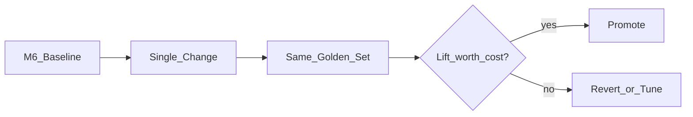
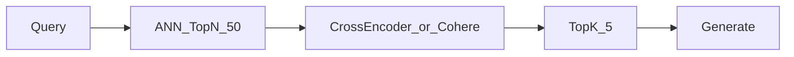
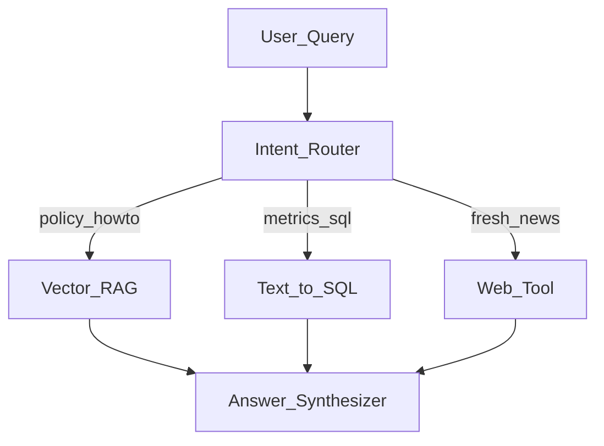
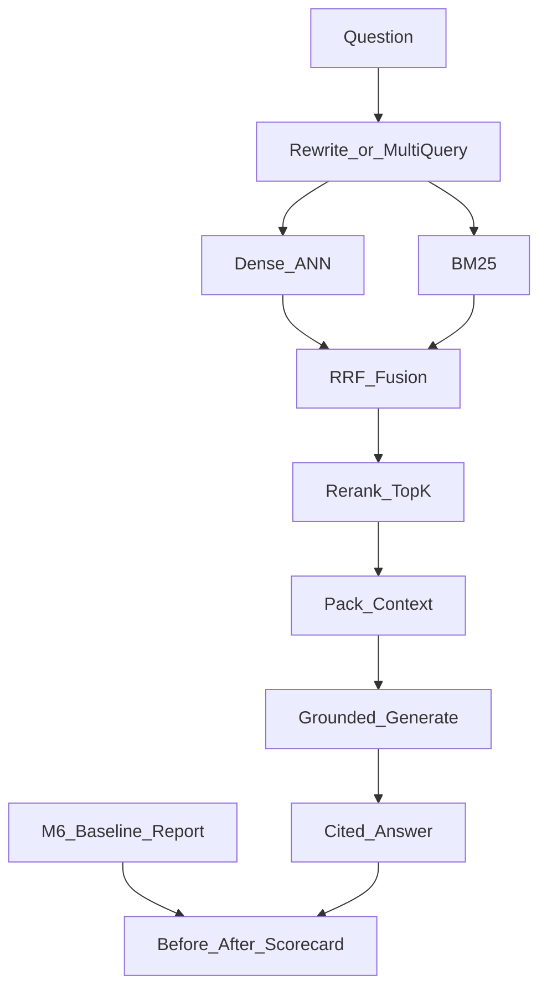

# Module 7: Advanced RAG & Retrieval Optimization

*Part II — Knowledge & Retrieval · Duration: **3 days***

**Nav:** [← M6 RAG](06-retrieval-augmented-generation.md) · **M7** · [Part overview](00-part-ii-overview.md)

---

## Why this matters in production

Your Module 6 baseline answers many questions correctly — and quietly fails a stubborn set: multi-hop policies, exact error codes, long handbooks where the answer sentence is drowned by neighbors, and queries phrased nothing like the documentation.

Advanced RAG is not a pile of tricks. It is a **disciplined upgrade loop**: change one retrieval component, measure faithfulness / context recall / hit rate on the **frozen M6 golden set**, keep the change only if the scorecard moves for the better without blowing latency or cost.

This module produces the Advanced RAG Upgrade — the retrieval core of your Week 8 capstone.

---

## Learning objectives

By the end of this module you will be able to:

- Apply advanced retrieval techniques that measurably raise answer quality.
- Implement reranking, query transformation, and hybrid/fusion pipelines.
- Handle structured data, large corpora, and agentic retrieval at a working level.
- Optimize a RAG system systematically against a fixed test set.

---

## Day 1 — Query transformation and reranking

### 1. The optimization contract

Before any technique:

1. Load `evals/` golden set from Module 6 (**do not edit labels mid-experiment**).
2. Record `m6-baseline.md` metrics.
3. Change **one** variable (e.g., add rerank).
4. Write `m7-after-<change>.md`.
5. Promote to default only if net positive.



### 2. Query transformation

User questions are rarely ideal search strings.

| Technique | Idea | Use when | Skip when |
| :---- | :---- | :---- | :---- |
| **Query rewriting** | LLM rewrites for retrieval (expand acronyms, add synonyms) | Colloquial questions; domain jargon | Already precise keyword queries; latency-critical path with no cache |
| **Multi-query** | Generate N paraphrases; retrieve for each; fuse | Ambiguous single wording | Cost sensitive and N is large |
| **HyDE** | Generate a hypothetical answer doc; embed that | Short questions that embed poorly | High hallucination risk domains without careful prompts |
| **Step-back** | Ask a broader question first; retrieve abstractions + specifics | Reasoning that needs principles then details | Simple factoid lookup |

**Rewrite sketch:**

```python
REWRITE_PROMPT = """Rewrite the user question as a search query over internal docs.
Expand acronyms. Keep it one sentence. Do not answer the question.
Question: {q}
Search query:"""

def rewrite_query(llm, q: str) -> str:
    return llm.complete(REWRITE_PROMPT.format(q=q)).strip()
```

**HyDE caution:** the hypothetical document must not be shown to the final answer model as *evidence* — it is only a retrieval probe.

### 3. Multi-query + reciprocal rank fusion (RRF)

Retrieve separately per rewritten query, then fuse ranks (not raw scores — scores are incomparable across channels).

\[
\mathrm{RRF}(d) = \sum_{q} \frac{1}{k + \mathrm{rank}_q(d)}
\]

Typical \(k = 60\).

```python
from collections import defaultdict

def rrf_fuse(rank_lists: list[list[str]], k: int = 60) -> list[str]:
    scores: dict[str, float] = defaultdict(float)
    for ranks in rank_lists:
        for r, doc_id in enumerate(ranks, start=1):
            scores[doc_id] += 1.0 / (k + r)
    return [d for d, _ in sorted(scores.items(), key=lambda x: x[1], reverse=True)]
```

**Use when / skip when — Multi-query + RRF**

- **Use when:** single-query hit rate plateaus; paraphrases help context recall.
- **Skip when:** p95 latency budget is already tight and you lack parallel retrieval.

### 4. Two-stage retrieval: reranking



- **Stage 1:** cheap dense/hybrid retrieval (`N` = 50–100).
- **Stage 2:** cross-encoder or Cohere Rerank scores `(query, passage)` pairs; keep top 5.

Cross-encoders are accurate and slower; run on shortlists only.

```python
# Pseudocode — sentence-transformers CrossEncoder
# from sentence_transformers import CrossEncoder
# model = CrossEncoder("cross-encoder/ms-marco-MiniLM-L-6-v2")
# pairs = [(query, hit.text) for hit in hits]
# scores = model.predict(pairs)
# reranked = sorted(zip(hits, scores), key=lambda x: x[1], reverse=True)
```

Cohere Rerank is a managed alternative — same two-stage pattern.

**Measure lift:** context precision and faithfulness often rise; track added latency per request.

---

## Day 2 — Advanced indexing and fusion routing

### 5. Advanced chunking and indexes

Naive equal chunks leave a trade-off: small chunks retrieve precisely but generate without context; large chunks reverse the pain.

| Pattern | Mechanism | Strength |
| :---- | :---- | :---- |
| **Parent-document** | Embed small children; return larger parent to the LLM | Precision at retrieve, context at generate |
| **Sentence-window** | Embed a sentence; expand ± window sentences at read time | Fine-grained match with local context |
| **Hierarchical / summary** | Summaries at section/doc level; route then drill down | Large corpora; “which doc?” then “which paragraph?” |

**Parent-document sketch:**

```python
# child embeds; parent_id in metadata; on hit, fetch parent text for the prompt
child_meta = {"parent_id": "runbooks/revert-failed-deploy.md#p01", "chunk_id": "...#c003"}
```

Lab 7.3 compares parent-document vs sentence-window on the **same** corpus and golden set.

### 6. Hybrid + fusion (dense meets BM25)

Module 5 introduced hybrid. Here you treat fusion as first-class:

1. Dense ANN → list A  
2. BM25 → list B  
3. RRF(A, B) → candidate list  
4. Optional rerank → final top-k  

Identifiers, SKUs, and stack traces usually need the sparse path; paraphrases need dense.

### 7. Metadata-aware routing

Not every question should hit the same index.



Router can be: lightweight classifier, LLM with structured output (Part I), or rules on keywords.

```python
from pydantic import BaseModel, Literal

class Route(BaseModel):
    target: Literal["vector", "sql", "web"]
    reason: str

# Force JSON/structured route; then dispatch.
```

**Use when / skip when — Routers**

- **Use when:** multiple sources (docs + warehouse + web) with clear intents.
- **Skip when:** a single corpus answers ≥95% of traffic — premature orchestration tax.

### 8. Structured data: text-to-SQL and tabular retrieval

PDFs about metrics are inferior to querying the warehouse.

Pattern:

1. Expose **schema cards** (table names, columns, grain) as text in a small catalog index.
2. Retrieve relevant schema snippets.
3. Generate SQL under constraints (read-only, limit, allowlisted tables).
4. Execute; summarize rows back to the user with citations to **query + schema version**.

Security: never free-form SQL without allowlists and timeouts — Part III/IV harden this further.

---

## Day 3 — Agentic retrieval, cost/latency, Graph RAG overview

### 9. Agentic and multi-hop RAG

Some questions need **iterative** retrieval: find policy A, then retrieve the runbook A references.

| Level | Behavior | When |
| :---- | :---- | :---- |
| Single-shot RAG | One retrieve → generate | Factoids, local SOP |
| Multi-hop | Planned sequence of retrieves | Cross-referenced policies |
| Agentic RAG | LLM chooses retrieve/rewrite/stop as tools | Open-ended research (bridge to Part III) |

Minimal multi-hop without a full agent framework:

```text
1) Retrieve for question
2) Ask LLM: "What follow-up search queries would resolve missing facts?" (structured list)
3) Retrieve for each; fuse; generate final answer
```

Cap hops (e.g., 2) and budget tokens — agentic loops burn money (preview of Module 8 failure modes).

### 10. Contextual retrieval, long context, caching

- **Contextual retrieval:** prepend document/section context to each chunk *before* embedding (e.g., title + section path). Improves disambiguation; increases embed cost.
- **Long-context models:** stuffing more chunks can help *if* retrieval still picks well — long context is not a substitute for ranking.
- **Caching:** cache embeddings (content hash), cache rewrite results for frequent questions, and consider semantic cache for identical answers under stable docs.

### 11. Graph RAG — honest scope

**Graph RAG** links entities and relationships (people, services, tickets) so retrieval can walk edges, not only vectors. Powerful for highly relational corpora; expensive to build and maintain.

For this course: understand the idea and when it outgrows hybrid RAG. Do not block your mini project on a knowledge graph unless mentors approve a scoped vertical.

**Use when / skip when — Graph RAG**

- **Use when:** questions are relational (“who owns service X and what runbook applies?”) and you can maintain the graph.
- **Skip when:** your corpus is mostly prose manuals — better chunking + rerank wins first.

### 12. Cost and latency tuning checklist

| Lever | Effect |
| :---- | :---- |
| Smaller embed model | Cheaper ingest/query |
| Lower `N` before rerank | Faster; may cut recall |
| Parallel multi-query | Lower latency, higher fan-out cost |
| Prompt cache / semantic cache | Big wins on repeated questions |
| Right-size generator model | Often largest $ lever after retrieval quality stabilizes |

Always report **$/question** and **p95 latency** next to RAGAS deltas in the upgrade report.

---

## Engineering decision guide

| Goal | First technique to try |
| :---- | :---- |
| Better paraphrases | Query rewrite or multi-query + RRF |
| Better precision among candidates | Cross-encoder / Cohere rerank |
| Exact IDs / error codes | Hybrid dense + BM25 |
| Long handbook answers | Parent-document or sentence-window |
| Mixed docs + DB | Intent router → vector vs SQL |
| Stubborn multi-hop | Capped two-hop retrieve before full agents |

---

## Failure modes & diagnostics

| Failure | Cause | Fix |
| :---- | :---- | :---- |
| Eval lift, production regress | Golden set too narrow | Add production-sampled questions |
| Latency doubles | Serial multi-query + heavy rerank | Parallelize; reduce N; cache rewrites |
| HyDE retrieves fiction clusters | Hypothetical too creative | Constrain HyDE; prefer rewrite |
| Router sends SQL to vector | Weak route schema | Few-shot routes; rules for “count/avg” |
| Cost explosion | Agentic loop without caps | Max hops, max tools, budget alarms |

---

## Hands-on labs

### Lab 7.1 — Reranker lift over baseline

**Steps**

1. Retrieve `N=50` from M6 retriever.
2. Rerank to top-5 with cross-encoder or Cohere.
3. Compare RAGAS + latency to `m6-baseline.md`.

**Acceptance**

- [ ] Written delta table (metrics + p95).
- [ ] Decision: ship rerank by default? yes/no with rationale.

### Lab 7.2 — Multi-query + RRF

**Steps**

1. Generate 3–5 query variants.
2. Retrieve per variant; fuse with RRF; optional rerank.
3. Measure context recall vs single-query.

**Acceptance**

- [ ] Side-by-side hit rate / RAGAS on the frozen set.
- [ ] Cost note: LLM rewrite tokens × N.

### Lab 7.3 — Parent-document vs sentence-window

**Steps**

1. Build two indexes over the same corpus.
2. Evaluate on the same golden questions.
3. Pick a default for the upgrade project.

**Acceptance**

- [ ] Comparison report with examples of wins/losses.
- [ ] Config flag to switch strategies.

### Lab 7.4 — Intent router (vector / SQL / web)

**Steps**

1. Define three sinks (vector RAG, mock SQL, mock web).
2. Structured route with Pydantic.
3. Log route accuracy on 20 labeled intents.

**Acceptance**

- [ ] ≥ 80% routing accuracy on the labeled set *or* documented error analysis.
- [ ] Safe fallback: uncertain → vector RAG + “low confidence” note.

---

## Mini project — Advanced RAG Upgrade

### Spec

Take the Module 6 Chat-With-Your-Docs app and add:

1. **Reranking**
2. **Query rewriting** (or multi-query)
3. **Hybrid retrieval** (dense + sparse with fusion)

Produce a **before/after evaluation** on the **same** frozen test set showing measurable gains. This stack is the retrieval core of your capstone.

### Architecture sketch



### Definition of done

- [ ] M6 app still runs; upgrade toggles via config flags.
- [ ] Hybrid + rewrite/multi-query + rerank implemented and documented.
- [ ] `evals/reports/m6-baseline.md` vs `evals/reports/m7-upgrade.md` on identical golden set.
- [ ] At least one primary metric improves without catastrophic latency (≥ define your SLA).
- [ ] README section: “What changed and why we kept it.”

### Rubric

| Criterion | Weight | Excellent |
| :---- | :---- | :---- |
| Correctness | 35% | Pipeline works; citations remain valid; refusals intact |
| Code quality | 25% | Config-driven stages; reuses M5 store; no dead experimental code in main path |
| Evaluation evidence | 40% | Frozen-set before/after; latency/cost notes; honest non-wins documented |

---

## Bridge to Part III — Agentic AI

You now retrieve with intent. Part III (Module 8+) turns retrieval into a **tool** inside an agent loop: plan → act → observe, with memory and multi-agent orchestration.

Take forward:

- Upgraded RAG service as `retriever` tool
- Frozen evals (agents still need regression gates — Module 12)
- Respect for budgets (hops, tokens, dollars)

Leave behind: the idea that a single top-k vector query is the whole knowledge layer.

---

## Part II closing checklist

Before you leave Knowledge & Retrieval, confirm:

- [ ] You can explain embeddings, ANN, and RAG failure modes without slides.
- [ ] M4→M5→M6→M7 artifacts exist and compose (corpus, store layer, app, upgrade report).
- [ ] Golden set is frozen and versioned.
- [ ] You know which lever to pull first when faithfulness drops in production.

That is the industry bar — not “we wrapped LangChain,” but “we measured and improved retrieval.”
