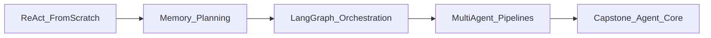

# Part III — Agentic AI: Agents, Memory, Orchestration & Multi-Agent Systems

*Move from single calls to autonomous systems. Build agents that reason, use tools, remember, plan, and collaborate — first from scratch to understand the control loop, then with the orchestration frameworks used in production.*

**Nav:** [README](README.md) · [M8 →](08-ai-agents-fundamentals.md) · [M9](09-agent-memory-planning.md) · [M10](10-agent-orchestration-frameworks.md) · [M11](11-multi-agent-systems.md)

---

## Why this part exists

A RAG call answers one question. An **agent** pursues a goal: retrieve, search, calculate, revise, and stop when done — or when the budget says stop. Without an explicit control loop, “agents” become infinite token sinks and mysterious failure modes.

Part III teaches agency as an engineering discipline: loops with termination, tool contracts, memory, planning, then frameworks (LangGraph) and multi-agent topologies — always with traces and cost caps.

By the end of Module 11 you will have:

1. Built a ReAct agent **from scratch** (no framework).
2. Added conversation + long-term memory and plan-and-execute.
3. Rebuilt the agent as a LangGraph with HITL and checkpoints.
4. Shipped a multi-agent research/content pipeline with per-agent cost reports.

---

## Dependency chain



| Module | What you gain | Hand forward |
| :---- | :---- | :---- |
| **M8** | Agent loop, ReAct, tool rails | Research Assistant + traces |
| **M9** | Memory + planning | Persistent assistant state |
| **M10** | Graphs, HITL, streaming | API-packaged workflow agent |
| **M11** | Multi-agent topologies | Pipeline + cost report |

---

## The autonomy spectrum

```text
Chain / single call  →  Fixed workflow  →  Tool-using agent  →  Multi-agent team
     low autonomy              mid                    high              higher cost/risk
```

**Use an agent when** the tool set and intermediate decisions cannot be fully enumerated at design time.  
**Skip agents when** a fixed pipeline (ingest → retrieve → generate) already meets the SLA — prefer deterministic workflows; add agency only at the decision points that need it.

---

## Carry-forward from Parts I–II

- **Tool schemas** (M3) are the interface contracts agents call.
- **RAG retriever** (M6/M7) is a first-class tool in M8+.
- **VectorStore** (M5) stores long-term memory in M9.
- Context windows still cost money — agents multiply that cost by the step count.

---

## What “good” looks like

| Signal | Weak “agent” | Strong Part III system |
| :---- | :---- | :---- |
| Control | Runs until timeout | Max steps + cost budget + loop detection |
| Tools | Hallucinated calls | Validated schemas; error recovery |
| Observability | Black box | Full step traces |
| Memory | Paste entire chat forever | Summarize + long-term retrieve |
| Multi-agent | More agents “for vibes” | Clear topology + budgets |

You are ready for Module 8 — build the loop by hand before you trust a framework.
