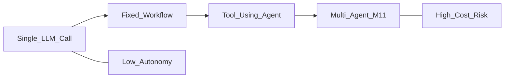
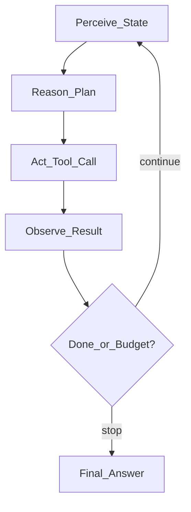
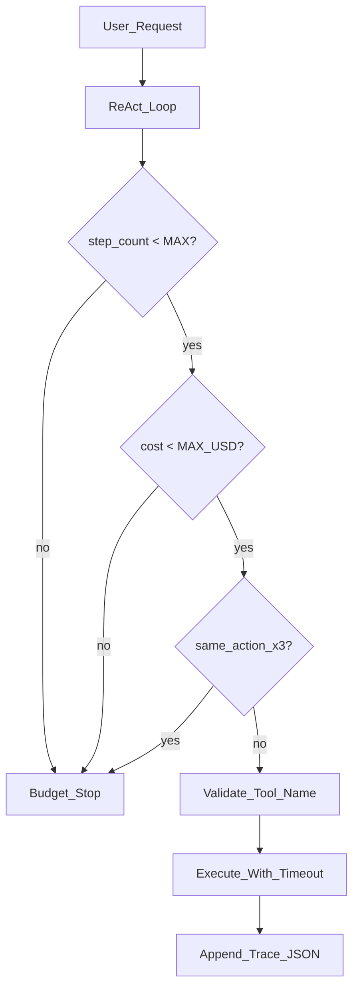
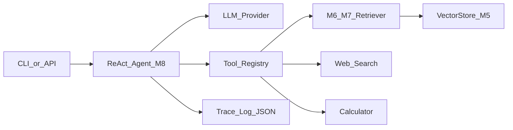

# Module 8: AI Agents — Fundamentals

*Part III — Agentic AI · Duration: **3 days***

**Nav:** [← Part III Overview](00-part-iii-overview.md) · **M8** · [M9 Agent Memory & Planning →](09-agent-memory-planning.md)

---

## Why this matters in production

A RAG call from Module 6 answers one question with one retrieval pass. A **research request** is different: "Compare our SSO policy with industry best practices and cite both internal docs and recent public guidance." That requires deciding *which* tools to call, in *what order*, and when to stop — not a fixed pipeline.

The production failure mode is familiar: an "agent" that loops forever on a malformed tool call, burns $40 in tokens before anyone notices, and returns a confident synthesis with no citations. Your job is not "make it autonomous." Your job is a **control loop with termination**, validated tool contracts, inspectable traces, and honest cost caps — before you trust LangGraph or any other framework to hide the wiring.

---

## Learning objectives

By the end of this module you will be able to:

- Define what an agent is and judge when it is warranted versus a fixed workflow or chain.
- Build a ReAct agent from scratch — LLM plus tool loop, **no framework**.
- Wire three production tools: web search, calculator, and your M6/M7 RAG retriever over AlrightTech Internal Docs.
- Enforce max steps, cost budgets, tool-error recovery, and loop detection.
- Design system prompts and tool descriptions as interface contracts.

---

## Day 1 — Agents, workflows, and the control loop

### 1. Agents vs workflows vs chains



| Pattern | Control flow | Best for |
| :---- | :---- | :---- |
| **Chain** | One prompt → one response | Classification, extraction, single RAG turn |
| **Workflow** | Deterministic DAG: A → B → C | Ingest pipelines, fixed retrieve-then-generate |
| **Agent** | LLM chooses next action until done | Open-ended research, multi-source synthesis |
| **Multi-agent** | Several agents with roles | Pipelines too large for one loop (M11) |

**Use when / skip when — Agents**

- **Use when:** the tool set and intermediate decisions cannot be fully enumerated at design time; the user goal spans multiple information sources; you need the model to *decide* whether to search, calculate, or retrieve.
- **Skip when:** M6 RAG already meets the SLA — ingest → retrieve → generate is faster, cheaper, and easier to eval. Do not wrap a solved pipeline in an agent "for vibes."

### 2. The agent control loop

Every agent — framework or hand-built — implements the same cycle:



| Phase | Responsibility | Owned artifacts |
| :---- | :---- | :---- |
| Perceive | Assemble messages: system contract, history, prior observations | Prompt version, trace log |
| Reason | LLM emits thought + chosen action (ReAct) or structured tool call | Model, temperature |
| Act | Execute tool with validated args | Tool registry, timeouts |
| Observe | Append tool result to scratchpad | Observation formatter |
| Terminate | Max steps, cost cap, loop detection, or explicit FINISH | Budget config |

### 3. When NOT to use an agent (engineering honesty)

Before writing a loop, ask:

1. Can I draw the flowchart without an "LLM decides" diamond? → **Workflow.**
2. Is there exactly one retrieval + one generation? → **RAG (M6).**
3. Will non-determinism block compliance or audit? → **Workflow with HITL (M10).**
4. Does the task need 3+ heterogeneous tools with unknown order? → **Agent.**

AlrightTech example: "What is our PTO accrual policy?" → M6 retriever, no agent. "Summarize our PTO policy and compare it to California labor guidance published this year" → agent with retriever + search tools.

### 4. Minimal state model (Pydantic)

```python
from __future__ import annotations

import os
from enum import Enum
from typing import Any

from pydantic import BaseModel, Field


class StepKind(str, Enum):
    THOUGHT = "thought"
    ACTION = "action"
    OBSERVATION = "observation"
    FINAL = "final"


class AgentStep(BaseModel):
    kind: StepKind
    content: str
    tool_name: str | None = None
    tool_input: dict[str, Any] | None = None


class AgentState(BaseModel):
    question: str
    steps: list[AgentStep] = Field(default_factory=list)
    total_cost_usd: float = 0.0
    step_count: int = 0

    def scratchpad(self) -> str:
        lines: list[str] = []
        for s in self.steps:
            if s.kind == StepKind.THOUGHT:
                lines.append(f"Thought: {s.content}")
            elif s.kind == StepKind.ACTION:
                lines.append(f"Action: {s.tool_name}[{s.tool_input}]")
            elif s.kind == StepKind.OBSERVATION:
                lines.append(f"Observation: {s.content}")
        return "\n".join(lines)


MAX_STEPS = int(os.getenv("AGENT_MAX_STEPS", "8"))
MAX_COST_USD = float(os.getenv("AGENT_MAX_COST_USD", "0.50"))
```

Pin budgets in environment variables. Never hard-code production limits in source.

---

## Day 2 — ReAct from scratch and tool wiring

### 5. The ReAct pattern (Reason + Act)

ReAct interleaves **reasoning traces** with **tool calls**. The model writes what it is thinking, picks a tool, reads the observation, and repeats.

**ReAct scratchpad contract (system prompt excerpt):**

```text
You are the AlrightTech Research Assistant. Answer using tools when needed.

Format each step EXACTLY as:
Thought: <your reasoning>
Action: <tool_name>[<JSON arguments>]

When you have enough evidence, respond with:
Final Answer: <synthesis with inline citations>

Available tools:
- search_web: {"query": "..."} — public web search
- calculator: {"expression": "..."} — safe math eval
- retriever: {"query": "..."} — AlrightTech Internal Docs (M6/M7 RAG)

Rules:
- Cite retriever hits as [chunk_id]. Cite web as [web: title].
- If tools fail, explain and try an alternative once.
- Never invent tool names or chunk_ids.
```

**Use when / skip when — ReAct text format vs native tool calling**

- **Use when:** learning the loop; providers without structured tool APIs; you need human-readable traces in logs.
- **Skip when:** production with OpenAI/Anthropic tool-use APIs — prefer validated JSON schema calls (M3) and map to the same loop.

### 6. Tool registry and the retriever bridge

Your M6/M7 RAG pipeline becomes a **tool**, not the whole app:

```python
from dataclasses import dataclass
from typing import Callable, Protocol


@dataclass
class ToolResult:
    ok: bool
    output: str
    metadata: dict | None = None


class Tool(Protocol):
    name: str
    description: str

    def run(self, **kwargs) -> ToolResult: ...


def make_retriever_tool(store, embed_fn, collection: str, top_k: int = 5) -> Tool:
    """Wrap M6/M7 RAG retrieval as an agent tool."""

    class RetrieverTool:
        name = "retriever"
        description = (
            "Search AlrightTech Internal Docs. Returns ranked chunks with chunk_id, "
            "source path, and text. Use for policies, runbooks, onboarding."
        )

        def run(self, query: str) -> ToolResult:
            vec = embed_fn([query])[0]
            hits = store.query(collection, vec, top_k=top_k)
            if not hits:
                return ToolResult(ok=True, output="No documents matched.", metadata={"hits": []})
            blocks = [
                f"[{h.chunk_id}] (source: {h.metadata.get('source')}, score: {h.score:.2f})\n{h.text}"
                for h in hits
            ]
            return ToolResult(
                ok=True,
                output="\n\n".join(blocks),
                metadata={"hits": [h.chunk_id for h in hits]},
            )

    return RetrieverTool()


def make_calculator_tool() -> Tool:
    import ast
    import operator

    OPS = {
        ast.Add: operator.add,
        ast.Sub: operator.sub,
        ast.Mult: operator.mul,
        ast.Div: operator.truediv,
        ast.Pow: operator.pow,
        ast.USub: operator.neg,
    }

    class CalculatorTool:
        name = "calculator"
        description = "Evaluate a numeric expression, e.g. '(100 * 0.15) + 42'."

        def run(self, expression: str) -> ToolResult:
            try:
                node = ast.parse(expression, mode="eval").body
                value = _eval_ast(node, OPS)
                return ToolResult(ok=True, output=str(value))
            except Exception as exc:
                return ToolResult(ok=False, output=f"Calculator error: {exc}")

    def _eval_ast(node, ops):
        if isinstance(node, ast.Constant) and isinstance(node.value, (int, float)):
            return node.value
        if isinstance(node, ast.BinOp):
            return ops[type(node.op)](_eval_ast(node.left, ops), _eval_ast(node.right, ops))
        if isinstance(node, ast.UnaryOp):
            return ops[type(node.op)](_eval_ast(node.operand, ops))
        raise ValueError("Unsupported expression")

    return CalculatorTool()


def make_search_tool(api_key: str | None = None) -> Tool:
    """Stub — swap for Tavily, SerpAPI, or internal search gateway."""

    class SearchTool:
        name = "search_web"
        description = "Search the public web for recent articles and guidance."

        def run(self, query: str) -> ToolResult:
            # Production: call real search API with api_key from env
            key = api_key or os.getenv("SEARCH_API_KEY")
            if not key:
                return ToolResult(ok=False, output="SEARCH_API_KEY not configured.")
            # ... HTTP call omitted for brevity; return normalized snippets
            return ToolResult(
                ok=True,
                output=f"[web: example] Stub result for query: {query}",
                metadata={"query": query},
            )

    return SearchTool()
```

Register tools in a dict keyed by name. The agent loop resolves `Action: retriever[{"query": "..."}]` to `tools["retriever"].run(query=...)`.

### 7. ReAct loop — no LangGraph

```python
import json
import re

from openai import OpenAI

ACTION_RE = re.compile(r"Action:\s*(\w+)\[(.*)\]", re.DOTALL)
FINAL_RE = re.compile(r"Final Answer:\s*(.*)", re.DOTALL)


def parse_model_output(text: str) -> tuple[str | None, str | None, dict | None]:
    if m := FINAL_RE.search(text):
        return "final", m.group(1).strip(), None
    if m := ACTION_RE.search(text):
        tool_name = m.group(1)
        raw_args = m.group(2).strip()
        try:
            args = json.loads(raw_args)
        except json.JSONDecodeError:
            args = {"query": raw_args.strip('"')}
        return "action", tool_name, args
    thought = text.split("Action:")[0].replace("Thought:", "").strip()
    return "thought", thought, None


def run_react_agent(
    question: str,
    tools: dict[str, Tool],
    llm_client: OpenAI,
    model: str = "gpt-4o-mini",
) -> AgentState:
    state = AgentState(question=question)
    client = llm_client

    while state.step_count < MAX_STEPS and state.total_cost_usd < MAX_COST_USD:
        messages = [
            {"role": "system", "content": SYSTEM_PROMPT},
            {
                "role": "user",
                "content": f"Question: {question}\n\nScratchpad:\n{state.scratchpad()}",
            },
        ]
        resp = client.chat.completions.create(model=model, messages=messages, temperature=0)
        text = resp.choices[0].message.content or ""
        state.total_cost_usd += _estimate_cost(resp)  # implement from usage fields
        state.step_count += 1

        kind, payload, args = parse_model_output(text)

        if kind == "final":
            state.steps.append(AgentStep(kind=StepKind.FINAL, content=payload or ""))
            break
        if kind == "thought":
            state.steps.append(AgentStep(kind=StepKind.THOUGHT, content=payload or ""))
            continue
        if kind == "action":
            tool_name = payload or ""
            if tool_name not in tools:
                obs = f"Unknown tool '{tool_name}'. Available: {list(tools.keys())}"
            else:
                try:
                    result = tools[tool_name].run(**(args or {}))
                    obs = result.output if result.ok else f"Tool error: {result.output}"
                except Exception as exc:
                    obs = f"Tool exception: {exc}"
            state.steps.append(
                AgentStep(
                    kind=StepKind.ACTION,
                    content="",
                    tool_name=tool_name,
                    tool_input=args,
                )
            )
            state.steps.append(AgentStep(kind=StepKind.OBSERVATION, content=obs))

        if _detect_loop(state):
            state.steps.append(
                AgentStep(
                    kind=StepKind.FINAL,
                    content="Stopped: repeated action loop detected.",
                )
            )
            break
    else:
        state.steps.append(
            AgentStep(
                kind=StepKind.FINAL,
                content="Stopped: step or cost budget exhausted.",
            )
        )
    return state


def _detect_loop(state: AgentState, window: int = 3) -> bool:
    actions = [
        (s.tool_name, json.dumps(s.tool_input, sort_keys=True))
        for s in state.steps
        if s.kind == StepKind.ACTION
    ]
    if len(actions) < window:
        return False
    return len(set(actions[-window:])) == 1
```

This is the loop LangGraph will later encode as nodes and edges (M10). Understand it here first.

### 8. Prompt contracts: tools as API documentation

Tool descriptions are not marketing copy. They are **interface docs** the model reads instead of OpenAPI.

| Field | Purpose | Example |
| :---- | :---- | :---- |
| `name` | Stable identifier | `retriever` |
| `description` | When to use / not use | "Internal AlrightTech docs only; not for public law" |
| Args schema | Types and constraints | `query: str, max 200 chars` |
| Error shape | What observation looks like on failure | `"No documents matched."` |

Version the system prompt (`research-agent-v1`). When retrieval quality shifts after M7, update the retriever tool description — not the whole agent persona.

**Use when / skip when — Verbose tool descriptions**

- **Use when:** tools overlap (search vs retriever) or models pick the wrong tool often.
- **Skip when:** descriptions exceed ~150 tokens each — trim and add few-shot traces instead.

---

## Day 3 — Guardrails, traces, and the mini project

### 9. Guardrails stack



| Guardrail | Default (dev) | Production guidance |
| :---- | :---- | :---- |
| Max steps | 8 | 5–12 by task complexity |
| Cost budget | $0.50 | Per-request cap + daily org cap |
| Loop detection | Same tool+args ×3 | Hash (tool, canonical args) |
| Tool timeout | 10s | 5–30s by dependency SLA |
| Unknown tool | Observation error | Never crash the loop |

### 10. Execution traces (non-negotiable)

Every agent response ships a trace:

```json
{
  "question": "Compare our SSO policy with current best practices",
  "prompt_version": "research-agent-v1",
  "steps": [
    {"kind": "action", "tool": "retriever", "input": {"query": "SSO policy"}},
    {"kind": "observation", "preview": "[onboarding/sso.md#c012] ..."},
    {"kind": "action", "tool": "search_web", "input": {"query": "SSO best practices 2026"}},
    {"kind": "final", "preview": "AlrightTech requires ... [onboarding/sso.md#c012]"}
  ],
  "step_count": 4,
  "total_cost_usd": 0.08,
  "stop_reason": "final_answer"
}
```

Store traces alongside M6 RAG traces. When leadership asks "why did it say that?", you answer from the scratchpad — not from vibes.

### 11. Failure modes (with a debug playbook)

| Failure | Symptom | Where to look | First fix |
| :---- | :---- | :---- | :---- |
| **Infinite loop** | Same tool until budget | Trace action sequence | Loop detection; tighten prompt "try at most once" |
| **Hallucinated tool** | `Action: fetch_url[...]` | Parser + registry | Return observation listing valid tools |
| **Wrong tool choice** | Web search for internal policy | Tool descriptions | Clarify retriever vs search; add negative examples |
| **Retriever ignored** | Generic answer, no chunk_ids | Trace missing retriever call | System rule: "call retriever before citing internal policy" |
| **Cost blow-up** | $2+ per request | `step_count`, long observations | Trim observation size; lower max steps |
| **Malformed Action line** | Parser falls through to thought | Raw LLM output in trace | Few-shot ReAct examples; lower temperature |

**Debug order:** trace → tool registry → retriever hits → prompt version → model change.

---

## Engineering decision guide

| Decision | Guidance |
| :---- | :---- |
| Agent vs RAG | Default to M6 RAG; add agent only when tool order is unknown |
| ReAct format | Text ReAct for learning; native tool calls for production |
| Tool count | Start with 3; every new tool increases mispick rate |
| Observations | Truncate to token budget (e.g. 2k chars); link full payload in trace |
| Retriever | Reuse M6/M7 pipeline unchanged; agent adds routing, not new index |
| Framework | **No LangGraph in M8** — hand-built loop only |

---

## Failure modes & diagnostics (ops view)

1. **Agent answers without calling retriever on doc questions** — add explicit policy in system prompt; eval with golden "must call retriever" set.
2. **Steps exhausted before Final Answer** — increase max steps slightly or improve tool latency; check for retry loops.
3. **Calculator or search stub in prod** — env misconfig; fail fast at startup if `SEARCH_API_KEY` missing when search enabled.
4. **Citations don't match retriever metadata** — post-validate `[chunk_id]` against last retriever observation (reuse M6 validator).

---

## Hands-on labs

### Lab 8.1 — Minimal ReAct loop

**Steps**

1. Implement `AgentState`, parser, and loop without any framework.
2. Single mock tool (`echo`) that returns its input.
3. Log every step to stdout and JSON file.

**Acceptance**

- [ ] Loop terminates on `Final Answer:` or max steps.
- [ ] Trace JSON written per run.

### Lab 8.2 — Three-tool agent

**Steps**

1. Wire `search_web`, `calculator`, and `retriever` (AlrightTech Internal Docs via M5 store).
2. Run five questions that require different tool combinations.
3. Print scratchpad after each run.

**Acceptance**

- [ ] Retriever returns real `chunk_id`s from your M6 corpus.
- [ ] At least one question uses two distinct tools.

### Lab 8.3 — Guardrails

**Steps**

1. Add max steps, cost estimate, and loop detection.
2. Deliberately prompt a loop (e.g. "keep searching until you find X").
3. Confirm clean stop with reason in trace.

**Acceptance**

- [ ] Loop detection fires with documented `stop_reason`.
- [ ] No unhandled exceptions on unknown tool names.

### Lab 8.4 — Retriever tool integration

**Steps**

1. Expose your M6/M7 RAG as `make_retriever_tool(...)`.
2. Ask an internal policy question; verify agent cites retrieved chunks.
3. Ask an out-of-corpus question; agent should search or refuse — not invent policy.

**Acceptance**

- [ ] Internal question trace shows retriever call before citations.
- [ ] No hallucinated AlrightTech `chunk_id`s.

---

## Mini project — Research Assistant Agent

### Spec

An agent that, given a research question:

1. Plans implicitly via ReAct (which tools, in what order).
2. Searches **AlrightTech Internal Docs** (retriever) and the **public web** (search).
3. Uses **calculator** when numeric comparison is needed.
4. Returns a **cited synthesis** with inline `[chunk_id]` and `[web: ...]` references.
5. Enforces **step and cost limits** with full **execution traces**.

### Architecture sketch



### Definition of done

- [ ] Hand-built ReAct loop — no LangGraph.
- [ ] Three tools registered with versioned descriptions.
- [ ] Retriever uses M5 `VectorStore` + M6/M7 retrieval config on AlrightTech Internal Docs.
- [ ] Max steps, cost budget, loop detection configured via env vars.
- [ ] Trace JSON per request with `stop_reason`.
- [ ] README: example questions, env vars (`OPENAI_API_KEY`, `SEARCH_API_KEY`, `AGENT_MAX_STEPS`).

### Rubric

| Criterion | Weight | Excellent |
| :---- | :---- | :---- |
| Control loop | 35% | Clean ReAct parse; reliable termination; loop detection works |
| Tool integration | 35% | Retriever cites real chunks; search/calc used appropriately |
| Observability | 30% | Full traces; prompt version pinned; costs estimated per run |

---

## Bridge to Module 9

Your Research Assistant can **act** but forgets everything on the next message. It also replans from scratch every time — no task decomposition, no persistent user facts.

Module 9 adds:

- **Short-term memory** — buffering, summarization, sliding windows across multi-turn chat.
- **Long-term memory** — user preferences and facts in M5 `VectorStore`.
- **Planning** — plan-and-execute, reflection, and persistence/checkpoints.

Hand forward from M8:

- Tool registry + retriever wrapper (unchanged).
- Trace schema (extend with memory reads/writes in M9).
- Env budget vars (reuse for planning steps).

Build the loop by hand here. In Module 10 you will rebuild the same agent as a LangGraph state machine — and you will know exactly what the framework is doing.
