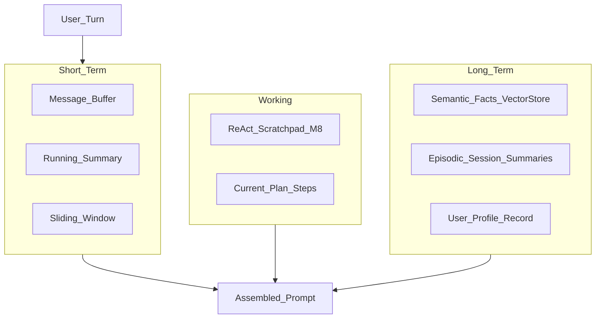
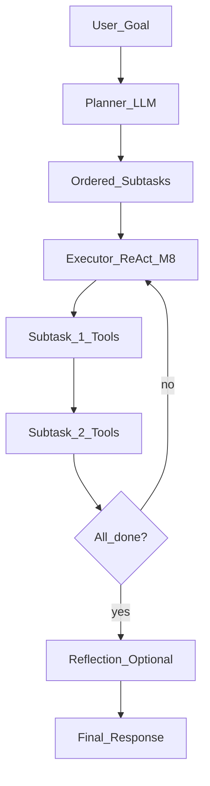
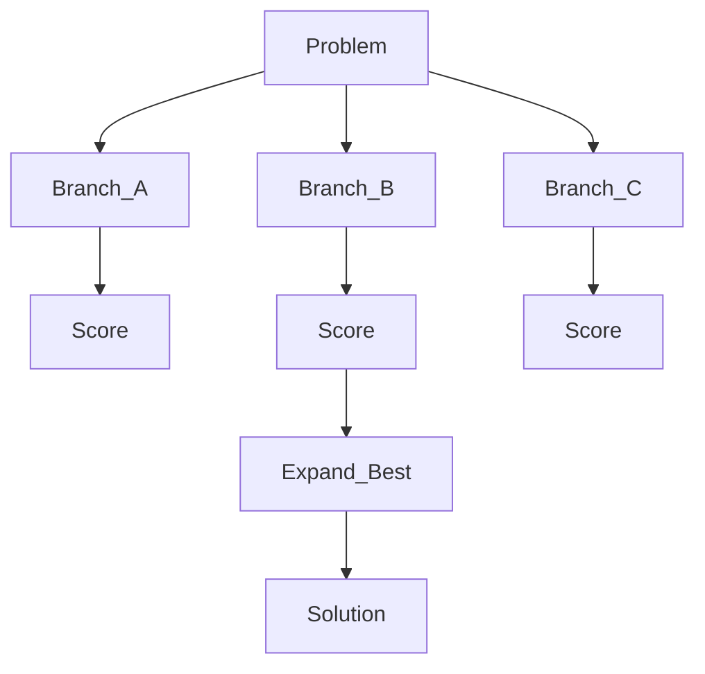
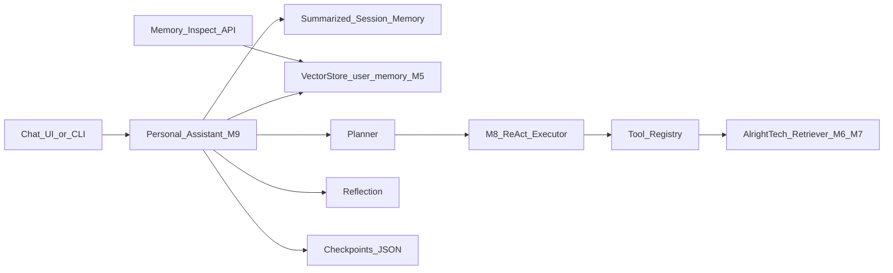

# Module 9: Agent Memory & Planning

*Part III — Agentic AI · Duration: **2 days***

**Nav:** [← M8 AI Agents Fundamentals](08-ai-agents-fundamentals.md) · **M9** · [M10 Agent Orchestration →](10-agent-orchestration-frameworks.md)

---

## Why this matters in production

Your M8 Research Assistant resets every request. It cannot remember that the user prefers bullet summaries, that they already asked about SSO yesterday, or that a multi-step goal ("book the offsite, draft the agenda, email the team") requires **ordered subtasks** — not one giant ReAct scramble.

The production failure mode: paste the entire chat history into every prompt until you hit the context window, then silently drop the oldest messages — including the user's allergy constraint or the CEO's name spelling. Or worse: summarize aggressively and lose the one fact that mattered.

Your job is **memory as engineering**: explicit buffers, summarization with audit trails, long-term retrieval from M5 `VectorStore`, context budgets, and planning patterns that decompose goals before the tool loop burns your step cap.

---

## Learning objectives

By the end of this module you will be able to:

- Distinguish short-term, working, and long-term memory — and what belongs in each.
- Implement conversation buffering, summarization, and sliding-window strategies.
- Store and retrieve user facts across sessions with vector memory (M5 `VectorStore`).
- Budget context windows deliberately instead of stuffing history.
- Build plan-and-execute and reflection steps; explain tree-of-thought at a high level.
- Persist agent state with checkpoints for resumable runs.

---

## Day 1 — Memory types and context engineering

### 1. Memory taxonomy



| Memory type | Lifetime | Storage | Example |
| :---- | :---- | :---- | :---- |
| **Short-term** | Current session | In-process list / summary string | Last 6 turns of chat |
| **Working** | Current task | Agent scratchpad + plan | ReAct steps, subtask list |
| **Long-term (semantic)** | Cross-session | M5 `VectorStore` | "User prefers Markdown tables" |
| **Long-term (episodic)** | Cross-session | DB or vector index | "2026-03-10: discussed Q2 offsite" |
| **Profile** | Cross-session | Structured record | Name, role, timezone, prefs |

Memory is **not** the context window. The window is a **budget**; memory systems decide what gets compiled into it.

### 2. Conversation buffering (baseline)

The simplest strategy: keep the last *N* message pairs.

```python
from __future__ import annotations

from pydantic import BaseModel, Field


class ChatMessage(BaseModel):
    role: str  # "user" | "assistant" | "system"
    content: str


class BufferMemory(BaseModel):
    max_turns: int = 6
    messages: list[ChatMessage] = Field(default_factory=list)

    def append(self, role: str, content: str) -> None:
        self.messages.append(ChatMessage(role=role, content=content))
        # Keep system messages + last N user/assistant pairs
        non_system = [m for m in self.messages if m.role != "system"]
        if len(non_system) > self.max_turns * 2:
            drop = len(non_system) - self.max_turns * 2
            trimmed: list[ChatMessage] = [m for m in self.messages if m.role == "system"]
            trimmed.extend(non_system[drop:])
            self.messages = trimmed

    def as_openai_messages(self) -> list[dict[str, str]]:
        return [{"role": m.role, "content": m.content} for m in self.messages]
```

**Use when / skip when — Raw buffering**

- **Use when:** sessions stay under ~10 turns; debugging memory behavior; low stakes.
- **Skip when:** dialogues exceed 20 turns — you will drop early constraints. Move to summarization or sliding window.

### 3. Summarization-based memory

Periodically compress older turns into a running summary. Keep recent turns verbatim.

```python
SUMMARIZE_PROMPT = """\
Summarize the conversation so far for future context.
Preserve: user preferences, names, decisions, open tasks, constraints.
Omit: pleasantries, repeated questions already resolved.
Existing summary (may be empty):
{existing}

New messages to merge:
{new_messages}

Updated summary:"""


def update_summary(
    existing: str,
    new_messages: list[ChatMessage],
    llm_call,
) -> str:
    block = "\n".join(f"{m.role}: {m.content}" for m in new_messages)
    prompt = SUMMARIZE_PROMPT.format(existing=existing or "(none)", new_messages=block)
    return llm_call(prompt).strip()


class SummarizedMemory(BaseModel):
    summary: str = ""
    recent: list[ChatMessage] = Field(default_factory=list)
    summarize_every: int = 4  # turns

    def maybe_summarize(self, llm_call) -> None:
        user_assistant = [m for m in self.recent if m.role in ("user", "assistant")]
        if len(user_assistant) >= self.summarize_every * 2:
            to_fold = user_assistant[: self.summarize_every * 2]
            self.summary = update_summary(self.summary, to_fold, llm_call)
            self.recent = [m for m in self.recent if m not in to_fold]

    def compile(self) -> str:
        parts = []
        if self.summary:
            parts.append(f"Conversation summary:\n{self.summary}")
        if self.recent:
            parts.append(
                "Recent messages:\n"
                + "\n".join(f"{m.role}: {m.content}" for m in self.recent)
            )
        return "\n\n".join(parts)
```

Log summary versions (`memory-summary-v3`) so you can replay what the model "remembered" when it forgets a preference.

**Use when / skip when — Summarization**

- **Use when:** long support sessions; cost of full history exceeds ~4k tokens.
- **Skip when:** legal/medical-adjacent threads requiring verbatim retention — store full transcript externally; don't rely on LLM summary alone.

### 4. Sliding window with token budget

Combine a char/token estimator with priority slots:

```python
def estimate_tokens(text: str) -> int:
    return max(1, len(text) // 4)


class ContextBudget(BaseModel):
    max_tokens: int = 8_000
    reserved_for_tools: int = 2_000
    reserved_for_system: int = 800

    def available_for_memory(self) -> int:
        return self.max_tokens - self.reserved_for_tools - self.reserved_for_system


def pack_memory(
    system: str,
    memory_block: str,
    working_scratchpad: str,
    budget: ContextBudget,
) -> str:
    """Drop oldest lines from memory_block until under budget."""
    parts = [("system", system), ("memory", memory_block), ("working", working_scratchpad)]
    total = sum(estimate_tokens(p[1]) for p in parts)
    avail = budget.available_for_memory()
    if total <= avail + budget.reserved_for_system:
        return memory_block
    lines = memory_block.split("\n")
    while lines and estimate_tokens("\n".join(lines)) > avail:
        lines.pop(0)
    return "\n".join(lines)
```

Priority order when packing (never drop first):

1. System contract + safety rules
2. Long-term retrieved facts (user-specific)
3. Running summary
4. Recent verbatim turns
5. Working scratchpad (current ReAct steps)

### 5. Long-term memory with M5 VectorStore

Reuse the same `VectorStore` abstraction from Module 5 — separate **collection** from doc RAG:

```python
import os
import uuid
from datetime import datetime, timezone

from pydantic import BaseModel

# Reuse M5 types: VectorRecord, SearchHit from your vector_store module


class MemoryFact(BaseModel):
    fact_id: str
    user_id: str
    text: str
    category: str  # preference | profile | episodic
    created_at: str


MEMORY_COLLECTION = os.getenv("MEMORY_COLLECTION", "user_memory")


def write_memory(
    store,
    embed_fn,
    user_id: str,
    text: str,
    category: str = "preference",
) -> str:
    fact_id = f"{user_id}#{uuid.uuid4().hex[:8]}"
    vec = embed_fn([text])[0]
    record = VectorRecord(
        chunk_id=fact_id,
        text=text,
        embedding=vec,
        metadata={
            "user_id": user_id,
            "category": category,
            "created_at": datetime.now(timezone.utc).isoformat(),
        },
    )
    store.upsert(MEMORY_COLLECTION, [record])
    return fact_id


def recall_memories(
    store,
    embed_fn,
    user_id: str,
    query: str,
    top_k: int = 5,
) -> list[SearchHit]:
    vec = embed_fn([query])[0]
    return store.query(
        MEMORY_COLLECTION,
        vec,
        top_k=top_k,
        filters={"user_id": user_id},
    )


def format_memory_hits(hits: list[SearchHit]) -> str:
    if not hits:
        return "No relevant long-term memories."
    return "Known about this user:\n" + "\n".join(
        f"- [{h.chunk_id}] {h.text} (score: {h.score:.2f})" for h in hits
    )
```

**Write triggers:** explicit ("remember that I prefer bullet points"), implicit (extract after session — M12 eval territory), or tool (`save_memory` the agent calls).

**Use when / skip when — Vector long-term memory**

- **Use when:** preferences, standing facts, episodic "what we discussed" retrieval.
- **Skip when:** secrets, credentials, or PCI — never embed API keys "for convenience."

Wire memory **read** into the M8 agent prompt before the ReAct loop:

```python
def build_agent_context(user_id: str, question: str, session_memory: SummarizedMemory, store, embed_fn) -> str:
    hits = recall_memories(store, embed_fn, user_id, question)
    long_term = format_memory_hits(hits)
    short_term = session_memory.compile()
    return f"{long_term}\n\n{short_term}\n\nCurrent question: {question}"
```

---

## Day 2 — Planning, reflection, and persistence

### 6. Plan-and-execute pattern

For complex goals, **plan first**, then execute steps with the M8 tool loop.



```python
import json

from pydantic import BaseModel


class PlanStep(BaseModel):
    id: int
    description: str
    status: str = "pending"  # pending | running | done | failed


class TaskPlan(BaseModel):
    goal: str
    steps: list[PlanStep]


PLANNER_PROMPT = """\
Decompose this goal into 3-7 ordered, actionable subtasks.
Return JSON: {"steps": [{"id": 1, "description": "..."}, ...]}
Goal: {goal}
"""


def create_plan(goal: str, llm_call) -> TaskPlan:
    raw = llm_call(PLANNER_PROMPT.format(goal=goal))
    data = json.loads(raw)
    steps = [PlanStep(**s) for s in data["steps"]]
    return TaskPlan(goal=goal, steps=steps)


def run_plan_and_execute(
    plan: TaskPlan,
    run_subtask,
) -> TaskPlan:
    for step in plan.steps:
        step.status = "running"
        result = run_subtask(step.description)  # wraps M8 ReAct for one subtask
        step.status = "done" if result.ok else "failed"
        if step.status == "failed":
            break
    return plan
```

Each subtask gets its **own** scratchpad and step budget — prevents one subtask from consuming all 8 steps.

**Use when / skip when — Plan-and-execute**

- **Use when:** 3+ distinct phases (research → draft → review); user goal reads like a checklist.
- **Skip when:** single-shot lookup ("what is our PTO policy?") — planner adds latency and cost.

### 7. Reflection and self-critique

After a draft answer or completed plan, a **critic** pass checks quality before the user sees output.

```python
REFLECT_PROMPT = """\
You are a critic. Review the draft against the original goal.
List specific issues (missing citations, wrong tone, factual gaps).
If acceptable, respond: APPROVED
Otherwise respond: REVISE followed by bullet fixes.

Goal: {goal}
Draft: {draft}
"""


def reflect_and_revise(goal: str, draft: str, llm_call, max_rounds: int = 2) -> str:
    current = draft
    for _ in range(max_rounds):
        verdict = llm_call(REFLECT_PROMPT.format(goal=goal, draft=current))
        if verdict.strip().startswith("APPROVED"):
            return current
        revise_prompt = f"Revise the draft addressing:\n{verdict}\n\nDraft:\n{current}"
        current = llm_call(revise_prompt)
    return current
```

Reflection costs extra tokens — cap rounds (1–2) and skip for low-stakes chat.

**Use when / skip when — Reflection**

- **Use when:** external-facing content; multi-source synthesis; user asked for high accuracy.
- **Skip when:** latency-sensitive UI; trivial FAQ — reflection doubles time-to-first-token.

### 8. Tree-of-thought (overview only)

**Tree-of-thought (ToT)** explores multiple reasoning branches, scores them, and expands the best — search over thoughts, not just one ReAct chain.



| Aspect | ReAct (M8) | Plan-and-execute (M9) | ToT |
| :---- | :---- | :---- | :---- |
| Branching | Single path | Linear subtasks | Multiple parallel thoughts |
| Cost | Moderate | Moderate–high | High (× branches) |
| Fit | Tool use | Structured projects | Puzzle-like reasoning |

This course treats ToT as **awareness**, not a lab requirement. Reach for it when benchmarks show single-path agents stuck on combinatorial planning — not for doc Q&A.

### 9. Persistence and checkpoints

Durable state lets agents **resume** after crash, deploy, or human approval (M10 HITL).

```python
import json
from pathlib import Path


class Checkpoint(BaseModel):
    session_id: str
    user_id: str
    plan: TaskPlan | None = None
    memory_summary: str = ""
    agent_steps: list[dict] = Field(default_factory=list)
    version: int = 1


def save_checkpoint(path: Path, ckpt: Checkpoint) -> None:
    path.parent.mkdir(parents=True, exist_ok=True)
    path.write_text(ckpt.model_dump_json(indent=2), encoding="utf-8")


def load_checkpoint(path: Path) -> Checkpoint | None:
    if not path.exists():
        return None
    return Checkpoint.model_validate_json(path.read_text(encoding="utf-8"))
```

Store under `state/checkpoints/{session_id}.json`. Module 10 moves this to LangGraph's checkpoint backend — same concepts, better tooling.

**Checkpoint contents:** plan progress, memory summary, incomplete scratchpad — not full embedding indexes (those live in M5).

### 10. Memory inspection view (product requirement)

Your Personal Assistant mini project must expose **what the agent remembers**:

```python
def list_user_memories(store, user_id: str, limit: int = 50) -> list[dict]:
    # Implementation depends on store backend — query by metadata filter
    # Return fact_id, text, category, created_at for UI table
    ...
```

Transparency reduces "creepy black box" support tickets and makes wrong memories debuggable.

---

## Engineering decision guide

| Decision | Guidance |
| :---- | :---- |
| Buffer vs summarize | Buffer ≤10 turns; summarize for longer sessions |
| Long-term store | M5 `VectorStore`, separate `user_memory` collection |
| When to write memory | Explicit user ask + high-confidence extractions only |
| Context budget | Reserve 25–30% for tools + system; measure with real traces |
| Planning | Plan-and-execute for 3+ phase goals; else M8 ReAct only |
| Reflection | 1–2 rounds max; skip on simple retrieval |
| Checkpoints | JSON files in M9; LangGraph saver in M10 |

---

## Failure modes & diagnostics

| Failure | Symptom | Where to look | First fix |
| :---- | :---- | :---- | :---- |
| **Lost preference** | User repeats "I told you already" | Summary log; dropped buffer | Lower summarize aggressiveness; write to long-term |
| **Wrong memory retrieved** | Irrelevant old fact injected | Recall hits + scores | Raise score floor; tag categories; decay old facts |
| **Memory pollution** | Agent saves nonsense | `write_memory` call sites | Gate writes behind explicit tool or confidence |
| **Plan drift** | Subtasks don't match goal | Planner JSON vs executions | Re-plan after failed subtask; shorten plan length |
| **Reflection loop** | Never APPROVED | Reflect trace | Cap rounds; soften critic prompt |
| **Checkpoint stale** | Resumed agent repeats work | `step.status` in checkpoint | Mark subtasks done atomically before save |

**Debug order:** memory inspection UI → summary text → recall hits → plan status → checkpoint file.

---

## Hands-on labs

### Lab 9.1 — Summarization memory

**Steps**

1. Add `SummarizedMemory` to your M8 agent.
2. Run a 12-turn scripted dialogue (preferences + task constraints).
3. Confirm early preferences survive in summary after recent turns grow.

**Acceptance**

- [ ] Summary version logged after each fold.
- [ ] Preference from turn 2 still present at turn 12.

### Lab 9.2 — Long-term vector memory

**Steps**

1. Create `user_memory` collection in M5 store.
2. Implement `write_memory` and `recall_memories` with `user_id` filter.
3. Session A: "Remember I prefer bullet summaries." Session B (new process): ask for a summary — verify recall.

**Acceptance**

- [ ] Memory persists across restarted Python process.
- [ ] Recall returns the stored preference with score logged.

### Lab 9.3 — Plan-and-execute

**Steps**

1. Planner decomposes: "Research our deploy rollback runbook and draft a one-paragraph exec summary."
2. Executor runs M8 ReAct per subtask with isolated step budgets.
3. Log plan JSON and per-subtask traces.

**Acceptance**

- [ ] ≥2 subtasks executed in order.
- [ ] Failed subtask stops plan with `status: failed`.

### Lab 9.4 — Reflection pass

**Steps**

1. Generate draft answer without citations.
2. Run reflection; confirm REVISE triggers citation fix.
3. Cap at 2 rounds; log APPROVED or final best-effort.

**Acceptance**

- [ ] Critic identifies missing citations in test case.
- [ ] Revised draft includes `[chunk_id]` from retriever.

---

## Mini project — Personal Assistant with Memory

### Spec

A multi-turn assistant that:

1. **Remembers** user preferences and facts **across sessions** (M5 long-term memory).
2. **Plans** multi-step tasks with plan-and-execute.
3. **Reflects** on drafts before returning high-stakes answers.
4. Exposes a **memory-inspection view** (CLI table or API endpoint) listing stored facts by `user_id`.
5. Reuses M8 tool registry (retriever over AlrightTech Internal Docs, search, calculator).

### Architecture sketch



### Definition of done

- [ ] Multi-turn chat with summarization-based short-term memory.
- [ ] Long-term facts written and recalled per `user_id`.
- [ ] Plan-and-execute for goals with 3+ subtasks demonstrated once.
- [ ] Reflection on at least one multi-source draft.
- [ ] Memory inspection lists fact_id, text, category, created_at.
- [ ] Checkpoint save/load demonstrated for interrupted plan.
- [ ] README documents memory collections, env vars, and inspection command.

### Rubric

| Criterion | Weight | Excellent |
| :---- | :---- | :---- |
| Memory correctness | 35% | Preferences persist across sessions; recall relevant; inspection accurate |
| Planning | 30% | Ordered subtasks; isolated budgets; clean failure on subtask error |
| Integration | 20% | M8 tools + M5 store + M6 retriever compose without duplication |
| Transparency | 15% | Summary versions + memory view + checkpoint files for debug |

---

## Bridge to Module 10

Your Personal Assistant now has memory and planning — but the control flow lives in ad-hoc Python: nested loops, manual checkpoint files, no streaming, no human-in-the-loop.

Module 10 **rebuilds the M8 agent in LangGraph**:

- Explicit **state graph** (nodes, edges, cycles).
- **Human-in-the-loop** interrupts before writes or external side effects.
- **Durable checkpoints** with framework-backed persistence.
- **Streaming** tokens and tool events to the UI.

Hand forward from M9:

- `SummarizedMemory.compile()` → graph state field `conversation_context`
- `user_memory` collection + recall/format helpers (unchanged)
- `TaskPlan` schema → planner node output
- Checkpoint JSON shape → reference when mapping to LangGraph checkpointer

You built the loop and memory by hand so Module 10's abstractions are choices — not magic.
