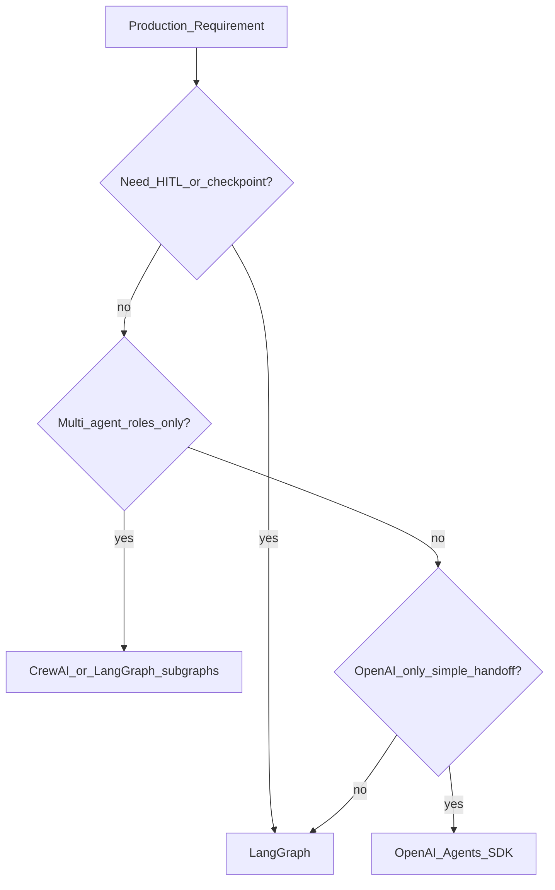
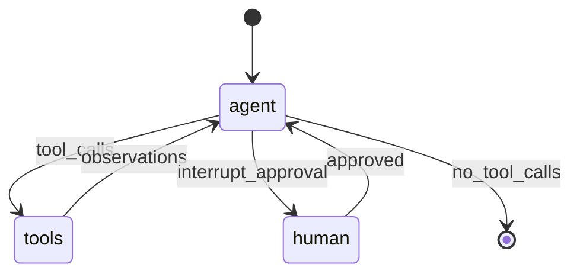
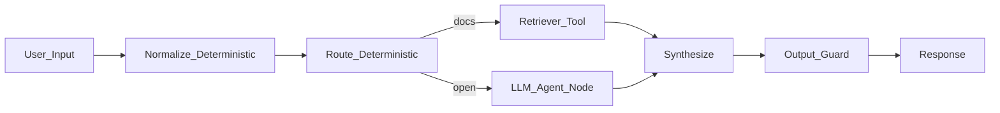
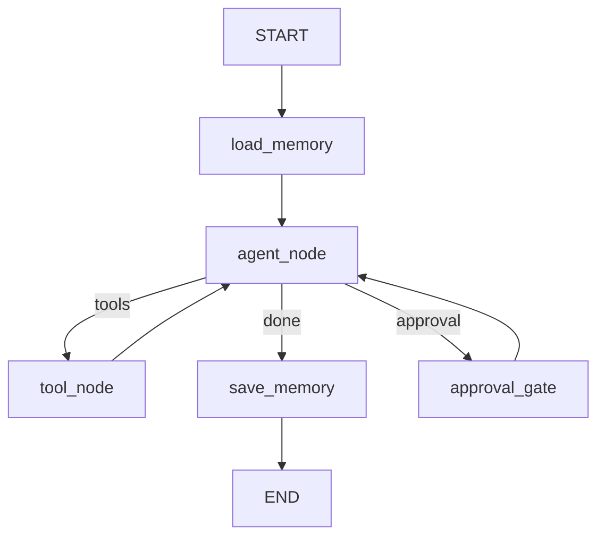

# Module 10: Agent Orchestration Frameworks

*Part III — Agentic AI · Duration: **2 days***

**Nav:** [← M9 Memory & Planning](09-agent-memory-planning.md) · **M10** · [M11 Multi-Agent →](11-multi-agent-systems.md) · [Part overview](00-part-iii-overview.md)

---

## Why this matters in production

Your Module 8 Research Assistant works — until you need to **pause for approval**, **resume after a crash**, **stream partial progress to the UI**, or **branch** on structured outcomes (e.g., "needs human review" vs "auto-answer"). Hand-rolled `while` loops with global state become brittle: thread IDs get lost, interrupts race with tool calls, and nobody can replay what happened at step 7.

Orchestration frameworks exist to make **control flow explicit**. LangGraph (and peers) model agents as **state machines on a graph**: nodes are steps, edges are transitions, and state is a typed object you can checkpoint, inspect, and stream. That is the difference between a demo script and something you can ship behind FastAPI with HITL and audit trails.

This module rebuilds your M8/M9 Research Assistant in **LangGraph** and produces the **Orchestrated Workflow Agent** — the API-packaged agent core for your capstone.

---

## Learning objectives

By the end of this module you will be able to:

- Choose an orchestration framework for a given autonomy and compliance profile.
- Model agent workflows as graphs with typed state, branching, and termination.
- Implement human-in-the-loop interrupts, approvals, and checkpoint resume.
- Stream graph events to clients and combine deterministic steps with LLM nodes.
- Port the M8 Research Assistant into LangGraph without losing tool contracts or traces.

---

## Day 1 — Why frameworks, landscape, graphs as state machines

### 1. When a framework earns its keep

You built ReAct from scratch in M8 to **understand** the loop. Frameworks are worth adopting when you need:

| Capability | Hand-rolled pain | Framework value |
| :---- | :---- | :---- |
| **Branching** | Nested `if` + scattered flags | Conditional edges on graph |
| **HITL pause** | Custom event queues, lost context | `interrupt()` + resume from checkpoint |
| **Durability** | Reconstruct state from logs | Persisted checkpoints per `thread_id` |
| **Streaming** | Manual yield plumbing | Native `stream()` / `astream_events` |
| **Multi-agent** (M11) | Ad-hoc message buses | Subgraphs, handoffs, supervisors |

**Use when:** production needs interrupts, replay, branching, or multi-step workflows with observability.  
**Skip when:** a single linear ReAct loop with no pause/resume — keep M8's minimal loop until requirements grow.

### 2. Landscape — pick the right abstraction

| Framework | Core model | Strengths | Trade-offs | Course role |
| :---- | :---- | :---- | :---- | :---- |
| **LangGraph** | Stateful directed graph; nodes + edges | HITL, checkpointing, streaming, subgraphs; LangChain ecosystem | Learning curve; verbose for trivial chains | **PRIMARY** — M10–M11, capstone |
| **OpenAI Agents SDK** | Agent + handoff + guardrails | Tight OpenAI integration; simple handoffs | Less graph-native; vendor coupling | Compare handoffs in M11 |
| **CrewAI** | Role-based crews & tasks | Fast multi-agent prototypes; readable YAML/Python roles | Less fine-grained state control | M11 topology contrast |
| **AutoGen** | Conversable agents, group chat | Research-style multi-agent dialogue | Heavier runtime; chat-centric | Awareness only |
| **LlamaIndex agents** | Agent workflows over indexes | Strong when retrieval is the spine | Overlap with your M6/M7 stack | Retriever-as-tool pattern |
| **Pydantic AI** | Type-safe agents + validation | Excellent structured outputs & tool typing | Smaller orchestration surface | Complements M3 schemas |

**Default for this course:** LangGraph. Use others to understand **patterns** (handoff, crew, debate), not to split your capstone across three stacks.



### 3. Graphs are state machines

A LangGraph workflow is not "LangChain with extra steps." It is a **state machine**:

- **State** — a typed dict or dataclass (messages, plan, tool results, flags).
- **Nodes** — functions that read state and return partial updates.
- **Edges** — fixed or conditional transitions (`route_after_tools`).
- **Reducer** — how lists merge (e.g., `messages` append via `add_messages`).



**Use when / skip when — Graph vs loop**

- **Use when:** you can draw the workflow on a whiteboard with ≤10 nodes and named branches.
- **Skip when:** behavior is one ReAct cycle with no branches — graph overhead buys nothing.

### 4. Minimal LangGraph — ReAct as a graph

This mirrors M8's Research Assistant tools (`search_docs`, `web_search`) without the framework magic:

```python
from typing import Annotated, Literal, TypedDict
from langgraph.graph import StateGraph, START, END
from langgraph.graph.message import add_messages
from langgraph.checkpoint.memory import MemorySaver
from langchain_core.messages import AIMessage, HumanMessage, ToolMessage

class AgentState(TypedDict):
    messages: Annotated[list, add_messages]
    step_count: int
    total_cost_usd: float

MAX_STEPS = 8

def agent_node(state: AgentState, llm_with_tools):
    response = llm_with_tools.invoke(state["messages"])
    return {
        "messages": [response],
        "step_count": state["step_count"] + 1,
    }

def should_continue(state: AgentState) -> Literal["tools", "end", "limit"]:
    if state["step_count"] >= MAX_STEPS:
        return "limit"
    last = state["messages"][-1]
    if isinstance(last, AIMessage) and last.tool_calls:
        return "tools"
    return "end"

def build_research_graph(llm_with_tools, tool_node):
    g = StateGraph(AgentState)
    g.add_node("agent", lambda s: agent_node(s, llm_with_tools))
    g.add_node("tools", tool_node)
    g.add_edge(START, "agent")
    g.add_conditional_edges("agent", should_continue, {
        "tools": "tools", "end": END, "limit": END
    })
    g.add_edge("tools", "agent")
    return g.compile(checkpointer=MemorySaver())
```

Carry forward from M8: same tool schemas, same max-step guard, same trace logging — the graph only **structures** what you already proved.

### 5. Hybrid deterministic + autonomous

Production systems rarely go "full agent." Prefer **deterministic nodes** for anything you can specify:

| Node type | Example | Why deterministic |
| :---- | :---- | :---- |
| **Preprocessor** | PII redaction, query normalization | Compliance; no model variance |
| **Router** | Intent → `retrieve` vs `escalate` | Cheaper than LLM routing at scale |
| **Post-validator** | JSON schema check on tool args | Block bad calls before execution |
| **Autonomous** | ReAct agent node | Open-ended research |



**Use when / skip when — Hybrid**

- **Use when:** 60–80% of steps are known (ingest, retrieve, validate) and 20–40% need judgment.
- **Skip when:** every step is exploratory — but then budget harder (M11 cost pitfalls).

---

## Day 2 — HITL, checkpointing, streaming, M8 rebuild, mini project

### 6. Human-in-the-loop: interrupts and approvals

Some actions must not run unattended: sending email, deleting records, publishing customer-facing text. LangGraph supports **interrupts** before a node runs; humans approve or edit state; execution **resumes** from the checkpoint.

```python
from langgraph.types import interrupt, Command

def approval_gate(state: AgentState):
    last = state["messages"][-1]
    if isinstance(last, AIMessage) and _needs_approval(last):
        decision = interrupt({
            "action": "approve_tool_call",
            "tool_calls": last.tool_calls,
            "reason": "External publish requires human OK",
        })
        if not decision.get("approved"):
            return {"messages": [HumanMessage(content="User rejected the action.")]}
    return {}

# Compile with interrupt_before=["approval_gate"] or use interrupt() inside the node
```

Patterns:

| Pattern | Mechanism | Use when |
| :---- | :---- | :---- |
| **Pre-node interrupt** | `interrupt_before=["dangerous_tool"]` | Hard gate on specific nodes |
| **In-node interrupt** | `interrupt(payload)` | Conditional approval based on state |
| **Edit state on resume** | Client sends `Command(resume=...)` | Human fixes tool args before run |

**Use when / skip when — HITL**

- **Use when:** irreversible side effects, regulated domains, or customer-facing drafts.
- **Skip when:** read-only research on internal docs — log and ship; don't add approval latency to every turn.

### 7. Checkpointing and thread identity

Checkpoints persist state per **`thread_id`** (conversation or workflow instance). After a deploy or worker crash, reload and continue.

```python
from langgraph.checkpoint.sqlite import SqliteSaver

checkpointer = SqliteSaver.from_conn_string("checkpoints.db")
graph = builder.compile(checkpointer=checkpointer)

config = {"configurable": {"thread_id": "research-session-42"}}
result = graph.invoke({"messages": [HumanMessage("Compare our refund policy to Stripe's")]}, config)

# Later: same thread_id resumes mid-graph
result2 = graph.invoke(None, config)  # after HITL resume payload
```

**Production habits:**

- One `thread_id` per user session or ticket — never reuse across users.
- TTL or archive old checkpoints; they contain message history.
- Store checkpoint DB path in env; use Postgres saver (`langgraph-checkpoint-postgres`) in staging+.

### 8. Streaming to clients

Users tolerate 8–15s agent runs if they **see progress**. Stream graph events, not only the final string.

```python
async def stream_research(graph, inputs, thread_id: str):
    config = {"configurable": {"thread_id": thread_id}}
    async for event in graph.astream_events(inputs, config, version="v2"):
        kind = event["event"]
        if kind == "on_chat_model_stream":
            yield {"type": "token", "data": event["data"]["chunk"].content}
        elif kind == "on_tool_start":
            yield {"type": "tool_start", "name": event["name"]}
        elif kind == "on_tool_end":
            yield {"type": "tool_end", "output": str(event["data"]["output"])[:500]}
```

Wire this to FastAPI `StreamingResponse` (SSE or NDJSON) in the mini project. Frontend shows: thinking → tool name → partial answer.

**Use when / skip when — Streaming**

- **Use when:** multi-tool runs >3s; demos and support consoles.
- **Skip when:** batch offline jobs — log to object storage instead.

### 9. Rebuild M8 Research Assistant in LangGraph

**Migration checklist** (from M8 scratch agent + M9 memory):

1. **State** — `messages` + `step_count` + `total_cost_usd` + optional `memory_snippets` from M9 vector store.
2. **Tools** — unchanged: `search_docs` (M6/M7 RAG), `web_search`; same Pydantic args from M3.
3. **Nodes** — `load_memory` (deterministic) → `agent` → `tools` → `save_memory` (deterministic).
4. **Edges** — conditional on tool calls and max steps (same as M8).
5. **Checkpoint** — `thread_id` per session; enable resume after HITL.
6. **Traces** — log every node enter/exit with latency and token cost (bridge to M12 evals).

```python
def load_memory(state: AgentState, memory_store) -> dict:
    query = state["messages"][-1].content
    snippets = memory_store.similarity_search(query, k=3)
    return {"memory_snippets": [s.page_content for s in snippets]}

def save_memory(state: AgentState, memory_store) -> dict:
    # Persist salient facts from final answer — M9 policy
    ...
```



**Parity test:** run the same 10 golden questions from M8; answers and tool counts should match within tolerance; traces must list graph node names.

---

## Engineering decision guide

| Goal | First choice |
| :---- | :---- |
| HITL + resume after crash | LangGraph + Sqlite/Postgres checkpointer |
| Type-safe tool args | Pydantic models (M3) + graph tool node |
| Fast multi-role prototype | CrewAI — or LangGraph subgraphs for capstone |
| OpenAI-only handoff spike | Agents SDK — compare in M11 |
| Retrieval-heavy agent | LlamaIndex agent **or** your M7 retriever as a tool |
| Minimal branching | Stay on M8 loop until you need checkpoint/HITL |

---

## Failure modes & diagnostics

| Failure | Cause | Fix |
| :---- | :---- | :---- |
| Stuck after interrupt | Client never sent resume `Command` | Timeout + cancel; document resume API contract |
| Checkpoint bloat | Unbounded message list in state | Summarize old turns (M9); prune in `save_memory` |
| Stream gaps | Filtering wrong `astream_events` kinds | Log raw events in dev; map tool_start/end explicitly |
| M8 parity drift | Different tool binding or prompts | Diff tool schemas and system prompt; frozen eval set |
| "Framework magic" regressions | Hidden default retries | Set explicit `recursion_limit`; keep max steps in state |
| Hybrid router wrong | LLM router on simple keywords | Deterministic router first; LLM only on low confidence |

---

## Hands-on labs

### Lab 10.1 — ReAct graph parity

**Steps**

1. Port M8 tools into a LangGraph `StateGraph` with `MemorySaver`.
2. Run 10 questions from your M8 golden set.
3. Compare final answers, step counts, and tool invocation names.

**Acceptance**

- [ ] Graph completes without custom `while` loop in application code.
- [ ] ≥8/10 answers match M8 quality (mentor rubric or side-by-side notes).
- [ ] Trace includes node names: `agent`, `tools`, etc.

### Lab 10.2 — HITL interrupt

**Steps**

1. Add `approval_gate` before a mock `publish_summary` tool.
2. Trigger interrupt; resume with `approved: false` and `approved: true` separately.
3. Confirm checkpoint resumes at the correct node.

**Acceptance**

- [ ] Rejected path never calls the publish tool.
- [ ] Approved path completes and checkpoint `thread_id` is reusable.

### Lab 10.3 — SSE streaming

**Steps**

1. Expose `astream_events` via FastAPI SSE endpoint.
2. Client receives tokens and at least one `tool_start` event per run.
3. Measure time-to-first-token vs non-streaming invoke.

**Acceptance**

- [ ] First event <2s on a typical research question (local or staging).
- [ ] Stream ends with explicit `done` event or connection close documented.

### Lab 10.4 — Deterministic + agent hybrid

**Steps**

1. Add deterministic `normalize_query` and `validate_output` nodes.
2. Route doc questions through `search_docs` without extra LLM hop when intent is `docs`.
3. Log which path taken per request.

**Acceptance**

- [ ] Router accuracy ≥80% on 20 labeled intents.
- [ ] Doc-only questions use fewer LLM calls than open research questions.

---

## Mini project — Orchestrated Workflow Agent

### Spec

Package the LangGraph Research Assistant as a **FastAPI service** with:

1. **Branching** — router node: internal docs vs web vs "needs approval" publish path.
2. **Human approval** — interrupt before any side-effect tool (mock publish is fine).
3. **Checkpointing** — Sqlite or Postgres saver; `thread_id` in API.
4. **Streaming** — SSE or NDJSON progress endpoint.
5. **Traces** — structured JSON log per node (latency, tokens, cost estimate).

### Architecture sketch

```mermaid
flowchart TD
  api[FastAPI] -->|thread_id| graph[LangGraph]
  subgraph graph [Orchestrated Workflow]
    norm[normalize]
    route[route_intent]
    mem[load_memory]
    agent[agent]
    tools[tools]
    appr[approval_gate]
    save[save_memory]
    norm --> route
    route --> mem --> agent
    agent --> tools --> agent
    agent --> appr
    appr --> save
  end
  graph --> cp[(Checkpoints)]
  graph -->|astream_events| sse[SSE_Client]
  tools --> rag[M7_RAG_Tool]
  tools --> web[Web_Search_Tool]
```

### Definition of done

- [ ] `POST /research` and `POST /research/stream` work with `thread_id`.
- [ ] `POST /research/resume` accepts HITL decision payload.
- [ ] Checkpoints survive process restart (document how to verify).
- [ ] M8 golden set re-run with parity notes in `evals/reports/m10-langgraph.md`.
- [ ] README: graph diagram, env vars, cost per request example.

### Rubric

| Criterion | Weight | Excellent |
| :---- | :---- | :---- |
| Control flow | 30% | Clear branches; max steps; approval cannot be bypassed |
| Durability & HITL | 25% | Checkpoint resume proven; interrupt contract documented |
| Observability | 25% | Per-node traces + streaming; tool names visible |
| API quality | 20% | Typed requests; errors on bad `thread_id`; config-driven limits |

---

## Bridge to Module 11 — Multi-Agent Systems

A single LangGraph agent with five tools scales until **roles** multiply: planner, researcher, writer, critic. Module 11 splits work across **topologies** (supervisor-worker, sequential pipelines, debate) and introduces **handoffs** in LangGraph, CrewAI, and the OpenAI Agents SDK.

Take forward:

- This graph as the **worker** subgraph inside a supervisor (M11).
- Checkpoint + `thread_id` pattern for the whole pipeline.
- Per-node cost fields — you'll aggregate per-agent in M11.

Leave behind: one monolithic agent node doing planning, retrieval, writing, and critique in a single context window.

---

## Part III checkpoint

Before Module 11, confirm:

- [ ] You can explain your graph on a whiteboard without opening code.
- [ ] HITL and checkpoint resume are demoable in under two minutes.
- [ ] Streaming shows tool progress, not only final text.
- [ ] M8 Research Assistant behavior is preserved or consciously improved with eval notes.

That is the orchestration bar — not "we imported LangGraph," but "we can pause, resume, branch, and ship it behind an API."
