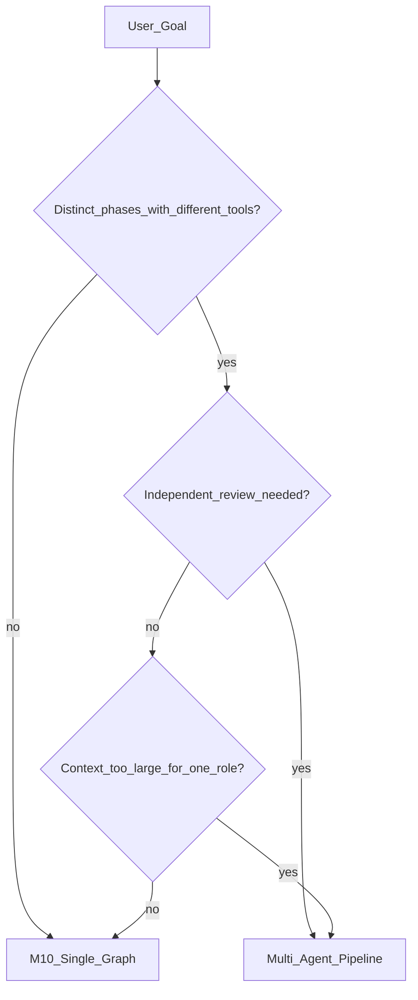
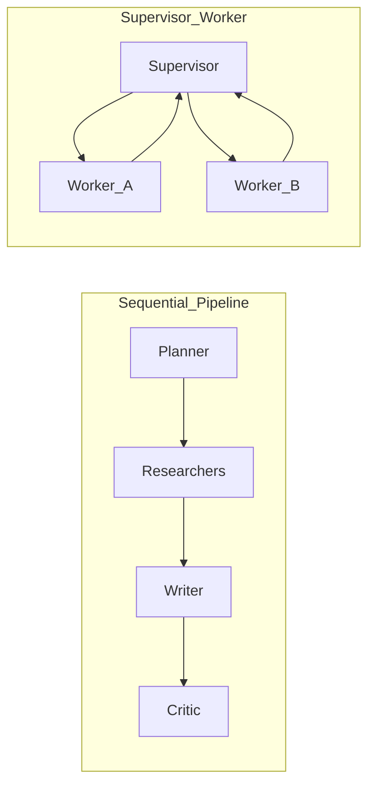
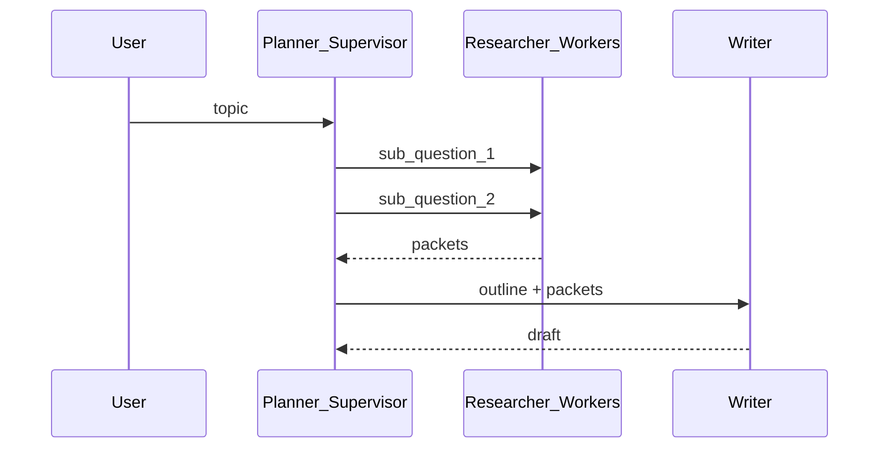
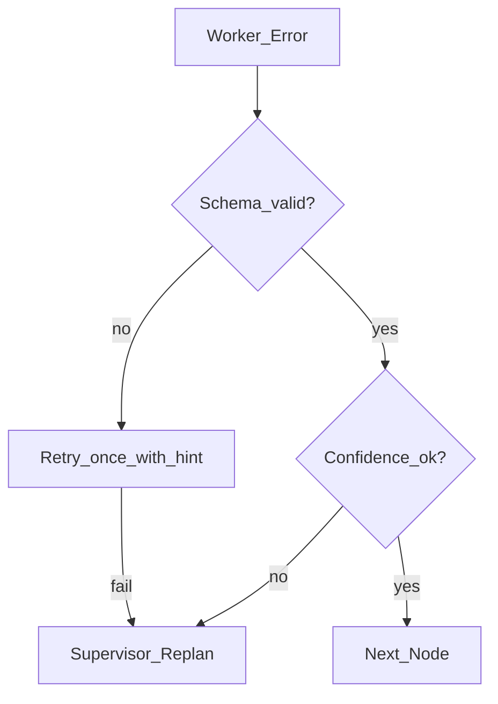
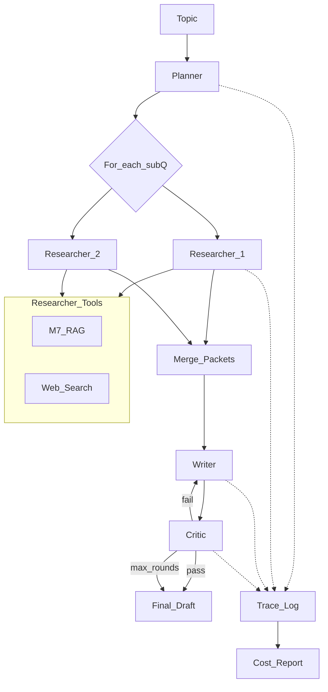

# Module 11: Multi-Agent Systems

*Part III — Agentic AI · Duration: **3 days***

**Nav:** [← M10 Orchestration](10-agent-orchestration-frameworks.md) · **M11** · [Part overview](00-part-iii-overview.md) · [Part IV →](../part-04-production-ai/README.md)

---

## Why this matters in production

One LangGraph agent with eight tools can research and draft — until quality plateaus: the planner rushes retrieval, the writer never sees raw sources, and the critic runs in the same context as the author (so it "approves" its own mistakes). **Multi-agent** design splits **roles** and **context windows** so each step gets the right tools, prompts, and budget.

The cost is real: more agents means more LLM calls, handoff overhead, and failure modes (error propagation, deadlocks, lost context). Module 11 teaches when that trade-off is worth it, which **topology** fits your workflow, and how to ship a pipeline with **per-agent traces and cost reports** — the pattern your capstone uses for research-to-content flows.

This module produces the **Multi-Agent Research & Content Pipeline**: planner → researchers → writer → critic, built primarily in LangGraph with explicit handoffs.

---

## Learning objectives

By the end of this module you will be able to:

- Decide when multi-agent architecture beats a single orchestrated agent.
- Implement common topologies: supervisor-worker, hierarchical, sequential, network, and debate.
- Define roles, communication channels, and handoff contracts between agents.
- Mitigate pitfalls: cost explosion, error propagation, deadlocks, and context loss.
- Compare handoff patterns in LangGraph, CrewAI, and the OpenAI Agents SDK.
- Apply orchestrator-worker and evaluator-optimizer patterns with measurable quality/cost trade-offs.

---

## Day 1 — When multi-agent, topologies, roles

### 1. When to use multi-agent (and when not to)

| Signal | Single agent (M10) | Multi-agent team |
| :---- | :---- | :---- |
| Task structure | One goal, shared context | Distinct phases with different expertise |
| Context pressure | Fits one window with summarization | Raw sources must stay with researcher, not writer |
| Quality gate | Self-check in same prompt | Independent critic / evaluator |
| Compliance | Uniform policy | Separation of duties (research vs publish) |
| Cost/latency budget | Tight | Moderate — you pay for coordination |

**Use when:** phases have **different tools and prompts**, an independent review pass measurably cuts errors, or organizational roles map cleanly to agents (research vs editorial).  
**Skip when:** a single ReAct loop with two tools already meets SLA — adding agents multiplies tokens and debugging surface.



### 2. Topologies — the design vocabulary

| Topology | Shape | Behavior | Use when | Skip when |
| :---- | :---- | :---- | :---- | :---- |
| **Supervisor-worker** | Hub assigns subtasks | Central planner delegates; workers report back | Dynamic task breakdown (research) | Supervisor context becomes the bottleneck |
| **Hierarchical** | Tree of supervisors | Manager → team leads → workers | Large org simulation; scoped budgets per subtree | Small pipelines — overhead > benefit |
| **Sequential** | A → B → C → D | Fixed pipeline, handoff artifacts | Content pipelines, ETL-style AI flows | Need parallel exploration or debate |
| **Network** | Any agent messages any | Flexible collaboration | Brainstorming, open research | Hard to debug; deadlock risk |
| **Debate** | Proposer vs critic rounds | Iterative refinement | High-stakes reasoning, policy review | Latency-sensitive chat |



**Course default:** sequential pipeline **inside** a light supervisor for replanning — planner acts as supervisor when research gaps are found.

### 3. Roles — prompts are job descriptions

A role is not a name tag. It is a **contract**:

- **Objective** — what success looks like for this agent only.
- **Allowed tools** — researcher gets `search_docs` / `web_search`; writer gets none (only artifacts).
- **Output schema** — Pydantic models from M3 (`ResearchBrief`, `DraftPost`, `CritiqueReport`).
- **Budget** — max steps, max tokens, max `$` per role.

Example role split for the mini project:

| Agent | Input | Output | Tools |
| :---- | :---- | :---- | :---- |
| **Planner** | User topic | `Plan` with sub-questions and assignees | Optional lightweight retrieval |
| **Researcher** | Sub-question | `ResearchPacket` with citations | RAG + web |
| **Writer** | Packets + plan | `Draft` | None — prevents sneaky re-retrieval |
| **Critic** | Draft + packets | `Critique` with pass/fail + edits | None |

**Use when / skip when — Role boundaries**

- **Use when:** tool access should be least-privilege (writer cannot browse the web).
- **Skip when:** roles are cosmetic duplicates of the same system prompt.

### 4. Communication — what gets handed off

Agents should pass **artifacts**, not chat logs.

```python
from pydantic import BaseModel, Field

class ResearchPacket(BaseModel):
    sub_question: str
    findings: str
    sources: list[str] = Field(description="URLs or doc paths")
    confidence: float

class PipelineState(TypedDict):
    topic: str
    plan: list[str]
    packets: Annotated[list[ResearchPacket], operator.add]
    draft: str
    critique: str
    messages: Annotated[list, add_messages]
    cost_by_agent: dict[str, float]
```

**Rules:**

1. **Structured handoffs** — validate with Pydantic before the next node runs.
2. **Citation carry-forward** — writer and critic must see `sources`, not just prose summaries.
3. **No global chat dump** — pass only fields the next role needs (reduces context loss and cost).

---

## Day 2 — Handoffs, orchestrator-worker, evaluator-optimizer

### 5. Handoffs across frameworks

| Framework | Handoff mechanism | Mental model |
| :---- | :---- | :---- |
| **LangGraph** | Shared `StateGraph` state; subgraphs per role; `Command` to jump | Pipeline as one graph with role nodes |
| **CrewAI** | `Task` output → next `Task` input; `Agent` roles in crew | YAML/Python job board |
| **OpenAI Agents SDK** | `handoff()` to another agent with instructions | Delegation with guardrails |

**LangGraph (primary) — sequential role nodes:**

```python
from langgraph.graph import StateGraph, START, END

def planner_node(state: PipelineState, llm) -> dict:
    plan = llm.with_structured_output(Plan).invoke(state["topic"])
    return {"plan": plan.sub_questions, "cost_by_agent": _add_cost(state, "planner", llm)}

def researcher_node(state: PipelineState, llm, tools) -> dict:
    sq = state["plan"][state["research_index"]]
    packet = run_research_subgraph(sq, llm, tools)
    return {"packets": [packet], "cost_by_agent": _add_cost(state, "researcher", llm)}

def writer_node(state: PipelineState, llm) -> dict:
    context = _format_packets(state["packets"])
    draft = llm.invoke(f"Write from sources only:\n{context}").content
    return {"draft": draft, "cost_by_agent": _add_cost(state, "writer", llm)}

def critic_node(state: PipelineState, llm) -> dict:
    critique = llm.with_structured_output(CritiqueReport).invoke(
        {"draft": state["draft"], "sources": state["packets"]}
    )
    return {"critique": critique.json(), "cost_by_agent": _add_cost(state, "critic", llm)}

def route_after_critic(state: PipelineState) -> str:
    report = CritiqueReport.model_validate_json(state["critique"])
    if report.passed:
        return END
    if state.get("revision_rounds", 0) >= 2:
        return END
    return "writer"

builder = StateGraph(PipelineState)
builder.add_node("planner", planner_node)
builder.add_node("researcher", researcher_node)
builder.add_node("writer", writer_node)
builder.add_node("critic", critic_node)
# edges: START→planner→researcher*→writer→critic→writer|END
```

**CrewAI sketch (contrast):**

```python
# Conceptual — same roles as Crew tasks
# researcher_task = Task(description="...", agent=researcher, context=[plan_task])
# writer_task = Task(description="...", agent=writer, context=[researcher_task])
# crew = Crew(agents=[...], tasks=[plan_task, researcher_task, writer_task, critic_task])
```

**OpenAI Agents SDK sketch:**

```python
# triage = Agent(name="Planner", ...)
# researcher = Agent(name="Researcher", tools=[...])
# triage.handoffs = [researcher, writer]
```

Use LangGraph for the capstone so checkpoints, HITL (M10), and traces stay unified.

### 6. Orchestrator-worker pattern

A **supervisor** (or planner) decomposes the goal, assigns workers, and **synthesizes** or replans when workers return `blocked` or low confidence.



**Use when / skip when — Orchestrator-worker**

- **Use when:** subtasks are unknown until runtime (open research).
- **Skip when:** fixed ETL-style steps — use sequential graph without a replanning supervisor.

**Implementation tips:**

- Cap parallel workers (e.g., max 3 researchers) — cost grows linearly with fan-out.
- Supervisor returns structured `Plan`, not free-form prose — easier to validate.
- Workers are **stateless** aside from their packet; supervisor merges.

### 7. Evaluator-optimizer pattern

A **critic** (evaluator) scores the draft against rubric criteria; on fail, route back to **writer** (optimizer) with structured edits — not a vague "try again."

```python
class CritiqueReport(BaseModel):
    passed: bool
    factual_issues: list[str]
    missing_citations: list[str]
    suggested_edits: str

def evaluator_optimizer_edge(state: PipelineState) -> str:
    c = CritiqueReport.model_validate_json(state["critique"])
    if c.passed:
        return "done"
    if state.get("revision_rounds", 0) >= 2:
        return "done"  # ship with critique attached — don't infinite loop
    return "revise"
```

**Use when / skip when — Evaluator-optimizer**

- **Use when:** factual grounding matters; critic has access to `ResearchPacket` sources.
- **Skip when:** single-pass creative writing with no verification requirement.

Pair with M10 **max revision rounds** — same discipline as max ReAct steps.

---

## Day 3 — Pitfalls, cost, labs, mini project

### 8. Pitfalls — what breaks in production

| Pitfall | Symptom | Mitigation |
| :---- | :---- | :---- |
| **Cost explosion** | Bill 10× single-agent | Per-agent budgets; parallel caps; cheaper models for planner/critic |
| **Error propagation** | Bad packet → polished wrong draft | Validate packets; critic checks claims vs sources; block writer on empty citations |
| **Deadlocks** | Agents wait on each other | Acyclic graph; timeouts; max rounds; supervisor fallback |
| **Context loss** | Writer invents facts | Artifact handoffs with `sources`; writer prompt: "use only provided packets" |
| **Supervisor bottleneck** | Hub sees everything, runs out of window | Summarize packets for supervisor; full text only on worker + writer |
| **Duplicate work** | Two researchers same query | Planner dedupes sub-questions; shared cache key on retrieval |



### 9. Per-agent traces and cost report

Every node should emit:

```python
def _trace(agent: str, event: str, meta: dict, state: PipelineState):
    log.info({
        "agent": agent,
        "event": event,
        "thread_id": meta.get("thread_id"),
        "latency_ms": meta.get("latency_ms"),
        "tokens_in": meta.get("tokens_in"),
        "tokens_out": meta.get("tokens_out"),
        "cost_usd": meta.get("cost_usd"),
    })
    state["cost_by_agent"][agent] = state["cost_by_agent"].get(agent, 0) + meta["cost_usd"]
```

End-of-run **cost report** (required for mini project):

```text
Pipeline: research-content-7f3a
Total: $0.042
  planner:    $0.004  (1 call)
  researcher: $0.021  (3 sub-questions, parallel)
  writer:     $0.009  (1 draft)
  critic:     $0.008  (2 rounds)
Latency p95: 18.2s
```

Compare to M10 single-agent baseline on the **same topics** — document when quality justifies the premium.

### 10. Parallel researchers (optional fan-out)

When sub-questions are independent, use LangGraph `Send` API or parallel edges — with a **hard cap**:

```python
# Conceptual: map plan.sub_questions to researcher subgraph invocations
# Merge packets with reducer: Annotated[list, operator.add]
MAX_PARALLEL_RESEARCHERS = 3
```

**Use when / skip when — Parallel workers**

- **Use when:** latency matters and sub-questions are independent.
- **Skip when:** budget is fixed — sequential researchers are cheaper and easier to debug.

---

## Engineering decision guide

| Goal | Topology / pattern |
| :---- | :---- |
| Blog/post from research | Sequential + evaluator-optimizer |
| Open-ended investigation | Supervisor-worker with replan |
| Quality gate before publish | Critic + M10 HITL on publish node |
| Brainstorm 10 angles | Network or debate (time-boxed rounds) |
| Enterprise role simulation | Hierarchical supervisors |
| Minimize cost | Single M10 agent + one critic pass only |

---

## Failure modes & diagnostics

| Failure | Cause | Fix |
| :---- | :---- | :---- |
| Hallucinated citations | Writer never received sources | Enforce `ResearchPacket.sources`; fail validation if empty |
| Critic always passes | Same model, same context as writer | Separate model/temperature; critic only sees draft + packets |
| Infinite revise loop | No max rounds on evaluator-optimizer | Cap at 2; attach critique to partial ship |
| Deadlock in network topology | Circular waits | Replace with DAG; add supervisor |
| 5× cost vs estimate | Parallel researchers uncapped | `MAX_PARALLEL`; cache retrieval per query |
| Planner duplicates work | No dedup on sub-questions | Normalize and hash sub-questions before assign |

---

## Hands-on labs

### Lab 11.1 — Sequential handoff schemas

**Steps**

1. Define `Plan`, `ResearchPacket`, `CritiqueReport` Pydantic models.
2. Wire planner → researcher → writer with schema validation between nodes.
3. Inject one invalid packet; confirm pipeline surfaces error without silent continue.

**Acceptance**

- [ ] Invalid handoff fails fast with agent name in error.
- [ ] Writer node has no tool bindings in config.

### Lab 11.2 — Evaluator-optimizer loop

**Steps**

1. Critic returns `passed: false` with `suggested_edits`.
2. Writer revises using edits only (second pass).
3. Stop after two rounds; final output includes last critique if still failing.

**Acceptance**

- [ ] Exactly ≤2 writer revisions per run.
- [ ] Second draft addresses at least one listed `factual_issue` (mentor check or self-rubric).

### Lab 11.3 — Supervisor replan

**Steps**

1. Researcher returns low `confidence` on one sub-question.
2. Supervisor adds a refined sub-question and re-assigns.
3. Log replan events in trace.

**Acceptance**

- [ ] Replan occurs at most once per sub-question.
- [ ] Final packets cover all plan items or document explicit gaps.

### Lab 11.4 — Cost report

**Steps**

1. Track tokens and `$` per agent across a 3-topic batch.
2. Produce `evals/reports/m11-cost.md` comparing M10 single-agent on same topics.

**Acceptance**

- [ ] Per-agent and total cost listed; methodology documented (model prices).
- [ ] Quality note: when multi-agent was worth the premium.

---

## Mini project — Multi-Agent Research & Content Pipeline

### Spec

Build a LangGraph pipeline:

1. **Planner** — decomposes user topic into sub-questions (structured `Plan`).
2. **Researchers** — one or parallel workers; M7 RAG + web tools; output `ResearchPacket` each.
3. **Writer** — draft from packets only; no tools.
4. **Critic** — evaluator against sources; evaluator-optimizer loop with max 2 revisions.

Deliver:

- **Per-agent traces** (JSON logs or OpenTelemetry-style spans).
- **End-of-run cost report** — breakdown by agent and total.
- **API** — extend M10 FastAPI or `POST /pipeline` with `thread_id` and optional SSE.

### Architecture sketch



### Definition of done

- [ ] Four roles implemented with least-privilege tools.
- [ ] Structured handoffs validated; writer cannot call retrieval tools.
- [ ] Evaluator-optimizer capped at 2 revision rounds.
- [ ] `evals/reports/m11-pipeline.md`: 3 sample topics with traces + cost report.
- [ ] Comparison table vs M10 single-agent (quality + cost + latency).

### Rubric

| Criterion | Weight | Excellent |
| :---- | :---- | :---- |
| Topology & roles | 25% | Clear sequential + critic loop; no tool leakage |
| Grounding | 30% | Citations trace to packets; critic catches injected factual error in test |
| Observability | 25% | Per-agent traces; cost report reproducible |
| Engineering | 20% | Caps on parallel research, revisions, and steps; checkpoint optional but documented |

---

## Bridge to Part IV — Production AI

Part III gave you **agency**: single agent (M8–M10), memory and planning (M9), orchestration (M10), multi-agent pipelines (M11). Part IV hardens the same systems for production: auth, rate limits, deployment, monitoring, red-teaming, and regression gates (Module 12).

Take forward:

- M10 API + M11 pipeline as deployable services.
- Per-agent traces and cost reports → dashboards and budget alerts.
- M7 retriever and M9 memory as shared platform tools.

Leave behind: adding agents for appearance. Every new role needs a **measurable** quality or compliance win that pays for its tokens.

---

## Part III closing checklist

Before Part IV, confirm:

- [ ] You can draw your M11 pipeline topology and name every handoff schema.
- [ ] You know the dollar cost of one full pipeline run vs one M10 research call.
- [ ] Critic/evaluator is independent of writer context (model or prompt separation).
- [ ] You can explain when you would **not** use multi-agent for a given product request.

That is the multi-agent bar — not "we have four ChatGPT personas," but "we split roles, bound cost, and prove the pipeline improves outcomes."
