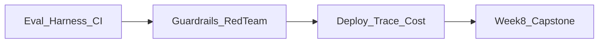

# Part IV — Production AI: Evaluation, Guardrails, Deployment & Observability

*Turn prototypes into products. Evaluate quality with real metrics, defend against prompt injection and unsafe output, then deploy AI services that are traced, monitored, cost-controlled, and reliable at scale.*

**Nav:** [README](README.md) · [M12 →](12-llm-agent-evaluation.md) · [M13](13-guardrails-safety-security.md) · [M14](14-deployment-observability.md) · [Capstone](15-capstone-overview.md)

---

## Why this part exists

Demo day and production diverge on three axes: **quality regressions**, **security**, and **ops**. Part IV installs the engineering controls that make AI systems shippable: evaluation harnesses in CI, guardrails and red-teams, then deployment with tracing and cost alarms.

By the end of Module 14 + Capstone briefing you will have:

1. A reusable evaluation suite that fails CI on regression.
2. A hardened endpoint with injection defense, PII, and moderation.
3. A containerized, traced, cost-monitored service.
4. A clear Week 8 capstone brief composing M1–M14.

---

## Dependency chain



| Module | What you gain | Hand forward |
| :---- | :---- | :---- |
| **M12** | Datasets, judges, CI scorecards | Eval harness for all prior projects |
| **M13** | Guardrails + red-team evidence | Hardened endpoint |
| **M14** | Deploy + observe + reliability | Production-grade service |
| **Capstone** | Integration requirements | Portfolio defense |

---

## Eval-driven loop (north star)

```text
Change prompt / retriever / agent
        → run golden set
        → compare scorecard
        → ship only if metrics hold
```

Artifacts you already have: M2 golden prompts, M6 `evals/reports/m6-baseline.md`, M7 before/after, M8+ agent traces. M12 unifies them.

---

## What “good” looks like

| Signal | Prototype | Production Part IV system |
| :---- | :---- | :---- |
| Quality | “Looks good in demo” | Frozen evals + CI gates |
| Security | Trust the prompt | Injection tests + guardrail layer |
| Privacy | Logs everything | PII redaction; secret hygiene |
| Ops | laptop uvicorn | Docker, health, traces, cost alerts |
| Change | Hope | Staged rollout + incident notes |

Start Module 12 — make evaluation non-optional.
