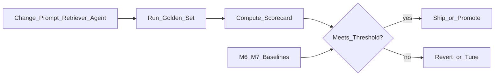
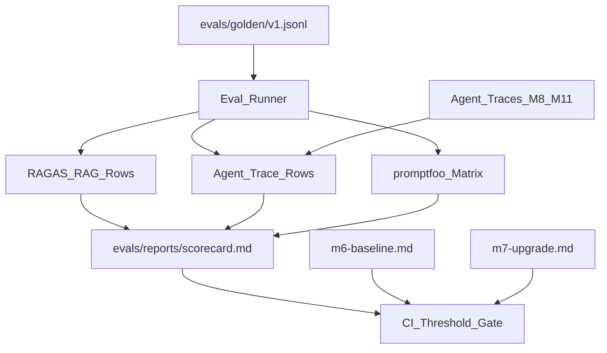
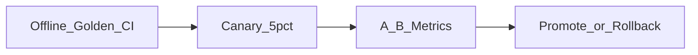
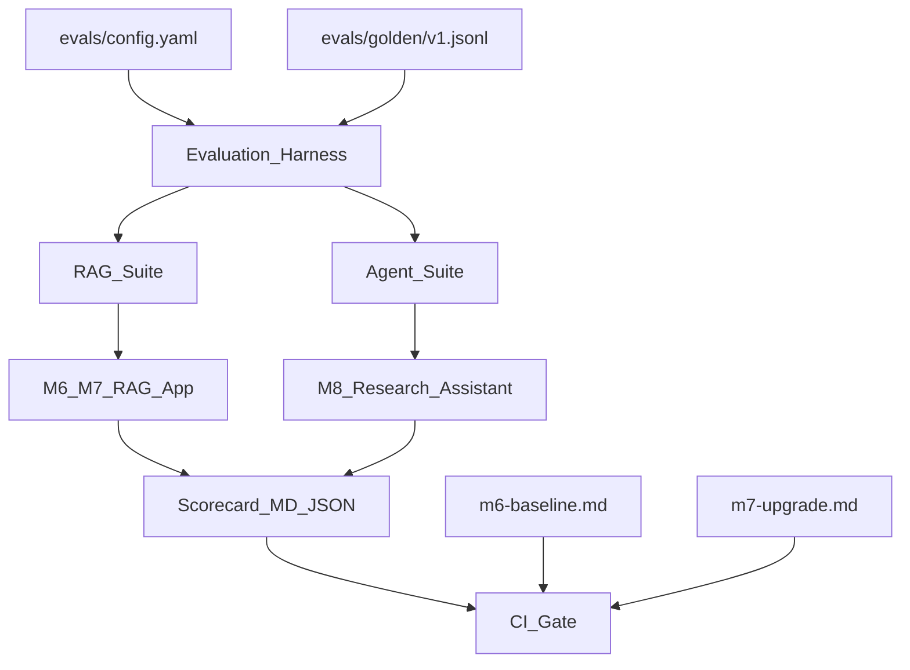

# Module 12: LLM & Agent Evaluation

*Part IV — Production AI · Duration: **2 days***

**Nav:** [← Part IV Overview](00-part-iv-overview.md) · **M12** · [M13 Guardrails →](13-guardrails-safety-security.md)

---

## Why this matters in production

Your Module 6 RAG app "looked fine" in the demo. Your Module 8 Research Assistant completed three hallway questions. Then someone changed the prompt, swapped the embed model, and added a reranker — and nobody noticed faithfulness drop from 0.81 to 0.62 until a new hire followed a hallucinated SSO step.

**Evaluation is how AI engineers ship changes without gambling on users.** Part IV starts here: a frozen golden set, a scorecard, and a CI gate that fails when metrics regress. This is eval-driven development (EDD) — the same discipline that turned software engineering from "it works on my machine" into reproducible releases, applied to nondeterministic models.

You already have the raw materials: M2 golden prompts, `evals/reports/m6-baseline.md`, M7 before/after scorecards, and JSON agent traces from M8–M11. Module 12 unifies them into one **Evaluation Harness** that runs offline suites, compares to baselines, and optionally feeds online A/B experiments.

---

## Learning objectives

By the end of this module you will be able to:

- Practice eval-driven development: change → measure → ship only if metrics hold.
- Classify evaluation types (unit, integration, end-to-end, adversarial) and pick the right layer for each change.
- Build and maintain golden datasets with stable labels and version pins.
- Measure task quality, RAG faithfulness/relevance/context, and agent success/tool accuracy/steps/cost.
- Wire evaluation tooling (promptfoo, RAGAS, DeepEval, LangSmith/Langfuse, Braintrust) into a repeatable harness.
- Integrate regression checks into CI and distinguish offline eval from online A/B monitoring.
- Recognize LLM-as-judge pitfalls and design mitigations.

---

## Day 1 — Eval-driven development and golden datasets

### 1. The eval-driven loop



| Principle | What it means in practice |
| :---- | :---- |
| **Freeze before you optimize** | Golden set v1 is sacred; add cases, don't relabel mid-sprint |
| **One variable at a time** | M7 lesson: rerank alone, then rewrite alone — not both in one commit |
| **Relative > absolute** | Judge scores drift; compare to `m6-baseline.md`, not a magic 0.85 |
| **Traces are evidence** | Every eval row should link to retrieval hits, tool calls, and prompt version |

**Use when / skip when — Eval-driven development**

- **Use when:** any change touches prompts, retrieval, tools, models, or agent topology.
- **Skip when:** pure refactors with zero behavior change *and* identical eval outputs on a smoke set — rare in LLM systems.

### 2. Evaluation types (where to invest)

| Layer | What you test | Examples | Typical cadence |
| :---- | :---- | :---- | :---- |
| **Unit** | Single function / prompt slice | Citation validator, JSON schema parse, PII regex | Every commit |
| **Integration** | Two components wired | Retriever returns gold chunk ids; tool registry dispatches | Every PR |
| **End-to-end (E2E)** | Full user path | Question → cited answer; research topic → grounded report | Nightly + pre-release |
| **Adversarial / red-team** | Attack and edge cases | Injection strings, jailbreaks, out-of-corpus (M13 expands) | Weekly + before launch |

Start with E2E on your frozen golden set. Add unit tests where failures are cheap and deterministic (citation allowlists, structured output). Adversarial suites belong in M13 but **reserve slots** in the harness now.

### 3. Golden dataset design

A golden set is not "questions we like." It is a **labeled contract** between product and engineering.

```json
{
  "id": "rag-q042",
  "type": "rag",
  "question": "How do we rollback a failed Railway deploy?",
  "ground_truth": "Follow the revert-failed-deploy runbook: ...",
  "ground_truth_chunk_ids": ["runbooks/revert-failed-deploy.md#c003"],
  "tags": ["runbook", "deploy", "single-hop"],
  "difficulty": "easy"
}
```

```json
{
  "id": "agent-a017",
  "type": "agent",
  "task": "Compare our SSO policy with NIST guidance; cite internal docs and one public source.",
  "success_criteria": {
    "must_cite_internal": true,
    "must_call_tools": ["rag_retriever", "web_search"],
    "max_steps": 8,
    "max_cost_usd": 0.15
  },
  "tags": ["multi-source", "research"]
}
```

**Coverage dimensions** — aim for spread, not volume:

| Dimension | Why it matters |
| :---- | :---- |
| Intent mix | Policy how-to, troubleshooting, comparison, refusal |
| Difficulty | Single-hop, multi-hop, ambiguous wording |
| Failure history | Production tickets and support escalations |
| Safety edges | Out-of-corpus, conflicting docs, stale `updated_at` |

**Versioning:** store as `evals/golden/v1.jsonl`. Bump to `v2` only when you add cases — never silently edit `ground_truth` on v1 rows.

```python
from pathlib import Path
import json

def load_golden(path: Path) -> list[dict]:
    rows = []
    with path.open() as f:
        for line in f:
            rows.append(json.loads(line))
    return rows
```

### 4. Metric families

#### Task-level metrics

| Metric | Definition | Tooling |
| :---- | :---- | :---- |
| **Exact match / F1** | Token overlap vs `ground_truth` | DeepEval, custom |
| **Pass@k** | Any of k samples passes rubric | Agent retries |
| **Human preference** | Side-by-side rating | Production sampling |

**Use when / skip when — Exact match**

- **Use when:** short factual answers with stable wording (error codes, dates).
- **Skip when:** paraphrase-heavy answers — use faithfulness + relevance instead.

#### RAG metrics (from M6 — now harnessed)

| Metric | Asks | Low score means |
| :---- | :---- | :---- |
| **Faithfulness** | Is the answer supported by retrieved context? | Hallucination |
| **Answer relevance** | Does the answer address the question? | Drift / verbosity |
| **Context precision** | Are retrieved chunks mostly relevant? | Noisy retrieval |
| **Context recall** | Did we retrieve gold evidence? | Missing chunks |

Pin: embed model, retriever `k`, prompt version, judge model. Your `m6-baseline.md` and `m7-upgrade.md` become **baseline rows** in the harness config.

#### Agent metrics (from M8–M11 traces)

| Metric | Asks | Source |
| :---- | :---- | :---- |
| **Task success** | Did the run meet `success_criteria`? | Trace + rubric |
| **Tool selection accuracy** | Right tools called in sensible order? | Trace `tool_calls` |
| **Tool argument validity** | Args parse and pass schema? | Tool registry logs |
| **Steps to completion** | Loop efficiency | `step_count` in trace |
| **Cost / latency** | $ and p95 per task | Token usage aggregation |

```python
def agent_success(trace: dict, criteria: dict) -> bool:
    tools_used = {t["name"] for t in trace.get("tool_calls", [])}
    if criteria.get("must_call_tools"):
        if not set(criteria["must_call_tools"]).issubset(tools_used):
            return False
    if trace.get("step_count", 99) > criteria.get("max_steps", 99):
        return False
    if trace.get("cost_usd", 0) > criteria.get("max_cost_usd", 1.0):
        return False
    return trace.get("status") == "completed"
```

### 5. Tooling landscape

| Tool | Strength | Typical use in this course |
| :---- | :---- | :---- |
| **promptfoo** | Prompt/model matrix, CI YAML, red-team hooks | Regression grids across prompt versions |
| **RAGAS** | RAG faithfulness, context precision/recall | M6/M7 scorecards |
| **DeepEval** | LLM metrics + custom GEval judges | Task success, hallucination checks |
| **LangSmith / Langfuse** | Traces, datasets, online feedback | Connect agent traces to eval rows |
| **Braintrust** | Experiments, diff views, production logging | Before/after promotion decisions |

You do not need all five. The mini project requires **one offline runner** (RAGAS or DeepEval) **plus** promptfoo or a thin custom CLI that fails on threshold breach.

```yaml
# promptfoo — sketch (see promptfoo docs for current schema)
description: M6 RAG regression
prompts:
  - file://prompts/docs-rag-v3.txt
  - file://prompts/docs-rag-v4.txt
providers:
  - id: openai:gpt-4o-mini
tests:
  - vars:
      question: "How do we rollback a failed Railway deploy?"
    assert:
      - type: contains
        value: "revert-failed-deploy"
```

**Use when / skip when — LangSmith vs Langfuse**

- **Use LangSmith when:** team is already on LangChain/LangGraph and wants native trace→dataset flow.
- **Use Langfuse when:** framework-agnostic tracing and self-hosting matter.
- **Skip both initially when:** JSON trace files + a Python eval script are enough for the harness MVP.

---

## Day 2 — CI regression, online eval, and LLM judges

### 6. Building the Evaluation Harness



**Harness responsibilities:**

1. Load golden set + config (`evals/config.yaml`: models, prompts, thresholds).
2. Invoke the app (RAG API, agent endpoint) or replay cached traces.
3. Compute metrics per row and aggregate.
4. Write Markdown + JSON scorecard with git SHA and config hash.
5. Exit non-zero if any **gate** metric drops below baseline − tolerance.

```python
# evals/run.py — structural sketch
import sys
from pathlib import Path

GATES = {
    "faithfulness": {"baseline": 0.81, "min_delta": -0.03},
    "agent_task_success_rate": {"baseline": 0.75, "min_delta": -0.05},
}

def main() -> int:
    scorecard = run_all_suites()  # rag, agent, optional promptfoo
    write_report(scorecard, Path("evals/reports/latest.md"))
    for metric, gate in GATES.items():
        if scorecard[metric] < gate["baseline"] + gate["min_delta"]:
            print(f"FAIL: {metric} = {scorecard[metric]}")
            return 1
    return 0

if __name__ == "__main__":
    raise SystemExit(main())
```

### 7. CI regression gates

| Gate type | Blocks merge when | Cost |
| :---- | :---- | :---- |
| **Smoke** | 5–10 golden rows; fast judges | Low — every PR |
| **Full offline** | Complete golden set | Medium — nightly or release branch |
| **Adversarial** | Injection/PII cases fail (M13) | Medium — weekly |

```yaml
# .github/workflows/eval.yml — sketch
name: eval-regression
on:
  pull_request:
    paths: ['prompts/**', 'retrieval/**', 'agent/**', 'evals/**']
jobs:
  eval-smoke:
    runs-on: ubuntu-latest
    steps:
      - uses: actions/checkout@v4
      - run: pip install -r requirements.txt
      - run: python evals/run.py --suite smoke --fail-on-regression
```

**Pin secrets and models in CI** — use the same judge model version as local runs. Document `EVAL_MODEL=gpt-4o-mini` in README.

**Use when / skip when — CI gates**

- **Use when:** golden set exists and flake rate is controlled (temperature 0 for judges, fixed seeds where possible).
- **Skip when:** eval is flaky because judges disagree run-to-run — fix judge design first, not the gate.

### 8. Offline vs online evaluation

| Mode | When | What you learn |
| :---- | :---- | :---- |
| **Offline** | Pre-deploy; golden set | Regressions, component swaps, prompt diffs |
| **Online A/B** | Post-deploy; live traffic | Real user phrasing, latency, engagement |
| **Human review queue** | Sampled production | Subtle quality, tone, trust |

Offline eval is your **contract**. Online A/B is your **reality check** — golden sets are always narrower than production.



Online metrics to watch alongside offline gates:

- Thumbs down / escalation rate
- Refusal rate (too high = retrieval broken; too low = maybe hallucinating)
- Cost per session and p95 latency
- Citation click-through (are users checking sources?)

Langfuse/Braintrust excel at tying **production traces** back to experiment IDs — carry the same `prompt_version` and `retriever_config` labels from M6–M11 traces into online dashboards.

### 9. LLM-as-judge: power and pitfalls

Most RAG and agent metrics use an LLM to score another LLM. Treat judges as **instruments**, not oracles.

| Pitfall | Symptom | Mitigation |
| :---- | :---- | :---- |
| **Position bias** | Prefers first answer in pairwise compare | Swap order; aggregate both |
| **Leniency drift** | Scores inflate after judge model upgrade | Re-baseline; keep human anchor set |
| **Rubric vagueness** | High variance run-to-run | Structured rubric + few-shot judge examples |
| **Self-preference** | Same family model rates itself higher | Use different judge provider |
| **Cost blindness** | Judge costs exceed generation | Cache judgments; sample subsets in CI |

```python
JUDGE_PROMPT = """Score faithfulness 1-5.
1 = unsupported claims present
5 = every claim traceable to CONTEXT
Return JSON: {{"score": int, "reason": str}}

QUESTION: {question}
CONTEXT: {context}
ANSWER: {answer}
"""

def faithfulness_judge(llm, row: dict) -> dict:
    raw = llm.complete(JUDGE_PROMPT.format(**row))
    return json.loads(raw)  # validate schema in production
```

**Use when / skip when — LLM judges**

- **Use when:** semantic judgments (faithfulness, helpfulness) at scale.
- **Skip when:** deterministic checks suffice — citation allowlists, JSON schema, regex for policy IDs.

Always keep a **human-labeled anchor set** (20–30 rows) to calibrate judge drift monthly.

---

## Engineering decision guide

| Decision | Guidance |
| :---- | :---- |
| Golden set size | Start 30–50 RAG + 15–25 agent; grow from production failures |
| CI smoke vs full | Smoke on PR; full suite nightly |
| Baseline source | `m6-baseline.md` for RAG; M8 trace exports for agent |
| Judge model | Pin version; temperature 0; document in scorecard |
| Threshold | Baseline − 3–5 pts on primary metric, not arbitrary 0.9 |
| Trace linkage | Every eval row stores `trace_id` or inline retrieval snapshot |

---

## Failure modes & diagnostics

| Failure | Cause | Fix |
| :---- | :---- | :---- |
| CI always red | Threshold too tight or flaky judge | Widen tolerance; fix judge rubric |
| CI always green | Smoke set too easy | Add production-sampled failures |
| Offline up, users complain | Golden set stale | Sample live queries into v2 |
| Agent success 100%, bad reports | Success criteria too weak | Add must-cite and critic rubric |
| RAGAS slow in CI | Full set + heavy judge | Smoke subset; cache retrieval contexts |

---

## Hands-on labs

### Lab 12.1 — Unify golden sets

**Steps**

1. Merge M6 RAG golden JSONL and M8/M11 agent tasks into `evals/golden/v1.jsonl` with `type` field.
2. Tag rows by difficulty and component (rag, agent).
3. Document coverage gaps in `evals/README.md`.

**Acceptance**

- [ ] ≥ 40 RAG rows and ≥ 15 agent rows (or documented corpus limits).
- [ ] No duplicate ids; schema validated.

### Lab 12.2 — RAG regression runner

**Steps**

1. Run RAGAS (or equivalent) on full RAG subset.
2. Compare output to `m6-baseline.md` and `m7-upgrade.md`.
3. Fail if faithfulness drops > 0.03 below M7 best.

**Acceptance**

- [ ] `evals/reports/m12-rag.md` with pinned models and prompt version.
- [ ] One-paragraph interpretation of any metric regression.

### Lab 12.3 — Agent trace scoring

**Steps**

1. Export three M8 Research Assistant traces (success, tool error, budget exceeded).
2. Implement `agent_success()` against `success_criteria`.
3. Add tool selection accuracy check (expected vs actual tool sets).

**Acceptance**

- [ ] Scoring script passes on labeled traces.
- [ ] False positive/negative noted for one edge case.

### Lab 12.4 — CI smoke gate

**Steps**

1. Add `evals/run.py --suite smoke` with 10 golden rows.
2. Wire GitHub Actions (or local pre-push hook) to fail on regression.
3. Document required env vars in project README.

**Acceptance**

- [ ] Intentional prompt regression fails CI.
- [ ] Revert restores green.

---

## Mini project — Evaluation Harness

### Spec

A repo-local evaluation harness that:

1. Runs **offline** suites for RAG (RAGAS or DeepEval) and **agent** tasks (trace-based success + cost/step gates).
2. Compares against **M6/M7 baselines** and agent criteria from M8+.
3. Writes reproducible scorecards (`evals/reports/`).
4. Provides a **CI smoke gate** that blocks regressions on prompt/retriever/agent changes.
5. Optionally integrates **promptfoo** for prompt/model matrices.

### Architecture sketch



### Definition of done

- [ ] `evals/golden/v1.jsonl` unified with RAG + agent rows.
- [ ] `evals/run.py` (or Makefile target) produces `evals/reports/latest.md`.
- [ ] CI smoke job fails on deliberate regression and passes on baseline.
- [ ] Scorecard pins: git SHA, prompt version, embed model, judge model, retriever config.
- [ ] README: how to run locally, required secrets, how to add a golden row.

### Rubric

| Criterion | Weight | Excellent |
| :---- | :---- | :---- |
| Coverage | 30% | Golden set spans RAG + agent; tags and success criteria are meaningful |
| Correctness | 35% | Metrics match definitions; trace linkage works; gates fail when they should |
| Operability | 35% | One-command run; CI integrated; baselines documented; judge pitfalls acknowledged |

---

## Bridge to Module 13 — Guardrails, Safety & Security

Evaluation tells you when quality drops. It does not stop prompt injection, PII leakage, or an agent from calling a destructive tool. Module 13 hardens the **same** RAG or Research Assistant endpoint with guardrails, red-team suites, and OWASP-aligned controls — then feeds adversarial cases **back** into this harness as a new eval suite.

Take forward:

- Evaluation Harness with CI gate
- Golden set versioning discipline
- Trace + scorecard habit

Add next:

- Adversarial rows in `evals/golden/`
- PII and moderation checks as **unit gates**
- Red-team report as evidence for portfolio defense

Quality without safety is still not shippable.
