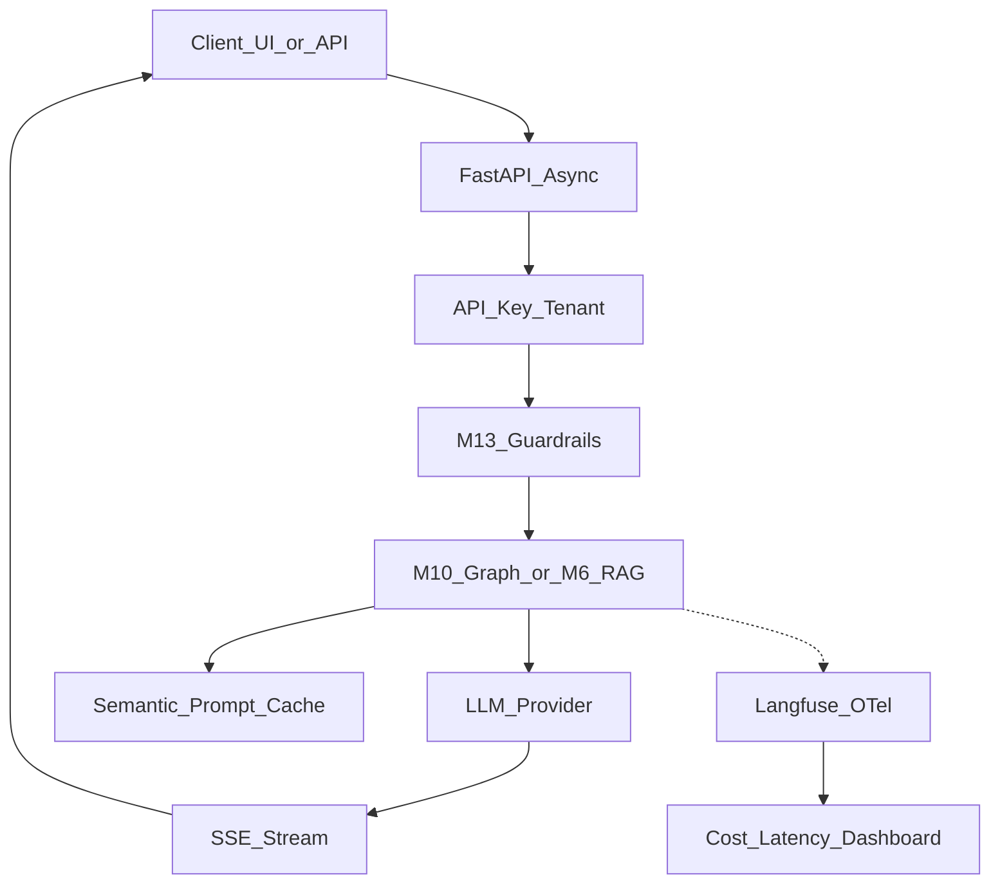
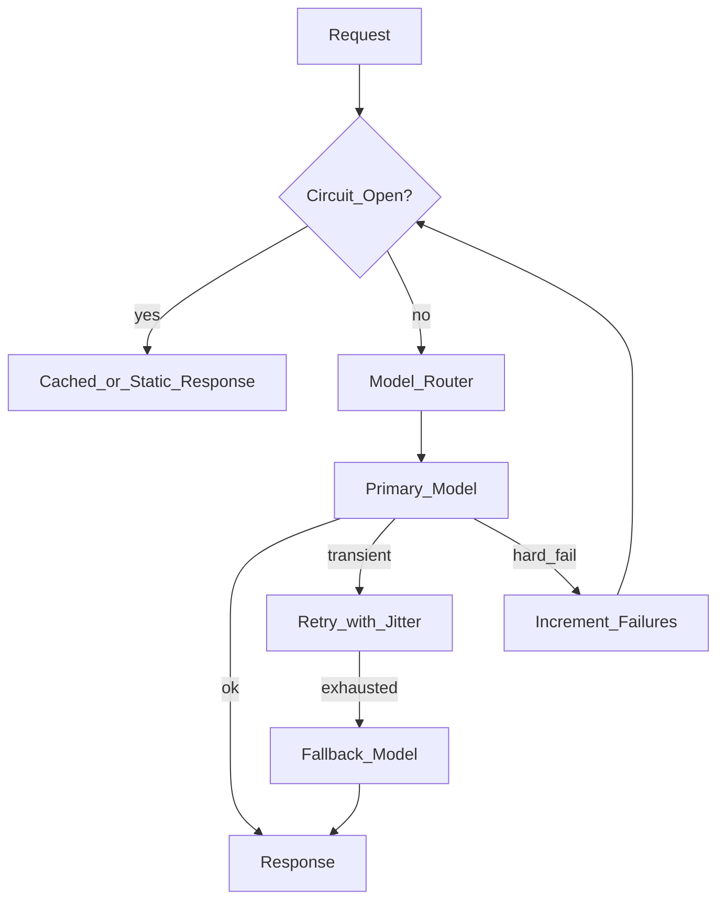
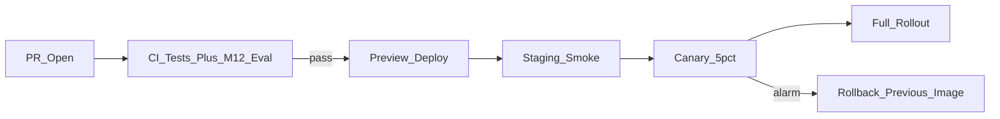
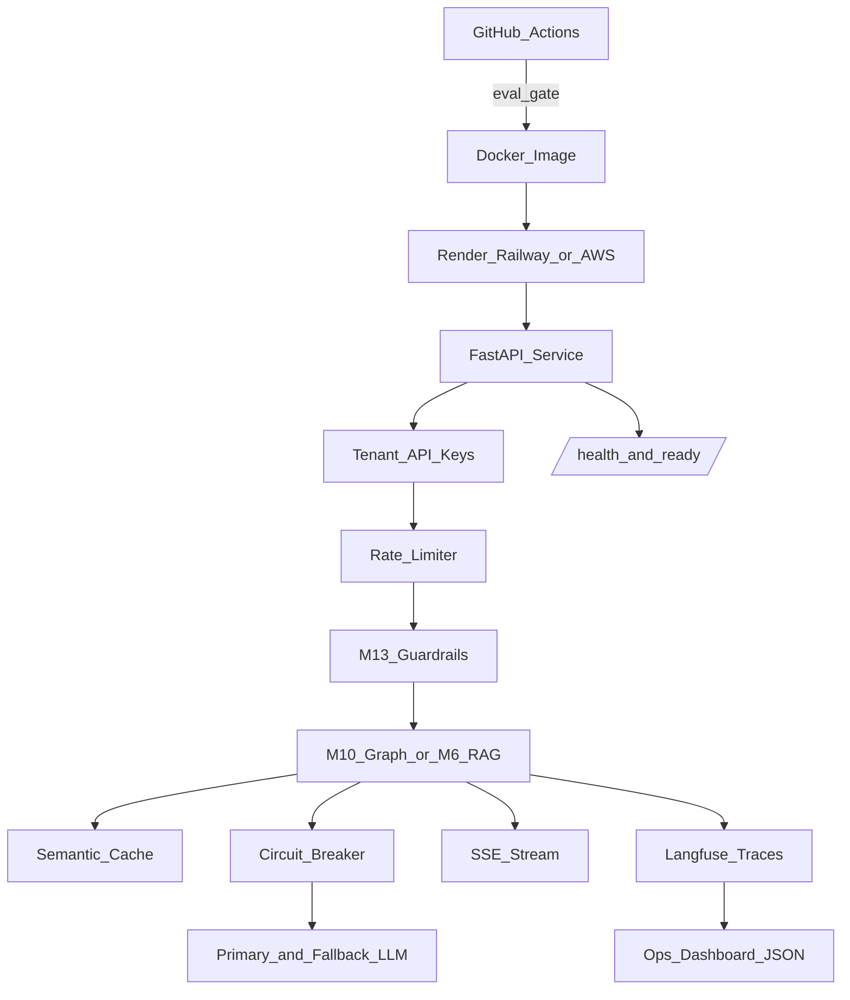

# Module 14: Deployment, Observability & Reliability

*Part IV — Production AI · Duration: **3 days***

**Nav:** [← M13 Guardrails & Safety](13-guardrails-safety-security.md) · **M14** · [Capstone Overview →](15-capstone-overview.md) · [Part overview](00-part-iv-overview.md)

---

## Why this matters in production

Modules 12 and 13 made your system **measurable** and **defensible**. Module 14 makes it **shippable**: a containerized FastAPI service that streams tokens to clients, survives provider outages, respects tenant boundaries, and tells you — in dollars and milliseconds — when something is wrong before users open Slack.

The production failure mode is familiar: a demo that runs on `uvicorn` with `OPENAI_API_KEY` in a `.env` file, no health checks, no traces, and a 429 storm that takes down the whole app because every retry fires instantly. Your job is not "deploy to the cloud." Your job is **operable AI**: secrets hygiene, async SSE with backpressure, observability that ties a user complaint to a span, cost alarms that fire at 80% of budget, and reliability patterns (timeouts, fallbacks, circuit breakers) that degrade gracefully instead of cascading.

This module produces the **Production Deployment** — the traced, cost-monitored, retry-aware service your capstone runs in a real environment.

---

## Learning objectives

By the end of this module you will be able to:

- Package an AI FastAPI service with Docker, health checks, and cloud-native secrets (Render, Railway, AWS, GCP).
- Stream LLM output with async SSE, bounded queues, and client disconnect handling.
- Instrument traces with Langfuse or LangSmith and align spans with OpenTelemetry concepts.
- Build cost and latency dashboards, rate limits, and alerting on SLO breaches.
- Implement retries, timeouts, fallbacks, model routing, and circuit breakers for LLM calls.
- Apply semantic/prompt caching, batching, right-sizing, and quantization at an engineering level.
- Operate multi-tenant API keys, CI/CD staged rollouts, and a lightweight incident response playbook.

---

## Day 1 — Service shape, Docker, secrets, and async SSE

### 1. The production service contract

Before choosing Render vs AWS, define what "production" means for your AI endpoint:

| Surface | Responsibility | Owned artifacts |
| :---- | :---- | :---- |
| **HTTP API** | Auth, validation, rate limits, tenancy | FastAPI routers, Pydantic models (M3) |
| **Inference** | Model calls with budgets | Provider client, routing table |
| **Streaming** | Token delivery without blocking the event loop | SSE handler, queue, disconnect cleanup |
| **Guardrails** | Input/output policy (M13) | Middleware or graph nodes |
| **Observability** | Traces, metrics, cost attribution | Langfuse/LangSmith + OTel hooks |
| **Ops** | Health, readiness, deploy hooks | `/health`, `/ready`, Dockerfile |



**Hand forward from M13:** deploy the **hardened** endpoint — injection tests passed, PII redaction on logs, moderation on output. Do not "simplify for deploy" and drop guardrails.

### 2. FastAPI async + SSE streaming with bounded queues

Blocking the event loop on long `llm.complete()` calls kills concurrency. Use **async** clients (`openai.AsyncOpenAI`, `httpx.AsyncClient`) and stream tokens through a **bounded queue** so slow clients cannot exhaust memory.

**Pattern:** producer coroutine fills the queue; SSE consumer drains it; on client disconnect, cancel the producer.

```python
import asyncio
from collections.abc import AsyncIterator

from fastapi import FastAPI, Request
from fastapi.responses import StreamingResponse
from sse_starlette.sse import EventSourceResponse

app = FastAPI()
QUEUE_MAX = 256  # backpressure: producer blocks when client is slow


async def token_producer(queue: asyncio.Queue[str | None], prompt: str) -> None:
    try:
        async for chunk in stream_llm_tokens(prompt):  # your async generator
            await queue.put(chunk)
    except asyncio.CancelledError:
        raise
    finally:
        await queue.put(None)  # sentinel: stream end


async def sse_events(queue: asyncio.Queue[str | None], request: Request) -> AsyncIterator[dict]:
    try:
        while True:
            if await request.is_disconnected():
                break
            chunk = await asyncio.wait_for(queue.get(), timeout=30.0)
            if chunk is None:
                yield {"event": "done", "data": ""}
                break
            yield {"event": "token", "data": chunk}
    finally:
        # Parent task cancellation happens in the route handler
        pass


@app.post("/v1/chat/stream")
async def chat_stream(request: Request, body: ChatRequest):
    queue: asyncio.Queue[str | None] = asyncio.Queue(maxsize=QUEUE_MAX)
    producer = asyncio.create_task(token_producer(queue, body.prompt))

    async def wrapped_events():
        try:
            async for event in sse_events(queue, request):
                yield event
        finally:
            producer.cancel()
            try:
                await producer
            except asyncio.CancelledError:
                pass

    return EventSourceResponse(wrapped_events())
```

**Use when / skip when — SSE**

- **Use when:** chat UIs, agent step progress, long generations where TTFB matters.
- **Skip when:** batch jobs or internal pipelines — return JSON and poll status; SSE adds client complexity without benefit.

**Queue sizing:** `maxsize=0` is unbounded (dangerous). `maxsize=64–512` is typical; producer `await queue.put()` blocks under backpressure — that is correct behavior.

### 3. Docker: multi-stage build and runtime hygiene

```dockerfile
# syntax=docker/dockerfile:1
FROM python:3.12-slim AS builder
WORKDIR /app
COPY pyproject.toml uv.lock ./
RUN pip install uv && uv sync --frozen --no-dev

FROM python:3.12-slim AS runtime
WORKDIR /app
RUN useradd --create-home appuser
COPY --from=builder /app/.venv /app/.venv
COPY src/ ./src/
ENV PATH="/app/.venv/bin:$PATH" \
    PYTHONUNBUFFERED=1
USER appuser
EXPOSE 8000
HEALTHCHECK --interval=30s --timeout=5s --start-period=20s --retries=3 \
  CMD python -c "import urllib.request; urllib.request.urlopen('http://127.0.0.1:8000/health')"
CMD ["uvicorn", "src.main:app", "--host", "0.0.0.0", "--port", "8000", "--workers", "1"]
```

| Choice | Guidance |
| :---- | :---- |
| **Workers** | Start with **1 worker** per container for in-memory agent state; scale **replicas** horizontally. Use 2+ workers only when state is externalized (Redis checkpoint, M10 `thread_id` store). |
| **Image size** | Slim base; no dev deps; no corpus files in image — mount object storage or pull at startup. |
| **Non-root** | Always run as unprivileged user. |
| **Health vs ready** | `/health` = process up. `/ready` = can reach LLM + vector DB + checkpoint backend. |

```python
@app.get("/health")
async def health():
    return {"status": "ok"}

@app.get("/ready")
async def ready():
    checks = await asyncio.gather(
        check_llm_ping(),
        check_vector_store(),
        return_exceptions=True,
    )
    if any(isinstance(c, Exception) for c in checks):
        raise HTTPException(status_code=503, detail="dependency_unavailable")
    return {"status": "ready"}
```

### 4. Secrets and configuration — never in the image

| Anti-pattern | Fix |
| :---- | :---- |
| `ENV OPENAI_API_KEY=sk-...` in Dockerfile | Inject at runtime from secret store |
| Committed `.env` | `.env.example` only; real values in platform secrets |
| Same key for dev and prod | Separate keys; separate Langfuse projects |

**Local:** `.env` loaded by `pydantic-settings` — gitignored.

**Docker Compose:** `env_file` + Docker secrets for production-like tests.

```yaml
# compose.prod.yml (sketch)
services:
  api:
    image: alrighttech/ai-service:latest
    secrets:
      - openai_api_key
    environment:
      OPENAI_API_KEY_FILE: /run/secrets/openai_api_key
secrets:
  openai_api_key:
    external: true
```

Read file-based secrets in settings:

```python
from pydantic_settings import BaseSettings

class Settings(BaseSettings):
    openai_api_key: str

    @classmethod
    def from_env(cls) -> "Settings":
        key_file = os.environ.get("OPENAI_API_KEY_FILE")
        if key_file:
            return cls(openai_api_key=Path(key_file).read_text().strip())
        return cls()  # falls back to OPENAI_API_KEY env var
```

### 5. Cloud deployment targets

Pick based on **ops appetite**, not logo preference.

| Platform | Best for | Secrets | SSE / long requests | Serverless fit |
| :---- | :---- | :---- | :---- | :---- |
| **Render** | Fast intern/prototype → staging | Environment groups + secret files | Web service (not free static) — set timeout ≥ 300s for agents | Background workers for ingest |
| **Railway** | Quick Docker deploy, PR previews | Project variables (sealed) | Configure request timeout; use streaming-friendly plan | Jobs for batch eval |
| **AWS** | Enterprise, VPC, compliance | Secrets Manager / SSM Parameter Store | ECS Fargate or ALB → EC2; **avoid** API Gateway 29s limit for agent SSE unless WebSocket | Lambda for ingest/eval only; not primary chat |
| **GCP** | Same enterprise tier | Secret Manager | Cloud Run (set `--timeout`, `--cpu-boost`); GKE for heavy vLLM | Cloud Functions for webhooks |

**Serverless rule of thumb:** use serverless for **stateless, short** work (webhook, nightly eval, document parse). Do **not** put a 40-step LangGraph agent on a 60-second Lambda unless you have stepped async invocation (complexity rarely worth it in Week 8).

**Staged environments:**

```text
local → PR preview (Railway/Render) → staging (real secrets, fake traffic) → production (canary 5%)
```

Wire M12 eval gate in CI **before** promote to staging.

---

## Day 2 — Observability, cost, rate limits, and reliability

### 6. Tracing: Langfuse, LangSmith, and OpenTelemetry concepts

You already have agent traces in JSON from M8+. Production needs **one trace per user request** with child spans per LLM call, retrieval, and tool — searchable by `tenant_id`, `session_id`, and `prompt_version`.

| Concept | OTel term | LLM observability term |
| :---- | :---- | :---- |
| One user request | Trace | Trace / session |
| LLM call | Span | Generation |
| Retrieval | Span | Span with `retrieval` type |
| Key-value context | Span attributes | `user_id`, `model`, `token_count` |
| Aggregated numbers | Metrics | Cost dashboard, p95 latency |

**Langfuse** (open source, self-host or cloud): strong for LLM-native views — prompt versions, eval scores linked to traces, cost per trace.

**LangSmith** (LangChain ecosystem): excellent if your graph is already LangChain/LangGraph — datasets and evals integrate tightly.

**Pick one for the course.** Dual-exporting to both is wasted scope unless your team standardizes otherwise.

```python
# Pseudocode — Langfuse drop-in around an LLM call
from langfuse.decorators import observe, langfuse_context

@observe()
async def generate_answer(prompt: str, tenant_id: str) -> str:
    langfuse_context.update_current_trace(
        user_id=tenant_id,
        metadata={"prompt_version": "v3.2"},
    )
    response = await client.chat.completions.create(...)
    langfuse_context.update_current_observation(
        model=response.model,
        usage=response.usage,
    )
    return response.choices[0].message.content
```

**OTel alignment:** even if you use Langfuse/LangSmith SDKs, understand that each "generation" is a **span** with duration, attributes, and parent trace ID. If your platform team exports OTel → Datadog/Jaeger/Grafana Tempo, map:

- `trace_id` = support ticket correlation
- `span.name` = `llm.chat`, `tool.retriever`, `guardrail.output`
- attributes: `gen_ai.request.model`, `gen_ai.usage.input_tokens` (emerging semantic conventions)

**What to log vs not log**

| Log | Never log raw |
| :---- | :---- |
| Trace IDs, latencies, token counts, model id | API keys, full prompts with PII |
| Retrieval `chunk_id` list | Full document bodies in prod logs |
| Guardrail decision (allow/block) | User medical/financial verbatim (M13 redaction) |

### 7. Cost and latency dashboards

**Instrument every billable unit:**

```python
@dataclass
class UsageRecord:
    tenant_id: str
    trace_id: str
    model: str
    input_tokens: int
    output_tokens: int
    latency_ms: float
    usd_estimate: float
```

Export aggregates to your dashboard (Grafana, Langfuse dashboard, or a simple `ops/metrics.jsonl` tailer for the course).

| Metric | Type | Alert threshold (example) |
| :---- | :---- | :---- |
| `llm.usd_per_hour` | Gauge / rollup | > 80% of daily budget by 2pm |
| `llm.p95_latency_ms` | Histogram | > 8s for 5m (SSE TTFB + total) |
| `llm.error_rate` | Counter ratio | > 2% 5xx or provider errors |
| `cache.hit_rate` | Gauge | < 20% when expected 40%+ (broken cache) |
| `rate_limit.violations` | Counter | Spike → possible abuse |

**Cost estimation:**

```python
PRICING_PER_1M = {"gpt-4o-mini": {"in": 0.15, "out": 0.60}}

def estimate_usd(model: str, inp: int, out: int) -> float:
    p = PRICING_PER_1M[model]
    return (inp * p["in"] + out * p["out"]) / 1_000_000
```

Attribute cost to **`tenant_id`** and **`feature`** (`rag_qa`, `agent_research`, `m11_pipeline`) so capstone demos can show per-tenant unit economics.

### 8. Rate limiting and abuse controls

AI endpoints are magnet targets for credential stuffing and token burn attacks.

| Layer | Mechanism |
| :---- | :---- |
| **Edge** | Cloudflare / API Gateway throttle by IP |
| **App** | Token bucket per API key + per tenant |
| **Model** | Max `max_tokens`, max requests/day per tier |
| **Agent** | M8 step cap, M10 graph recursion limit — still required in prod |

```python
from slowapi import Limiter
from slowapi.util import get_remote_address

limiter = Limiter(key_func=get_remote_address)

@app.post("/v1/chat")
@limiter.limit("30/minute")
async def chat(...):
    ...
```

**Tenant tiers (sketch):**

| Tier | RPM | Tokens/day | Features |
| :---- | :---- | :---- | :---- |
| `free` | 10 | 50k | RAG only |
| `team` | 60 | 500k | Agent + SSE |
| `enterprise` | Custom | Custom | Dedicated index, SLA |

Return `429` with `Retry-After` header — clients and retry logic depend on it.

### 9. Retries, timeouts, fallbacks, routing, circuit breakers

**Retries:** idempotent reads and **safe** transient failures only (429, 502, 503). Never blind-retry 400s.

```python
import tenacity

@tenacity.retry(
    retry=tenacity.retry_if_exception_type(TransientProviderError),
    wait=tenacity.wait_exponential_jitter(initial=1, max=30),
    stop=tenacity.stop_after_attempt(4),
    reraise=True,
)
async def chat_with_retry(**kwargs):
    return await client.chat.completions.create(**kwargs)
```

**Timeouts:** set at every hop — HTTP client (30s), single LLM call (60s), full agent request (180s), SSE idle (120s).

```python
timeout = httpx.Timeout(connect=5.0, read=60.0, write=10.0, pool=5.0)
```

**Fallbacks and model routing:**

```python
MODEL_ROUTES = [
    {"model": "gpt-4o", "when": "complexity=high"},
    {"model": "gpt-4o-mini", "when": "default"},
]

async def routed_completion(messages, complexity: str):
    primary = "gpt-4o" if complexity == "high" else "gpt-4o-mini"
    try:
        return await call_model(primary, messages)
    except TransientProviderError:
        return await call_model("gpt-4o-mini", messages)  # downgrade
```

**Circuit breaker:** after N consecutive provider failures, **fail fast** for a cooldown window — protects your budget and prevents retry storms.

```python
class CircuitBreaker:
    def __init__(self, failure_threshold: int = 5, cooldown_s: float = 60.0):
        self.failures = 0
        self.threshold = failure_threshold
        self.cooldown_s = cooldown_s
        self.open_until: float = 0.0

    def record_success(self):
        self.failures = 0

    def record_failure(self):
        self.failures += 1
        if self.failures >= self.threshold:
            self.open_until = time.monotonic() + self.cooldown_s

    def allow(self) -> bool:
        return time.monotonic() >= self.open_until
```

When open: return cached answer, static degradation message, or queue for async — **never** hang until timeout.



---

## Day 3 — Efficiency, tenancy, CI/CD, and operations

### 10. Semantic cache and prompt cache

| Cache type | Key | Hits when | Invalidation |
| :---- | :---- | :---- | :---- |
| **Exact prompt cache** | Hash of (model, system prompt, messages) | Identical request | TTL (e.g., 1h) or prompt version bump |
| **Semantic cache** | Embedding of user question | Paraphrase similar enough | Lower similarity threshold → more false hits |
| **Retrieval cache** | Hash of (query, collection, filters) | Same search | Corpus version change |

```python
async def answer_with_semantic_cache(question: str, embed_fn, store, threshold: float = 0.92):
    q_vec = embed_fn(question)
    hit = store.search_nearest("answer_cache", q_vec, top_k=1)
    if hit and hit.score >= threshold:
        return hit.metadata["answer"], {"cache": "semantic_hit"}
    answer = await generate_fresh(question)
    store.upsert("answer_cache", [VectorRecord(...)])
    return answer, {"cache": "miss"}
```

**Guardrail interaction:** do not cache blocked or PII-heavy turns. Cache key must include `tenant_id` — **no cross-tenant cache leakage**.

**Provider prompt caching** (OpenAI/Anthropic): automatic prefix caching for long stable system prompts — structure prompts with **static prefix first**, volatile user content last.

### 11. Batching, right-sizing, and quantization (overview)

| Lever | Effect | Caveat |
| :---- | :---- | :---- |
| **Batch embed (ingest)** | Higher throughput per dollar | Latency insensitive path only |
| **Smaller chat model** | Largest recurring savings after retrieval stabilizes | Eval regression — run M12 gate |
| **Lower `max_tokens`** | Caps runaway agents | May truncate valid answers |
| **Quantization (AWQ/GPTQ)** | Cheaper self-hosted inference | Quality eval on your tasks |
| **Right-size context** | Fewer input tokens | M6/M7 context packing discipline |

**When to self-host with vLLM or Ollama**

| Signal | Managed API | vLLM / Ollama self-host |
| :---- | :---- | :---- |
| Volume | Low / spiky | Sustained high token volume |
| Model needs | Frontier models, low ops | Open weights, data residency |
| Team | No GPU ops | Someone can patch CUDA at 2am |
| Latency | OK with network hop | Need in-VPC inference |

**Course default:** managed APIs for capstone **unless** you already run GPUs. Document the **break-even** token math in README.

```text
monthly_spend = daily_tokens * 30 * price_per_token
gpu_monthly = instance_hours * $/hr
# self-host wins when monthly_spend > gpu_monthly + engineer_time
```

Ollama: best for **local dev** and demos. vLLM: production throughput on a GPU fleet with OpenAI-compatible `/v1` — swap base URL in your client.

### 12. Multi-tenancy and API keys

**Tenancy model for capstone:** logical isolation per tenant — separate vector collections or `tenant_id` filter on every query (M5 labs).

```python
async def get_tenant(request: Request) -> Tenant:
    api_key = request.headers.get("X-API-Key")
    tenant = await resolve_tenant(api_key)  # hashed lookup
    if not tenant:
        raise HTTPException(401)
    return tenant

# Every store call:
hits = store.search(collection="docs", query_vec=vec, filters={"tenant_id": tenant.id})
```

| Practice | Why |
| :---- | :---- |
| Hash API keys at rest | DB leak ≠ usable keys |
| Prefix keys (`at_live_...`) | Humans recognize prod vs test |
| Rotate without downtime | Support two valid hashes per tenant during rotation |
| Per-tenant eval slices | M12 regression per customer corpus |

### 13. CI/CD and staged rollout



**CI pipeline minimum:**

1. Unit tests + lint.
2. M12 eval harness on golden set — **fail PR if primary metric drops**.
3. Build Docker image; scan for secrets (gitleaks).
4. Deploy preview; hit `/ready` and one streaming smoke test.

**Staged rollout:** new prompt version or retrieval config ships to 5% traffic; compare error rate, p95, cost per request for 24h; promote or rollback.

**Version everything:**

```text
PROMPT_VERSION=v3.2
RETRIEVAL_CONFIG=v7-hybrid-rerank
MODEL_ROUTING_TABLE=v2
```

Traces must record these versions — otherwise you cannot explain a regression.

### 14. Incident response (lightweight)

Keep a one-page `ops/RUNBOOK.md`:

| Severity | Example | First actions |
| :---- | :---- | :---- |
| **SEV1** | Service down, 50%+ errors | Rollback deploy; status page; preserve traces |
| **SEV2** | Cost 3× baseline | Enable circuit breaker; lower max tokens; disable agent path |
| **SEV3** | Retrieval quality drop | Roll back `RETRIEVAL_CONFIG`; rerun M12 eval |
| **SEV4** | Single tenant abuse | Revoke API key; tighten rate limit |

**During incident:** freeze prompt changes; export Langfuse traces for failing `trace_id`s; check provider status page; verify secret rotation did not break `/ready`.

**After:** blameless note — timeline, root cause, eval gap that let it ship, action item (new golden question, new alert).

---

## Engineering decision guide

| Goal | First lever |
| :---- | :---- |
| Ship this week | Render/Railway Docker web service + platform secrets |
| Debug user report | Langfuse trace → span waterfall |
| Cut LLM bill 30% | Semantic cache + `gpt-4o-mini` default + prompt prefix caching |
| Survive provider outage | Timeouts + fallback model + circuit breaker |
| Pass enterprise security | Secrets Manager, per-tenant keys, no PII in traces |
| Agent SSE in AWS | Fargate/ALB, not API Gateway 29s limit |
| Prove deploy safe | M12 eval in CI + canary + rollback tag |

---

## Failure modes & diagnostics

| Failure | Cause | Fix |
| :---- | :---- | :---- |
| Memory climb under load | Unbounded SSE queue | `maxsize` on `asyncio.Queue`; cancel on disconnect |
| 502 mid-stream | Platform timeout < generation time | Raise idle timeout; heartbeat SSE comments |
| Cost spike overnight | Retry storm on 429 | Exponential backoff; circuit breaker |
| Cross-tenant data leak | Missing filter on retrieval | `tenant_id` on every query; integration test |
| Cache returns stale policy | Corpus updated, cache not | Bump `corpus_version` in cache key |
| "Works locally" | `.env` secrets not in cloud | `/ready` checks; secret mount verification |
| Eval passed, prod bad | Canary too small / wrong traffic | Per-tenant golden samples; longer canary |
| Traces useless | No `prompt_version` attribute | Standard span metadata contract |

---

## Hands-on labs

### Lab 14.1 — Containerize and health-check

**Steps**

1. Add Dockerfile + `.dockerignore` (exclude `.env`, `evals/raw/`, corpora if mounted).
2. Implement `/health` and `/ready` with LLM + vector store checks.
3. Run locally: `docker build -t ai-service . && docker run -p 8000:8000 --env-file .env ai-service`.

**Acceptance**

- [ ] Image runs non-root; `/ready` returns 503 when Qdrant/Postgres is stopped.
- [ ] README documents required env vars (names only, no values).

### Lab 14.2 — Async SSE with backpressure

**Steps**

1. Convert M10 streaming endpoint to `EventSourceResponse` + bounded queue.
2. Simulate slow client (sleep in consumer); verify producer blocks at `maxsize`.
3. Disconnect client mid-stream; verify producer task cancelled (no zombie tasks).

**Acceptance**

- [ ] `curl -N` receives token events; `event: done` terminates cleanly.
- [ ] Log line confirms cancellation on disconnect.

### Lab 14.3 — Langfuse (or LangSmith) tracing

**Steps**

1. Create project; wire `@observe` or LangGraph callback on LLM + retriever + tools.
2. Run one M8 research query and one M6 RAG query; find both traces in UI.
3. Attach `tenant_id`, `prompt_version`, token usage to each trace.

**Acceptance**

- [ ] Screenshot or exported JSON of trace with ≥ 3 spans.
- [ ] Documented attribute contract in `docs/observability.md`.

### Lab 14.4 — Retries, fallback, circuit breaker

**Steps**

1. Wrap provider client with tenacity retry (429/503 only).
2. Implement primary → fallback model route.
3. Force 5 failures; verify circuit opens and returns degradation response.

**Acceptance**

- [ ] Unit test for circuit breaker cooldown.
- [ ] No unbounded retry loop in logs.

### Lab 14.5 — Rate limits and tenant keys

**Steps**

1. Issue two API keys for tenants A and B.
2. Enforce per-key RPM; verify A throttled does not block B.
3. Confirm retrieval never crosses tenants on shared index.

**Acceptance**

- [ ] `429` with `Retry-After` on burst traffic.
- [ ] Test query proving tenant isolation.

### Lab 14.6 — Semantic cache layer

**Steps**

1. Add `answer_cache` collection (or Redis + embed hash).
2. Ask same question two ways; measure cache hit on paraphrase.
3. Bump `prompt_version`; verify cache miss.

**Acceptance**

- [ ] Report: hit rate on 10 paraphrase pairs.
- [ ] `tenant_id` in cache key — cross-tenant miss guaranteed.

### Lab 14.7 — Deploy to cloud + secrets

**Steps**

1. Deploy container to Render **or** Railway **or** ECS/Cloud Run (one is enough).
2. Store `OPENAI_API_KEY` and `LANGFUSE_SECRET_KEY` in platform secret UI — not git.
3. Smoke test `/ready` and one SSE request against public URL.

**Acceptance**

- [ ] Public HTTPS URL documented in README.
- [ ] `git grep sk-` returns nothing.

### Lab 14.8 — CI/CD with eval gate

**Steps**

1. Add GitHub Actions (or equivalent): test → M12 eval → docker build.
2. Fail pipeline if faithfulness (or primary metric) drops > agreed tolerance.
3. Tag image `sha-abc123`; document rollback command.

**Acceptance**

- [ ] CI badge or link in README.
- [ ] One intentional bad prompt fails the eval step.

---

## Mini project — Production Deployment

### Spec

Take your **M13-hardened** M10 API (or M6/M7 Chat-With-Docs if you are on the RAG track) and ship a **production-grade** deployment:

1. **Docker** — multi-stage image, non-root, health + readiness.
2. **Cloud** — one managed environment with runtime secrets.
3. **SSE** — async streaming with bounded queue and disconnect cleanup.
4. **Tracing** — Langfuse or LangSmith on LLM, retrieval, and tools.
5. **Reliability** — timeouts, retries (transient only), fallback model, circuit breaker.
6. **Cache** — exact or semantic cache on the hot path.
7. **Ops** — rate limits, per-tenant API keys, cost/latency summary endpoint or dashboard export.
8. **CI/CD** — pipeline with M12 eval gate; documented staged rollout and rollback.

### Architecture sketch



### Definition of done

- [ ] Public URL serves hardened endpoint only (M13 controls active).
- [ ] `docker build` reproducible; no secrets in image layers.
- [ ] SSE endpoint can stream a full agent or RAG answer without blocking other requests.
- [ ] Traces visible with `tenant_id`, model, tokens, `prompt_version`.
- [ ] `ops/cost-report.md` or dashboard: p50/p95 latency and $/request over ≥ 20 test calls.
- [ ] Circuit breaker and fallback demonstrated in test or scripted failure.
- [ ] Cache hit documented on repeated/paraphrased queries.
- [ ] CI pipeline runs M12 eval before deploy tag.
- [ ] `ops/RUNBOOK.md` with rollback steps and one simulated incident note.

### Rubric

| Criterion | Weight | Excellent |
| :---- | :---- | :---- |
| Deploy & secrets hygiene | 20% | Non-root Docker; cloud secrets; `/ready` checks deps; no keys in repo |
| Streaming & reliability | 25% | Bounded SSE; disconnect cleanup; retries/timeouts/fallback/circuit breaker correct |
| Observability | 25% | End-to-end traces; cost + latency attributable to tenant/feature |
| Security & tenancy | 15% | API keys hashed; rate limits; tenant isolation on retrieval/cache |
| Ops maturity | 15% | CI eval gate; rollback documented; runbook actionable |

---

## Bridge to Capstone

Module 14 is the **runtime shell** your capstone demo runs in. The capstone does not replace M14 — it **inherits** it:

- Same Docker image and secret pattern.
- Same trace and cost attribution (per pipeline run in M11).
- Same tenant and rate-limit model for portfolio review.

Read [15-capstone-overview.md](15-capstone-overview.md) for how M1–M14 artifacts compose into Week 8 deliverables.

---

## Part IV closing checklist

Before capstone kickoff, confirm:

- [ ] M12 eval runs in CI and blocks regressions.
- [ ] M13 guardrails active on the deployed route (not bypassed).
- [ ] You can open a trace and explain every span in a user complaint.
- [ ] You know `$` per request for RAG-only vs full agent pipeline.
- [ ] Rollback is one command or one click — tested once.
- [ ] Incident runbook exists; on-call is not "DM the intern."

That is the production bar — not "it's on the internet," but "it's traced, bounded, cost-aware, and recoverable."
