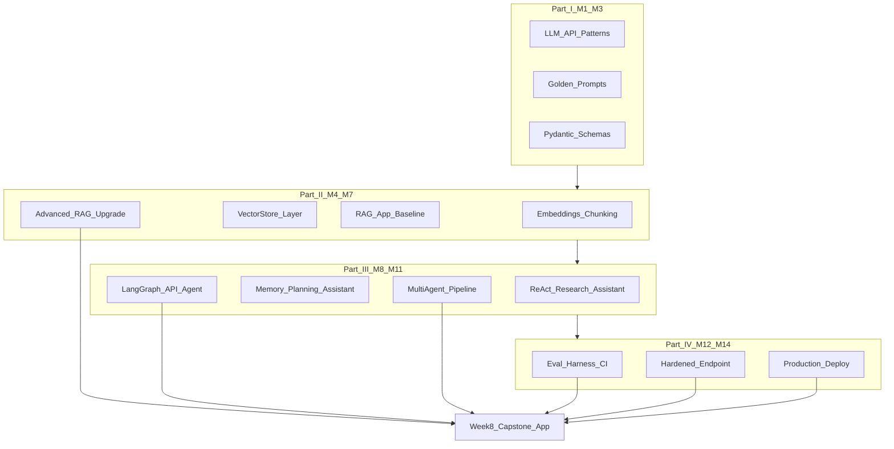
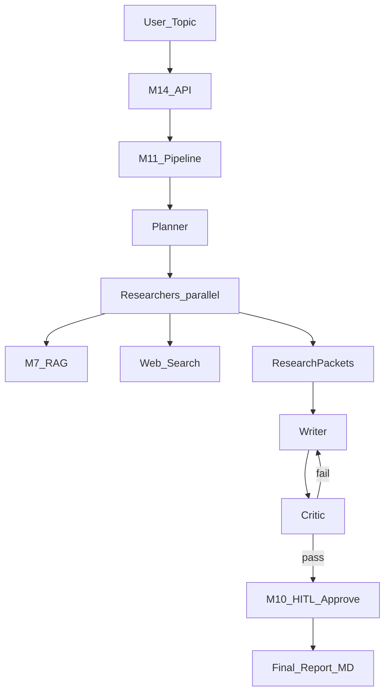
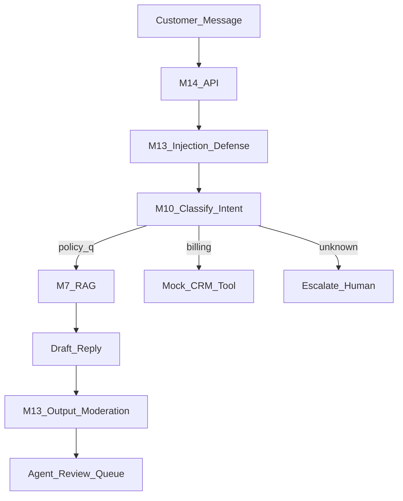
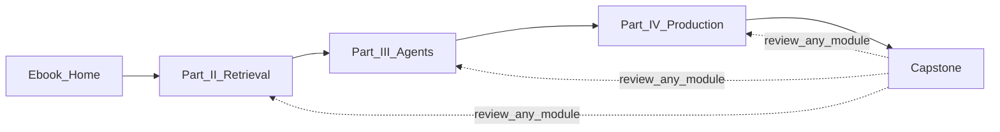

# Capstone Overview — Week 8 Production AI Application

*Part IV — Production AI · **Book closer** (not a timed module)*

**Nav:** [← M14 Deployment & Observability](14-deployment-observability.md) · **Capstone** · [Part overview](00-part-iv-overview.md) · [Course home](../README.md)

---

## Why the capstone exists

Eight weeks of modules produced **pieces**: embeddings, vector stores, RAG, agents, graphs, multi-agent pipelines, eval harnesses, guardrails, and a deployed service. The capstone is the **proof you can compose them** into one production-grade AI application — with evidence, not adjectives.

Portfolio reviewers and hiring managers do not reward "we used LangChain." They reward: frozen evals that gate releases, traces that explain failures, guardrails that survived a red-team, and a deploy URL that stays up when the provider flickers. The capstone is your **defense** of that bar.

This chapter is the brief. It is not a three-day module — it is the map for Week 8 and the closing frame for the ebook.

---

## What every capstone must include

Regardless of which option you choose, your submission **must** demonstrate the full curriculum stack. Missing any row is a **capstone blocker** (see grading).

| # | Requirement | Source modules | Evidence artifact |
| :--: | :---- | :---- | :---- |
| 1 | **Grounded knowledge** — RAG or equivalent retrieval with citations | M4–M7 | Live query with `chunk_id` citations; M6/M7 eval baseline |
| 2 | **Agentic capability** — tool-using loop or orchestrated graph, not single-shot only | M8–M11 | Trace showing ≥ 2 tool or node transitions |
| 3 | **Structured handoffs** — Pydantic (or equivalent) schemas between stages | M3, M10, M11 | Schema definitions + validated JSON in traces |
| 4 | **Memory or state** — session, long-term, or checkpoint resume | M9–M10 | Second-session recall **or** `thread_id` resume demo |
| 5 | **Evaluation harness** — golden set + CI or documented gate | M2, M6, M12 | `evals/` folder; CI badge or manual gate log |
| 6 | **Guardrails** — input/output policy, injection resistance | M13 | Red-team results; blocked unsafe request demo |
| 7 | **Production deploy** — container, secrets, health, cloud URL | M14 | Public `/health` + HTTPS endpoint |
| 8 | **Observability** — traces with cost/latency per request | M8+, M14 | Langfuse/LangSmith screenshot or export |
| 9 | **Reliability** — timeouts, retries or fallback, rate limits | M14 | Test or runbook section proving behavior |
| 10 | **Tenancy or API keys** — logical isolation model | M5, M14 | Two keys or tenants; no cross-leak test |
| 11 | **Documentation** — architecture, ops, known limits | All | README + `docs/architecture.md` |
| 12 | **Live defense** — 15–20 min demo + Q&A | — | Recorded or scheduled with instructor |

**Quality floor:** at least one **primary eval metric** (faithfulness, task success, or route accuracy) reported on a **frozen** golden set with before/after or baseline comparison — same discipline as M6/M7/M12.

---

## How M1–M14 artifacts compose

You are not starting from zero. The capstone **extends and unifies** work you already shipped.



### Module-by-module handoff map

| Module | Artifact you already built | Capstone role |
| :---- | :---- | :---- |
| **M1** | Provider client wrapper, token counting, streaming basics | Inference layer under M14 service |
| **M2** | Versioned prompt templates, golden prompt files | System prompts + eval inputs |
| **M3** | `ResearchBrief`, `DraftPost`, `CritiqueReport`, tool arg models | Inter-agent and API contracts |
| **M4** | Chunking experiments, embedding model choice | Ingest quality for your corpus |
| **M5** | `VectorStore` over pgvector/Qdrant, `tenant_id` filters | Document + optional memory index |
| **M6** | Chat-With-Docs, citations, `evals/reports/m6-baseline.md` | Knowledge Q&A path or retriever tool |
| **M7** | Hybrid + rerank + rewrite upgrade report | Default retrieval for agent tools |
| **M8** | ReAct loop, tool registry, trace JSON, step caps | Tool execution semantics (even if M10 graph is primary) |
| **M9** | `user_memory` collection, plan-and-execute | Personalization or multi-step goals |
| **M10** | LangGraph graph, HITL hook, SSE API, checkpoints | **Primary orchestration** for most capstones |
| **M11** | Planner → researchers → writer → critic pipeline, cost report | Optional topology for research/content options |
| **M12** | Unified eval runner, CI workflow, scorecards | Release gate; capstone regression suite |
| **M13** | Injection tests, moderation, PII redaction, allowlists | Middleware on every user-facing route |
| **M14** | Docker image, cloud deploy, Langfuse, cache, circuit breaker | **Runtime** hosting the capstone |

### Recommended integration paths

**Path A — RAG-centric capstone** (Enterprise Knowledge Assistant, Customer Support)

```text
M6/M7 retriever → M10 graph (optional M9 memory) → M13 guardrails → M14 deploy
Eval: M6 golden set + M12 CI
```

**Path B — Agent / research capstone** (Research Report Agent, Domain Copilot)

```text
M8 tools (M7 retriever) → M10 or M11 pipeline → M13 → M14
Eval: M12 task-success set + M11-style cost report
```

**Path C — Code & data analysis**

```text
M8 tools (code exec, SQL, files) → M10 graph with HITL on destructive ops → M13 → M14
Eval: structured output accuracy + safety cases
```

Pick **one primary orchestration** (M10 single graph **or** M11 multi-agent). Do not submit three frameworks.

---

## Capstone options

Choose **one** track. All five satisfy the must-include table when scoped correctly.

### Option 1 — Enterprise Knowledge Assistant

**Product story:** Internal copilot over company docs (AlrightTech Internal Docs or your chosen corpus) with cited answers, follow-up memory, and admin guardrails.

**Best if:** you strongest in M6/M7 and want a clear retrieval story.

**Architecture hints**

```mermaid
flowchart LR
  user[Employee_Chat] --> api[M14_FastAPI]
  api --> guard[M13]
  guard --> graph[M10_LangGraph]
  graph --> mem[M9_User_Memory]
  graph --> rag[M7_Hybrid_RAG]
  rag --> store[M5_VectorStore]
  graph --> sse[SSE_Response]
```

| Component | Recommendation |
| :---- | :---- |
| Retrieval | M7 hybrid + rerank as default tool |
| Agent depth | Light M10 graph: classify → retrieve → answer → optional clarify |
| Memory | M9 summarized session + `user_memory` for preferences |
| Differentiator | Department-scoped collections (`tenant_id` = team) |

**Stretch goals:** intent router (M7 Lab 7.4), Slack/Teams webhook, semantic cache on FAQ queries.

---

### Option 2 — Autonomous Research Report Agent

**Product story:** User supplies a topic; system plans research, gathers evidence from internal docs **and** web, drafts a structured report, critic revises — human approves publish (M10 HITL).

**Best if:** you completed M11 and want the richest agent narrative.

**Architecture hints**



| Component | Recommendation |
| :---- | :---- |
| Topology | M11 sequential + critic loop (cap 2 revisions) |
| Schemas | M3 `ResearchBrief`, `ResearchPacket`, `DraftPost`, `CritiqueReport` |
| Observability | Per-agent cost in `evals/reports/capstone-cost.md` |
| Differentiator | Export PDF/Markdown with bibliography from citations |

**Stretch goals:** parallel researchers with merge, evaluator on source diversity.

---

### Option 3 — AI Customer-Support Agent

**Product story:** Tier-1 support bot: policy RAG, ticket classification, draft reply for human review, escalation on low confidence or policy edge cases.

**Best if:** you want a clear production + guardrails story with measurable deflection.

**Architecture hints**



| Component | Recommendation |
| :---- | :---- |
| Guardrails | Heavy M13 — PII scrub on logs, moderation on outbound |
| Confidence | Refusal + escalation when retrieval score < threshold |
| Eval | Golden tickets: resolution accuracy, no-policy-hallucination rate |
| Tenancy | Per-customer `tenant_id` on index or filter |

**Stretch goals:** sentiment-based routing, multilingual template (M2 prompt variants).

---

### Option 4 — Code & Data Analysis Agent

**Product story:** Developer or analyst assistant: questions over a repo or dataset, SQL/Python tools, summarized findings with citations to files or query results.

**Best if:** you prefer tools over large doc corpora; strong M3 structured outputs.

**Architecture hints**

```mermaid
flowchart LR
  q[Analysis_Question] --> api[M14]
  api --> graph[M10_Graph]
  graph --> code[Sandboxed_Python]
  graph --> sql[ReadOnly_SQL]
  graph --> files[Repo_RAG_or_Tree]
  code --> struct[M3_AnalysisReport]
  sql --> struct
  files --> struct
  struct --> sse[SSE_Summary]
```

| Component | Recommendation |
| :---- | :---- |
| Safety | Sandboxed code exec; read-only DB creds; M13 on generated code execution requests |
| HITL | M10 interrupt before any non-readonly mutation |
| Retrieval | Code-aware chunking (symbols, paths) or AST-aware search |
| Eval | Structured output validation + golden analysis tasks |

**Stretch goals:** notebook export, chart generation with data citation.

---

### Option 5 — Domain Vertical Copilot

**Product story:** Specialized assistant for one vertical you define (legal clause review, clinical chart summary, real estate listing copy, etc.) with domain disclaimers, custom ontology, and compliance guardrails.

**Best if:** you have domain access and can craft a focused golden set.

**Architecture hints**

```mermaid
flowchart TD
  user[Domain_User] --> api[M14]
  api --> disc[M13_Disclaimer_and_Policy]
  disc --> graph[M10_or_M11]
  graph --> dom[Domain_Corpus_RAG]
  graph --> rules[Rule_Checker_Tool]
  graph --> out[Structured_Domain_Output]
  out --> audit[Trace_and_Citation_Audit]
```

| Component | Recommendation |
| :---- | :---- |
| Legal/safety | Prominent non-advice disclaimers; block diagnostic claims in regulated domains |
| Retrieval | Curated domain corpus + metadata filters (jurisdiction, date) |
| Eval | Domain expert review sheet + M12 automated metrics |
| Differentiator | Ontology-aware chunk metadata (M4/M5) |

**Stretch goals:** multi-document comparison, version diff over policy corpus.

---

## Deliverables

Submit a **single repository** (or monorepo folder) with the following layout. Names can vary; contents cannot.

```text
capstone/
├── README.md                 # Setup, public URL, 2-min architecture summary
├── docs/
│   ├── architecture.md       # Diagram + module mapping (M1–M14)
│   ├── observability.md      # Trace attributes, cost model
│   └── runbook.md            # Rollback, incidents (from M14)
├── src/                      # Application code
├── evals/
│   ├── golden/               # Frozen test set
│   ├── reports/
│   │   ├── baseline.md
│   │   └── capstone-final.md
│   └── ci/                   # Workflow or gate script
├── ops/
│   ├── Dockerfile
│   └── deploy-notes.md       # Platform, secrets, canary steps
├── docker-compose.yml        # Optional local stack
└── demo/
    └── DEMO_SCRIPT.md        # 15–20 min walkthrough beats
```

### README must answer

1. What problem does this solve for whom?
2. Public URL and example `curl` (with redacted API key pattern).
3. Which capstone option (1–5) and why that topology.
4. Primary eval metric and current score on frozen set.
5. `$` per typical request (order of magnitude is fine).
6. Known limitations — honest, specific.

### Demo script beats (15–20 minutes)

| Minute | Show |
| :---- | :---- |
| 0–2 | Architecture diagram; M1–M14 mapping |
| 2–5 | Happy path live query with citations or structured output |
| 5–8 | Agent trace in Langfuse — spans, tokens, cost |
| 8–10 | Guardrail block (injection or unsafe output) |
| 10–12 | Memory, HITL, or multi-agent handoff (option-dependent) |
| 12–14 | CI eval gate or scorecard |
| 14–18 | Ops: `/ready`, rate limit, cache hit, or failover story |
| 18–20 | Q&A |

---

## Grading rubric

**Total: 100 points.** Must-include blockers (−10 each, max −50) apply before rubric weighting if core evidence is missing.

| Dimension | Pts | Excellent (90–100%) | Adequate (70–89%) | Weak (<70%) |
| :---- | :--: | :---- | :---- | :---- |
| **Architecture & composition** | 20 | Clear M1–M14 map; one orchestration; schemas at boundaries | Works but duplicated logic or unclear module boundaries | Monolith prompt; cannot explain data flow |
| **Retrieval & grounding** | 15 | Citations trace to sources; refusals when evidence thin | Mostly grounded; occasional orphan claims | Hallucination on demo path |
| **Agent orchestration** | 15 | Bounded steps; tools least-privilege; M10/M11 patterns correct | Agent works; loose caps or leaky tools | Single LLM call posing as agent |
| **Evaluation discipline** | 15 | Frozen golden set; CI or strict gate; metrics reported honestly | Eval exists; manual or moving target set | No reproducible metrics |
| **Security & guardrails** | 10 | M13 controls live; red-team documented | Partial guardrails | Bypassable or omitted |
| **Production ops** | 15 | M14 deploy; traces; cost/latency; reliability patterns proven | Deployed with gaps (no cache or no fallback) | Local-only |
| **Documentation & defense** | 10 | README/runbook complete; crisp live demo | Docs present but shallow | Cannot operate without author |

### Blocker checklist (automatic revision required)

- [ ] No public HTTPS endpoint with `/health`
- [ ] No eval artifact in `evals/reports/`
- [ ] No trace/export showing multi-step agent or graph
- [ ] No citation or structured evidence path (options 1–3)
- [ ] Guardrails disabled in deployed build
- [ ] Secrets in git history

---

## Week 8 suggested schedule

Not a module — a pacing guide.

| Day | Focus |
| :---- | :---- |
| **Mon** | Lock option; gap analysis against must-include table; architecture doc v1 |
| **Tue** | Wire retrieval + graph/pipeline; port M13 middleware |
| **Wed** | M14 deploy to staging; Langfuse project live |
| **Thu** | Expand golden set; run M12 gate; fix regressions |
| **Fri** | Cache, rate limits, failover tests; runbook |
| **Mon** | Canary deploy; cost report |
| **Tue** | Demo rehearsal; record backup video |
| **Wed** | **Defense day** |

---

## Pre-submission checklist

### Engineering

- [ ] One command starts local stack; one command runs eval suite.
- [ ] `docker build` succeeds from clean clone.
- [ ] `/ready` fails when vector DB is down.
- [ ] SSE stream completes and cancels on disconnect.
- [ ] Two tenants tested — no retrieval or cache bleed.
- [ ] Circuit breaker or fallback demonstrated.
- [ ] `prompt_version` / `corpus_version` in traces.

### Evidence

- [ ] `evals/reports/capstone-final.md` with primary metric.
- [ ] Langfuse/LangSmith trace export attached or linked.
- [ ] M13 red-team summary (even if short).
- [ ] `ops/cost-report.md` or equivalent dashboard capture.

### Portfolio narrative

- [ ] Can explain why agent vs workflow for your product.
- [ ] Can explain one thing you tried that **failed** eval and reverted.
- [ ] Can quote p95 latency and $/request for demo path.

---

## After the capstone — what you ship forward

The capstone repo is a **portfolio piece**, not homework to archive.

| Audience | Highlight |
| :---- | :---- |
| **Hiring manager** | Eval-gated deploy; trace screenshot; cost discipline |
| **Engineering lead** | Architecture doc; runbook; tenant model |
| **Your future self** | Frozen golden set; module map for the next feature |

Consider tagging releases: `v1.0-capstone`, `v1.1-post-internship` with changelog tied to eval scores.

---

## Navigation — back to the course home

You started this ebook to learn **production AI engineering**, not to collect notebooks. Use the map below to revisit any module during hardening or interviews.

| Part | Focus | Start here |
| :---- | :---- | :---- |
| **Part I** | LLM foundations, prompts, structured outputs (M1–M3) | *Foundations volume* (when published) |
| **Part II** | Embeddings → RAG → advanced retrieval (M4–M7) | [part-02-knowledge-retrieval/README.md](../part-02-knowledge-retrieval/README.md) |
| **Part III** | Agents, memory, LangGraph, multi-agent (M8–M11) | [part-03-agentic-ai/README.md](../part-03-agentic-ai/README.md) |
| **Part IV** | Eval, guardrails, deploy, observability (M12–M14) | [part-04-production-ai/README.md](README.md) |
| **Ebook root** | Full program index | [../README.md](../README.md) |



---

## Closing

The industry bar you trained for is simple to state and hard to fake: **grounded**, **measured**, **defended**, **deployed**, **observable**. Your capstone is the proof.

Pick one option. Reuse M1–M14 artifacts ruthlessly. Let the eval harness veto bad ideas. Put it on the internet with secrets outside git and traces inside every request.

Then defend it.

**Nav:** [← M14 Deployment & Observability](14-deployment-observability.md) · [Part IV README](README.md) · [Course home](../README.md)
